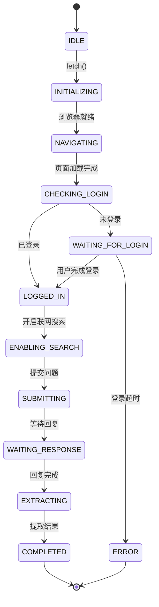

# 浏览器 Agent 设计文档

## 概述

Browser Agent 是一个代理式（Agentic）浏览器自动化系统，提供：

1. **透明可见** - 用户始终知道 Agent 在做什么
2. **智能协作** - 需要人工时才打扰用户，否则自动运行
3. **无缝衔接** - 用户完成操作后，Agent 自动继续

**基于Agent Browser技术：**

agent-browser
Headless browser automation CLI for AI agents. Fast Rust CLI with Node.js fallback.

Installation
npm (recommended)
npm install -g agent-browser
agent-browser install  # Download Chromium
From Source
git clone https://github.com/vercel-labs/agent-browser
cd agent-browser
pnpm install
pnpm build
pnpm build:native   # Requires Rust (https://rustup.rs)
pnpm link --global  # Makes agent-browser available globally
agent-browser install
Linux Dependencies
On Linux, install system dependencies:

agent-browser install --with-deps
# or manually: npx playwright install-deps chromium
Quick Start
agent-browser open example.com
agent-browser snapshot                    # Get accessibility tree with refs
agent-browser click @e2                   # Click by ref from snapshot
agent-browser fill @e3 "test@example.com" # Fill by ref
agent-browser get text @e1                # Get text by ref
agent-browser screenshot page.png
agent-browser close
Traditional Selectors (also supported)
agent-browser click "#submit"
agent-browser fill "#email" "test@example.com"
agent-browser find role button click --name "Submit"
Commands
Core Commands
agent-browser open <url>              # Navigate to URL (aliases: goto, navigate)
agent-browser click <sel>             # Click element
agent-browser dblclick <sel>          # Double-click element
agent-browser focus <sel>             # Focus element
agent-browser type <sel> <text>       # Type into element
agent-browser fill <sel> <text>       # Clear and fill
agent-browser press <key>             # Press key (Enter, Tab, Control+a) (alias: key)
agent-browser keydown <key>           # Hold key down
agent-browser keyup <key>             # Release key
agent-browser hover <sel>             # Hover element
agent-browser select <sel> <val>      # Select dropdown option
agent-browser check <sel>             # Check checkbox
agent-browser uncheck <sel>           # Uncheck checkbox
agent-browser scroll <dir> [px]       # Scroll (up/down/left/right)
agent-browser scrollintoview <sel>    # Scroll element into view (alias: scrollinto)
agent-browser drag <src> <tgt>        # Drag and drop
agent-browser upload <sel> <files>    # Upload files
agent-browser screenshot [path]       # Take screenshot (--full for full page)
agent-browser pdf <path>              # Save as PDF
agent-browser snapshot                # Accessibility tree with refs (best for AI)
agent-browser eval <js>               # Run JavaScript
agent-browser close                   # Close browser (aliases: quit, exit)
Get Info
agent-browser get text <sel>          # Get text content
agent-browser get html <sel>          # Get innerHTML
agent-browser get value <sel>         # Get input value
agent-browser get attr <sel> <attr>   # Get attribute
agent-browser get title               # Get page title
agent-browser get url                 # Get current URL
agent-browser get count <sel>         # Count matching elements
agent-browser get box <sel>           # Get bounding box
Check State
agent-browser is visible <sel>        # Check if visible
agent-browser is enabled <sel>        # Check if enabled
agent-browser is checked <sel>        # Check if checked
Find Elements (Semantic Locators)
agent-browser find role <role> <action> [value]       # By ARIA role
agent-browser find text <text> <action>               # By text content
agent-browser find label <label> <action> [value]     # By label
agent-browser find placeholder <ph> <action> [value]  # By placeholder
agent-browser find alt <text> <action>                # By alt text
agent-browser find title <text> <action>              # By title attr
agent-browser find testid <id> <action> [value]       # By data-testid
agent-browser find first <sel> <action> [value]       # First match
agent-browser find last <sel> <action> [value]        # Last match
agent-browser find nth <n> <sel> <action> [value]     # Nth match
Actions: click, fill, check, hover, text

Examples:

agent-browser find role button click --name "Submit"
agent-browser find text "Sign In" click
agent-browser find label "Email" fill "test@test.com"
agent-browser find first ".item" click
agent-browser find nth 2 "a" text
Wait
agent-browser wait <selector>         # Wait for element to be visible
agent-browser wait <ms>               # Wait for time (milliseconds)
agent-browser wait --text "Welcome"   # Wait for text to appear
agent-browser wait --url "**/dash"    # Wait for URL pattern
agent-browser wait --load networkidle # Wait for load state
agent-browser wait --fn "window.ready === true"  # Wait for JS condition
Load states: load, domcontentloaded, networkidle

Mouse Control
agent-browser mouse move <x> <y>      # Move mouse
agent-browser mouse down [button]     # Press button (left/right/middle)
agent-browser mouse up [button]       # Release button
agent-browser mouse wheel <dy> [dx]   # Scroll wheel
Browser Settings
agent-browser set viewport <w> <h>    # Set viewport size
agent-browser set device <name>       # Emulate device ("iPhone 14")
agent-browser set geo <lat> <lng>     # Set geolocation
agent-browser set offline [on|off]    # Toggle offline mode
agent-browser set headers <json>      # Extra HTTP headers
agent-browser set credentials <u> <p> # HTTP basic auth
agent-browser set media [dark|light]  # Emulate color scheme
Cookies & Storage
agent-browser cookies                 # Get all cookies
agent-browser cookies set <name> <val> # Set cookie
agent-browser cookies clear           # Clear cookies

agent-browser storage local           # Get all localStorage
agent-browser storage local <key>     # Get specific key
agent-browser storage local set <k> <v>  # Set value
agent-browser storage local clear     # Clear all

agent-browser storage session         # Same for sessionStorage
Network
agent-browser network route <url>              # Intercept requests
agent-browser network route <url> --abort      # Block requests
agent-browser network route <url> --body <json>  # Mock response
agent-browser network unroute [url]            # Remove routes
agent-browser network requests                 # View tracked requests
agent-browser network requests --filter api    # Filter requests
Tabs & Windows
agent-browser tab                     # List tabs
agent-browser tab new [url]           # New tab (optionally with URL)
agent-browser tab <n>                 # Switch to tab n
agent-browser tab close [n]           # Close tab
agent-browser window new              # New window
Frames
agent-browser frame <sel>             # Switch to iframe
agent-browser frame main              # Back to main frame
Dialogs
agent-browser dialog accept [text]    # Accept (with optional prompt text)
agent-browser dialog dismiss          # Dismiss
Debug
agent-browser trace start [path]      # Start recording trace
agent-browser trace stop [path]       # Stop and save trace
agent-browser console                 # View console messages
agent-browser console --clear         # Clear console
agent-browser errors                  # View page errors
agent-browser errors --clear          # Clear errors
agent-browser highlight <sel>         # Highlight element
agent-browser state save <path>       # Save auth state
agent-browser state load <path>       # Load auth state
Navigation
agent-browser back                    # Go back
agent-browser forward                 # Go forward
agent-browser reload                  # Reload page
Setup
agent-browser install                 # Download Chromium browser
agent-browser install --with-deps     # Also install system deps (Linux)
Sessions
Run multiple isolated browser instances:

# Different sessions
agent-browser --session agent1 open site-a.com
agent-browser --session agent2 open site-b.com

# Or via environment variable
AGENT_BROWSER_SESSION=agent1 agent-browser click "#btn"

# List active sessions
agent-browser session list
# Output:
# Active sessions:
# -> default
#    agent1

# Show current session
agent-browser session
Each session has its own:

Browser instance
Cookies and storage
Navigation history
Authentication state
Snapshot Options
The snapshot command supports filtering to reduce output size:

agent-browser snapshot                    # Full accessibility tree
agent-browser snapshot -i                 # Interactive elements only (buttons, inputs, links)
agent-browser snapshot -c                 # Compact (remove empty structural elements)
agent-browser snapshot -d 3               # Limit depth to 3 levels
agent-browser snapshot -s "#main"         # Scope to CSS selector
agent-browser snapshot -i -c -d 5         # Combine options
Option	Description
-i, --interactive	Only show interactive elements (buttons, links, inputs)
-c, --compact	Remove empty structural elements
-d, --depth <n>	Limit tree depth
-s, --selector <sel>	Scope to CSS selector
Options
Option	Description
--session <name>	Use isolated session (or AGENT_BROWSER_SESSION env)
--headers <json>	Set HTTP headers scoped to the URL's origin
--executable-path <path>	Custom browser executable (or AGENT_BROWSER_EXECUTABLE_PATH env)
--json	JSON output (for agents)
--full, -f	Full page screenshot
--name, -n	Locator name filter
--exact	Exact text match
--headed	Show browser window (not headless)
--cdp <port>	Connect via Chrome DevTools Protocol
--debug	Debug output
Selectors
Refs (Recommended for AI)
Refs provide deterministic element selection from snapshots:

# 1. Get snapshot with refs
agent-browser snapshot
# Output:
# - heading "Example Domain" [ref=e1] [level=1]
# - button "Submit" [ref=e2]
# - textbox "Email" [ref=e3]
# - link "Learn more" [ref=e4]

# 2. Use refs to interact
agent-browser click @e2                   # Click the button
agent-browser fill @e3 "test@example.com" # Fill the textbox
agent-browser get text @e1                # Get heading text
agent-browser hover @e4                   # Hover the link
Why use refs?

Deterministic: Ref points to exact element from snapshot
Fast: No DOM re-query needed
AI-friendly: Snapshot + ref workflow is optimal for LLMs
CSS Selectors
agent-browser click "#id"
agent-browser click ".class"
agent-browser click "div > button"
Text & XPath
agent-browser click "text=Submit"
agent-browser click "xpath=//button"
Semantic Locators
agent-browser find role button click --name "Submit"
agent-browser find label "Email" fill "test@test.com"
Agent Mode
Use --json for machine-readable output:

agent-browser snapshot --json
# Returns: {"success":true,"data":{"snapshot":"...","refs":{"e1":{"role":"heading","name":"Title"},...}}}

agent-browser get text @e1 --json
agent-browser is visible @e2 --json
Optimal AI Workflow
# 1. Navigate and get snapshot
agent-browser open example.com
agent-browser snapshot -i --json   # AI parses tree and refs

# 2. AI identifies target refs from snapshot
# 3. Execute actions using refs
agent-browser click @e2
agent-browser fill @e3 "input text"

# 4. Get new snapshot if page changed
agent-browser snapshot -i --json
Headed Mode
Show the browser window for debugging:

agent-browser open example.com --headed
This opens a visible browser window instead of running headless.

Authenticated Sessions
Use --headers to set HTTP headers for a specific origin, enabling authentication without login flows:

# Headers are scoped to api.example.com only
agent-browser open api.example.com --headers '{"Authorization": "Bearer <token>"}'

# Requests to api.example.com include the auth header
agent-browser snapshot -i --json
agent-browser click @e2

# Navigate to another domain - headers are NOT sent (safe!)
agent-browser open other-site.com
This is useful for:

Skipping login flows - Authenticate via headers instead of UI
Switching users - Start new sessions with different auth tokens
API testing - Access protected endpoints directly
Security - Headers are scoped to the origin, not leaked to other domains
To set headers for multiple origins, use --headers with each open command:

agent-browser open api.example.com --headers '{"Authorization": "Bearer token1"}'
agent-browser open api.acme.com --headers '{"Authorization": "Bearer token2"}'
For global headers (all domains), use set headers:

agent-browser set headers '{"X-Custom-Header": "value"}'
Custom Browser Executable
Use a custom browser executable instead of the bundled Chromium. This is useful for:

Serverless deployment: Use lightweight Chromium builds like @sparticuz/chromium (~50MB vs ~684MB)
System browsers: Use an existing Chrome/Chromium installation
Custom builds: Use modified browser builds
CLI Usage
# Via flag
agent-browser --executable-path /path/to/chromium open example.com

# Via environment variable
AGENT_BROWSER_EXECUTABLE_PATH=/path/to/chromium agent-browser open example.com
Serverless Example (Vercel/AWS Lambda)
import chromium from '@sparticuz/chromium';
import { BrowserManager } from 'agent-browser';

export async function handler() {
  const browser = new BrowserManager();
  await browser.launch({
    executablePath: await chromium.executablePath(),
    headless: true,
  });
  // ... use browser
}
CDP Mode
Connect to an existing browser via Chrome DevTools Protocol:

# Connect to Electron app
agent-browser --cdp 9222 snapshot

# Connect to Chrome with remote debugging
# (Start Chrome with: google-chrome --remote-debugging-port=9222)
agent-browser --cdp 9222 open about:blank
This enables control of:

Electron apps
Chrome/Chromium instances with remote debugging
WebView2 applications
Any browser exposing a CDP endpoint
Architecture
agent-browser uses a client-daemon architecture:

Rust CLI (fast native binary) - Parses commands, communicates with daemon
Node.js Daemon - Manages Playwright browser instance
Fallback - If native binary unavailable, uses Node.js directly
The daemon starts automatically on first command and persists between commands for fast subsequent operations.

Browser Engine: Uses Chromium by default. The daemon also supports Firefox and WebKit via the Playwright protocol.

Platforms
Platform	Binary	Fallback
macOS ARM64	Native Rust	Node.js
macOS x64	Native Rust	Node.js
Linux ARM64	Native Rust	Node.js
Linux x64	Native Rust	Node.js
Windows x64	Native Rust	Node.js
Usage with AI Agents
Just ask the agent
The simplest approach - just tell your agent to use it:

Use agent-browser to test the login flow. Run agent-browser --help to see available commands.
The --help output is comprehensive and most agents can figure it out from there.

AGENTS.md / CLAUDE.md
For more consistent results, add to your project or global instructions file:

## Browser Automation

Use `agent-browser` for web automation. Run `agent-browser --help` for all commands.

Core workflow:
1. `agent-browser open <url>` - Navigate to page
2. `agent-browser snapshot -i` - Get interactive elements with refs (@e1, @e2)
3. `agent-browser click @e1` / `fill @e2 "text"` - Interact using refs
4. Re-snapshot after page changes
Claude Code Skill
For Claude Code, a skill provides richer context:

cp -r node_modules/agent-browser/skills/agent-browser .claude/skills/
Or download:

mkdir -p .claude/skills/agent-browser
curl -o .claude/skills/agent-browser/SKILL.md \
  https://raw.githubusercontent.com/vercel-labs/agent-browser/main/skills/agent-browser/SKILL.md
License
Apache-2.0

## 核心体验

```
┌─────────────────────────────────────────────────────────────┐
│                    Agentic AEO - 品牌评估                     │
├─────────────────────────────────────────────────────────────┤
│                                                             │
│  ◐ navigating                    [████████░░░░░░░░░░] 40%   │
│    正在访问 https://chat.deepseek.com/...                    │
│                                                             │
│  ─────────────────────────────────────────────────────────  │
│                                                             │
│  ⏳ waiting_for_login            [████░░░░░░░░░░░░░░] 20%   │
│    检测到需要登录，正在打开浏览器窗口...                        │
│                                                             │
│  ┌─────────────────────────────────────────────────────┐   │
│  │  ⚠️ 需要您的操作                                      │   │
│  │  → 请在弹出的浏览器窗口中完成登录                       │   │
│  └─────────────────────────────────────────────────────┘   │
│                                                             │
│  ─────────────────────────────────────────────────────────  │
│                                                             │
│  ◑ waiting_response              [████████████░░░░░░] 60%   │
│    正在等待 AI 回复...                                       │
│                                                             │
└─────────────────────────────────────────────────────────────┘
```

## 状态流



## 状态定义

| 状态 | 说明 | 需要用户操作 |
|------|------|-------------|
| `idle` | 空闲 | 否 |
| `initializing` | 初始化浏览器 | 否 |
| `navigating` | 正在访问网页 | 否 |
| `checking_login` | 检查登录状态 | 否 |
| `waiting_for_login` | 等待用户登录 | **是** |
| `logged_in` | 已登录 | 否 |
| `enabling_search` | 开启联网搜索 | 否 |
| `submitting` | 提交问题 | 否 |
| `waiting_response` | 等待 AI 回复 | 否 |
| `extracting` | 提取结果 | 否 |
| `completed` | 完成 | 否 |
| `error` | 错误 | 可能需要重试 |

## 事件结构

```python
@dataclass
class AgentEvent:
    state: AgentState           # 当前状态
    message: str                # 人类可读描述
    timestamp: datetime         # 时间戳
    progress: Optional[float]   # 进度 0-1

    # 交互相关
    requires_action: bool       # 是否需要用户操作
    action_type: str           # login, confirm, retry
    action_hint: str           # 操作提示

    # 错误相关
    error: Optional[str]
    recoverable: bool

    # 结果数据
    data: Optional[Any]        # 完成时包含 FetchResult
```

## 使用方式

### 1. 基础使用（异步生成器）

```python
from app.fetchers.browser import DeepSeekBrowserAgent, AgentState

agent = DeepSeekBrowserAgent(headed=True)

async for event in agent.fetch("纽崔莱的优势有哪些？"):
    print(f"[{event.state.value}] {event.message}")

    # 处理需要用户操作的情况
    if event.requires_action:
        if event.action_type == "login":
            # 通知前端显示浏览器窗口
            notify_user(event.action_hint)

    # 处理完成
    if event.state == AgentState.COMPLETED:
        result = event.data  # FetchResult
        print(f"获取到 {len(result.search_results)} 条结果")
```

### 2. 前端集成（SSE 事件流）

```python
# FastAPI 端点
from fastapi import FastAPI
from fastapi.responses import StreamingResponse

@app.post("/api/v1/browser-fetch")
async def browser_fetch(question: str, platform: str = "deepseek"):
    async def event_stream():
        agent = DeepSeekBrowserAgent(headed=True)
        async for event in agent.fetch(question):
            yield f"data: {event.to_json()}\n\n"

    return StreamingResponse(
        event_stream(),
        media_type="text/event-stream"
    )
```

### 3. 前端显示（React 示例）

```tsx
function BrowserAgentStatus({ event }: { event: AgentEvent }) {
  return (
    <div className="agent-status">
      <div className="state-indicator">
        <StateIcon state={event.state} />
        <span>{event.message}</span>
        {event.progress && <ProgressBar value={event.progress} />}
      </div>

      {event.requires_action && (
        <Alert variant="warning">
          <AlertTitle>需要您的操作</AlertTitle>
          <AlertDescription>{event.action_hint}</AlertDescription>
        </Alert>
      )}
    </div>
  );
}
```

## 人机协作流程

### 场景：用户未登录

```
1. Agent 开始执行
   └── UI: 显示 "正在访问 DeepSeek..."

2. Agent 检测到未登录
   └── Agent: 切换到 headed 模式，打开浏览器窗口
   └── UI: 显示警告 "请在浏览器中完成登录"

3. 用户在浏览器中手动登录
   └── Agent: 每 2 秒检测登录状态

4. Agent 检测到登录成功
   └── UI: 显示 "登录成功！"
   └── Agent: 自动继续执行后续步骤

5. Agent 完成抓取
   └── UI: 显示结果
```

### 场景：已有登录会话

```
1. Agent 开始执行
   └── UI: 显示 "正在访问 DeepSeek..."

2. Agent 检测到已登录（复用之前的 session）
   └── UI: 显示 "已检测到登录状态"
   └── Agent: 直接继续执行，无需用户干预

3. Agent 完成抓取
   └── UI: 显示结果
```

## 配置选项

```python
@dataclass
class BrowserAgentConfig:
    platform: str               # 平台名称
    platform_url: str           # 平台 URL
    session_name: str           # 会话名称（用于复用登录状态）
    headed: bool = False        # 是否显示浏览器
    timeout: int = 300          # 超时时间（秒）
    auto_show_on_login: bool = True  # 需要登录时自动显示浏览器
    login_wait_timeout: int = 300    # 等待登录超时（秒）
    polling_interval: float = 2.0    # 状态轮询间隔
    headless: bool = True            # 是否无头模式

```

## 抓取过程示例

###  DeepSeek Web

| 步骤 | 操作 | 选择器/动作 |
|------|------|------------|
| 1 | 访问 | `https://chat.deepseek.com/` |
| 2 | 登录 | 用户名/密码 或 已保存 session |
| 3 | 输入问题 | `find role textbox fill "question"` |
| 4 | 开启联网 | `find text "联网搜索" click` 或类似开关 |
| 5 | 提交 | `find role button click --name "发送"` |
| 6 | 等待 | `wait --text "停止生成"` 消失 |
| 7 | 获取答案 | `get text @answer-container` |
| 8 | 获取引用 | 点击引用展开，获取 URL 列表 |

###  Kimi Web

| 步骤 | 操作 | 选择器/动作 |
|------|------|------------|
| 1 | 访问 | `https://kimi.moonshot.cn/` |
| 2 | 登录 | 手机号/验证码 或 已保存 session |
| 3 | 新建对话 | `find text "新建对话" click` |
| 4 | 输入问题 | `find role textbox fill "question"` |
| 5 | 联网搜索 | Kimi 默认联网或手动开启 |
| 6 | 提交 | `press Enter` 或点击发送 |
| 7 | 等待 | `wait --fn "document.querySelector('.loading') === null"` |
| 8 | 获取答案 | `get text @message-content` |
| 9 | 获取引用 | 展开引用面板，提取 URL |


