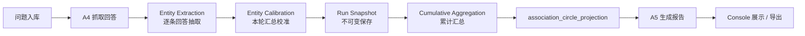

# 安利品牌圈层持续追踪版本设计

日期：2026-06-22  
状态：草案  
适用范围：`/amwaychina` 安利中国专属 Console  
关联功能：题库上传、四平台抓取、实体抽取、图谱校准、圈层报告、HTML 导出、运营后台权限

## 1. 背景

当前安利品牌圈层 Console 已经能完成一轮流程：上传 32 道题，抓取平台回答，抽取实体关系，生成轨道图谱，再生成解读报告。

但这个链路当前更像一次性诊断。真实使用时，同一批问题在不同时间、不同平台状态、不同模型版本下会得到不同答案。品牌方真正关心的会逐步从“这一轮看到了什么”变成：

- 安利的核心联想有没有越来越稳定？
- “四有”战略里哪些词持续被 AI 接住，哪些只是偶然出现？
- 风险认知有没有下降，还是被新的平台继续放大？
- 竞品是否在某些场景里持续替代安利？
- 本轮变化是噪声，还是值得品牌团队行动的信号？

因此下一版要从“单轮报告”升级为“持续追踪系统”。Review 后调整为一个更简单的前台模型：用户只选择时间周期，系统展示该周期内的累计图谱，并在报告里补充与相邻上一周期的变化 Top 5。`run / snapshot / projection / compare` 都保留为内部实现概念，不作为主界面概念暴露。

## 2. 设计目标

1. 保留现有 A3/A4/实体抽取/校准/A5 的职责边界，不把所有逻辑重新塞回 A5。
2. 把每一轮抓取保存成不可变的 `run snapshot`，作为时间周期聚合的底层输入。
3. 前台只提供时间周期选择：最近一次、最近 7 天、最近 14 天、最近 30 天、自定义区间。
4. 图谱展示所选周期内的累计结果；不要求用户理解单轮、累计、对比三种工程视角。
5. 报告只新增一个变化说明：对比相邻上一周期的变化 Top 5；没有上一周期则不展示变化。
6. 让普通品牌路径保持现状，安利专属能力只通过 `/amwaychina` 与开通权限的组织进入。

## 2.1 Review 后的前台用户旅程

1. 用户进入 `/amwaychina`。
2. 选择中心品牌：安利 / 安利中国 / 纽崔莱。
3. 选择时间周期：最近一次、最近 7 天、最近 14 天、最近 30 天、自定义区间。
4. 系统读取该周期内完成的采集 run，生成周期图谱。
5. 系统自动计算相邻上一周期：
   - 最近一次：上一轮完成采集。
   - 最近 7 天：前 7 天。
   - 最近 14 天：前 14 天。
   - 最近 30 天：前 30 天。
   - 自定义区间：向前平移同等时长。
6. 图谱只展示当前周期结果。
7. 报告解释当前周期，并在有可比上一周期时增加“变化 Top 5”。

报告变化说明只处理三个状态：

- 有上一周期，且问题集一致：正常写“相比上一周期变化 Top 5”。
- 有上一周期，但问题集不同：仍写变化 Top 5，但在该节前加一句：`本期与上一周期的问题集不同，以下变化仅作参考，不能直接视为品牌联想的真实趋势。`
- 没有上一周期：不写变化 Top 5，只写：`暂无可比上一周期，本期结果作为后续追踪基线。`

除此之外不新增额外报告分析逻辑，避免把报告再次复杂化。

## 3. 非目标

- 不把普通 Dashboard 改造成安利图谱 Console。
- 不把 A5 重新变成抽词、校准和统计模块。
- 不追求实时抓取过程中每秒都精确刷新最终图谱；动态过程可以展示抽取进度，最终结论以校准后的 snapshot 为准。
- 不在第一版做复杂时间序列预测，只做可解释的历史对比。

## 4. 核心概念

### 4.1 Run

一次完整采集与分析任务。

一个 run 包含：

- 本轮题库版本
- 本轮平台范围
- 每个平台抓取状态
- 每条问题与回答原文
- 实体抽取结果
- 校准后的图谱 projection
- A5 基于本轮 projection 生成的报告
- 导出的 HTML/PDF 版本记录

### 4.2 Cumulative Snapshot

多轮 run 汇总后的累计视图。

累计视图保留单轮结果，并由多个 run 计算得到：

- 累计题目数
- 累计有效回答数
- 累计平台覆盖
- 每个实体的累计提及次数
- 每个实体的稳定性
- 每个实体的轨道归属
- 风险与竞品的累计语境判断
- 与上一轮相比的变化值

### 4.3 Compare Snapshot

对比视图。

最小版本支持：

- 本轮 vs 上一轮
- 本轮 vs 累计均值
- 指定两轮对比

对比输出沿用同一套节点，并在节点上增加变化属性。

### 4.4 Projection Lineage

每个 projection 必须记录它由哪些 run 生成：

- `source_run_ids`：参与计算的 run 清单。
- `source_run_count`：参与计算的 run 数量。
- `source_run_hash`：run 清单 hash，防止同一批 run 重复生成多个不可区分的累计结果。
- `as_of_run_id`：累计视图截止到哪一轮。

同一实体、同一 projection scope 只能有一个 `is_latest = true`。旧 projection 保留为历史版本，最新读取路径只读 latest。

跨轮节点必须优先使用 `lexicon_entity_id` 识别同一实体；题目必须使用 `question_hash` 识别同一道题。名称和上传题号都可以变，稳定 ID 不能跟着变。

## 5. 数据链路

完整链路调整为：



职责边界保持：

- A3 / 上传问题：题目定义、题目标签、题库版本。
- A4：抓取回答、保存原文、记录平台状态。
- Entity Extraction：每条回答入库后抽取实体、关系、证据片段、上下文语气。
- Entity Calibration：本轮完成后做去重、归并、关系确认、平台统计、图谱数据生成。
- Cumulative Aggregation：跨轮汇总，生成累计图谱和对比数据。
- A5：读取已经校准好的 `report_input` 写报告。

## 6. 数据模型建议

### 6.1 Run Snapshot

```json
{
  "run_id": "amway_20260622_001",
  "entity_id": "faf399ab-4d43-40dc-86fe-7847fd04947f",
  "question_set_id": "qs_20260622_v1",
  "started_at": "2026-06-22T10:00:00Z",
  "completed_at": "2026-06-22T10:42:00Z",
  "platforms": ["DeepSeek", "Kimi", "豆包", "元宝"],
  "answer_scope": {
    "question_count": 32,
    "expected_answers": 128,
    "valid_answers": 116,
    "failed_answers": 12
  },
  "projection_id": "projection_run_001",
  "report_id": "report_run_001"
}
```

### 6.2 Node Snapshot

```json
{
  "node_id": "entity_nutrilite",
  "run_id": "amway_20260622_001",
  "entity_name": "纽崔莱",
  "entity_type": "Brand",
  "source_type": "answer_entity",
  "track": "stable",
  "mention_answers": 43,
  "platform_count": 4,
  "question_count": 9,
  "distance_score": 22,
  "gravity_score": 78,
  "evidence_count": 43,
  "sentiment_context": "positive",
  "amway_anchor_ratio": 0.84,
  "position": { "x": 0.52, "y": 0.39 },
  "evidence_refs": [
    "8f0c8e7c-17d0-4f0d-8a10-2b83c8d3a001:ev_0016",
    "8f0c8e7c-17d0-4f0d-8a10-2b83c8d3a001:ev_0020"
  ]
}
```

`evidence_refs` 在单轮 projection 中可以保存短证据号；累计和对比 projection 必须保存 `circle_run_id:evidence_ref`，避免多轮都存在 `ev_0016` 时串到其他轮次。

### 6.3 Cumulative Node

```json
{
  "node_id": "entity_nutrilite",
  "entity_name": "纽崔莱",
  "entity_type": "Brand",
  "track": "stable",
  "runs_observed": 5,
  "runs_total": 5,
  "cumulative_mentions": 218,
  "avg_gravity_score": 81,
  "latest_gravity_score": 78,
  "delta_vs_previous": -3,
  "delta_vs_cumulative_avg": -2,
  "trend": "stable",
  "first_seen_run_id": "amway_20260601_001",
  "latest_seen_run_id": "amway_20260622_001"
}
```

### 6.4 Compare Data

```json
{
  "compare_mode": "latest_vs_previous",
  "base_run_id": "amway_20260615_001",
  "target_run_id": "amway_20260622_001",
  "node_changes": [
    {
      "node_id": "entity_social_companion",
      "entity_name": "社群陪伴",
      "change_type": "strengthened",
      "track_from": "opportunity",
      "track_to": "stable",
      "gravity_delta": 12,
      "mention_delta": 8,
      "reason": "豆包和 Kimi 在退休后陪伴场景中更频繁把社群关系带回安利。"
    }
  ]
}
```

## 7. 图谱交互设计

### 7.1 默认视图：累计图谱

默认进入 `/amwaychina` 时展示累计图谱。

顶部需要清楚标识当前视角：

- 累计视图
- 最新一轮
- 对比上轮

建议文案：

- `累计图谱`：基于全部历史采集形成的稳定判断。
- `本轮图谱`：只看最近一次采集结果。
- `对比上轮`：看本轮相对上一轮的增强、减弱、新增和消失。

### 7.2 轨道规则

继续保留三条主轨：

- 稳定轨：已经被平台稳定带回安利的资产。
- 机会轨：有一定信号，但还需要品牌内容继续锚定。
- 观察轨：出现过，但关系弱、语境不稳定或平台覆盖不足。

风险不混入普通轨道。风险保持单独入口和风险关系图。

### 7.3 节点视觉

节点默认颜色尽量克制，避免一屏出现过多颜色。

推荐规则：

- 未聚焦：浅灰或低饱和蓝灰。
- Hover 稳定轨：稳定轨节点转为绿色，其他节点淡出。
- Hover 机会轨：机会轨节点转为黄色，其他节点淡出。
- Hover 观察轨：观察轨节点转为灰色，其他节点淡出。
- 风险聚焦：风险关系图单独展示，使用红色系。

节点大小不要只由提及次数决定。建议综合：

- 提及回答数
- 覆盖平台数
- 覆盖问题数
- 是否在安利上下文中出现
- 是否跨轮持续出现

### 7.4 变化表达

对比模式下，节点增加变化标识：

- 增强：向中心轻微移动，显示上升箭头。
- 减弱：向外轻微移动，显示下降箭头。
- 新增：使用细描边光圈，标注“新出现”。
- 消失：只在对比列表展示，不默认铺在主图上。
- 轨道迁移：从机会轨进入稳定轨，或从稳定轨滑出到机会轨，需要在报告中解释。

### 7.5 点击节点浮层

点击节点后，在图谱上覆盖浮层，不放到图下方。

浮层必须回答四个问题：

1. 它和安利的关系是什么？
2. 本轮/累计有多少问题和回答支持？
3. 哪些平台更容易提到它？
4. 代表性原文是什么？

如果节点是战略词，还要补充：

- 它属于“四有”的哪一个维度。
- 是否真的被 AI 回答带回安利。
- 是否被风险、竞品或旧认知遮蔽。

如果节点是风险，必须判断上下文语气：

- 平台在澄清安利与风险无关。
- 平台在提示安利需要注意这个风险。
- 平台把安利和风险直接绑定。
- 原文证据不足，不能下结论。

风险不能只凭风险词命中入图。

## 8. 报告设计

### 8.1 默认报告：累计报告

累计报告要回答：

- 安利当前在 AI 叙事中的总体位置是什么？
- 四有战略里哪些被接住，哪些仍然薄弱？
- 风险认知是否遮蔽了“有保障”和“有价值”？
- 竞品在哪些场景替代了安利？
- 本周应该优先做哪三件事？

### 8.2 新增章节：与上轮相比

报告需要新增一个稳定章节：

## 和上一轮相比，发生了什么

这一章不列全部变化，只讲最重要的 3 到 5 个变化。

每个变化必须包含：

- 变化标题
- 变化类型：增强、减弱、新增、消失、轨道迁移
- 涉及节点
- 涉及平台
- 涉及问题
- 原文证据
- 对安利品牌动作的意义

示例结构：

```markdown
### 1. 社群陪伴从机会轨靠近稳定轨

这一轮“社群陪伴”不再只是退休场景里的泛泛建议。豆包和 Kimi 在 55 岁退休后陪伴、长期价值感等问题中，更频繁把社群关系带回安利。

证据来自 3 道问题、11 条回答，覆盖豆包、Kimi、元宝。它说明“有陪伴”开始有机会被 AI 接住，但仍要警惕平台把它解释成卖货群或熟人关系压力。

下一轮需要补两类题：一类点名安利社群，一类不点名只问退休后陪伴，看平台是否会主动把安利带回来。
```

### 8.3 单轮报告

单轮报告只解释某一轮，不混入累计判断。

适合用于：

- 验证一次内容投放后的短期反馈。
- 回看某个平台异常波动。
- 检查某轮抓取质量。

### 8.4 导出

导出 HTML 时需要包含：

- 报告正文
- 当前图谱截图或可交互图谱的静态嵌入
- 当前视角说明：累计 / 本轮 / 对比
- 数据口径
- 问题列表
- 平台答案附录

导出文件名建议：

- `amway-circle-cumulative-report-YYYY-MM-DD.html`
- `amway-circle-run-report-<run_id>.html`
- `amway-circle-compare-<base_run_id>-<target_run_id>.html`

## 9. 评分与汇总原则

### 9.1 单轮远近

单轮节点远近建议由以下因素决定：

- 安利上下文锚定：回答中是否在安利前后上下文提及该实体。
- 问题覆盖：多少个不同问题支持该实体。
- 平台覆盖：多少个平台出现。
- 证据数量：多少条有效回答提及。
- 语义关系：是产品/方案/战略/风险/竞品/泛场景。
- 语气方向：正向、质疑、负向、澄清、无关。

### 9.2 累计远近

累计远近不能简单累加提及次数。建议加入持续性：

- 出现轮数 / 总轮数
- 最近三轮平均位置
- 本轮是否仍然出现
- 是否跨平台持续出现
- 是否持续在安利上下文出现

### 9.3 风险判断

风险判断必须由上下文决定。

例如“直销”“KOC”“ABO”“安利事业机会”属于安利体系内部实体，默认不作为风险。

只有在原文把它们放进质疑、合规、传销、拉人头、熟人压力、夸大收益等语境时，才进入风险候选。

风险分为：

- 负向绑定：回答明确把安利与风险联系起来。
- 风险提示：回答提醒安利模式需要合规或谨慎。
- 正向澄清：回答说明安利与某风险不同，或强调合法合规。
- 无关命中：风险词出现，但上下文与安利无直接关系。

只有前两类进入风险关系图。正向澄清进入“信任修复证据”，无关命中不进入图谱结论。

## 10. 前端信息架构

### 10.1 顶部入口

`/amwaychina` 是正式入口。

当用户在品牌空间里选中安利圈层实体时，顶部栏应切到安利语义：

- 副标题：安利品牌圈层
- 主按钮：进入安利专项

普通品牌保持：

- 副标题：品牌情报
- 主按钮：新建品牌

### 10.2 主导航

建议减少入口，只保留三块：

1. 图谱
2. 报告
3. 资产库

资产库下再承载：

- 实体词库
- 历史问题
- 历史采集

不要把规则、证据、问题、追踪全部作为同级主入口。

### 10.3 图谱页控件

图谱页上方保留：

- 视角切换：累计 / 本轮 / 对比
- Run 选择器
- 节点筛选：全部 / 战略词 / 回答词 / 风险 / 竞品
- 轨道筛选：稳定 / 机会 / 观察

默认不要把所有筛选器展开成复杂面板。

### 10.4 历史采集页

历史采集页要能回答：

- 跑了多少轮？
- 每轮采集了哪些平台？
- 每轮有效回答多少？
- 每轮生成了什么报告？
- 哪一轮是当前累计视图的最新输入？

列表字段建议：

- 采集时间
- 题库版本
- 平台范围
- 有效回答
- 失败回答
- 主要变化
- 查看本轮
- 对比上一轮
- 导出

## 11. 后端实现切片

### Slice 1：保存 run snapshot

目标：每轮抓取结束后，能稳定保存不可变快照。

任务：

- 新增或复用 run 记录表。
- 保存题库版本、平台状态、回答统计。
- 保存本轮 projection。
- 保存本轮 report_input。
- API 支持按 entity 查询历史 run。

验收：

- 同一实体可以看到多轮历史。
- 旧 run 不会被新 run 覆盖。
- 单轮报告可以按 run_id 重新打开。

### Slice 2：累计 aggregation

目标：基于多轮 run 生成累计图谱。

任务：

- 读取同一实体下所有成功 run。
- 合并同名实体和同义实体。
- 计算累计提及、平台覆盖、出现轮数、最近趋势。
- 输出 cumulative projection。

验收：

- 默认图谱读取累计 projection。
- 单轮图谱仍可打开。
- 累计结果能追溯到具体 run 和 evidence_refs。

### Slice 3：对比 projection

目标：支持本轮与上一轮对比。

任务：

- 选择 base_run 和 target_run。
- 计算节点新增、消失、增强、减弱、轨道迁移。
- 输出 compare projection。

验收：

- 图谱能显示变化标识。
- 报告能读取 top changes。
- 变化结论能追溯到问题和平台原文。

### Slice 4：报告升级

目标：报告默认讲累计结论，并增加变化篇章。

任务：

- A5 输入增加 `view_scope`：cumulative / run / compare。
- A5 读取 `top_changes`。
- 报告正文按视角生成。
- 导出 HTML 包含图谱和视角口径。

验收：

- 累计报告不再写成单轮报告。
- 对比报告能讲清本轮变化。
- 导出 HTML 与页面展示一致。

### Slice 5：前端体验

目标：用户能在一个界面里理解累计、单轮、对比。

任务：

- 增加视角切换。
- 增加历史 run 列表。
- 增加对比选择器。
- 图谱节点增加变化标识。
- 报告页显示当前视角。

验收：

- 默认累计视图清晰。
- 切到本轮后，节点和报告都切换到本轮。
- 切到对比后，用户能看到增强、减弱、新增、消失。

## 12. API 草案

```http
GET /api/v1/amwaychina/entities/{entity_id}/circle-runs?limit=30
GET /api/v1/amwaychina/entities/{entity_id}/circle-projection?scope=cumulative
GET /api/v1/amwaychina/entities/{entity_id}/circle-projection?scope=run&run_id=...
GET /api/v1/amwaychina/entities/{entity_id}/circle-projection?scope=compare&base_run_id=...&target_run_id=...
GET /api/v1/amwaychina/entities/{entity_id}/circle-node-insight?projection_id=...&node_id=...
POST /api/v1/amwaychina/entities/{entity_id}/reports
```

`POST /reports` 请求体：

```json
{
  "view_scope": "compare",
  "base_run_id": "amway_20260615_001",
  "target_run_id": "amway_20260622_001",
  "export_format": "html"
}
```

## 13. 验收标准

### 数据

- 每轮采集都有独立 run_id。
- 每轮问题、平台回答、抽取结果和报告可回溯。
- 累计图谱可追溯到多个 run。
- 对比图谱可说明每个变化来自哪些 run。

### 图谱

- 默认展示累计图谱。
- 本轮视图和累计视图可切换。
- 对比视图能看到增强、减弱、新增、消失。
- 风险默认可见，但风险关系图与正向轨道分开。
- 点击节点浮层能看到关系解释、平台分布、问题和原文。

### 报告

- 报告第一屏先给结论。
- 报告能讲四有战略的累计判断。
- 报告能讲相对上轮变化。
- 报告引用原文时必须给平台和问题。
- 风险结论必须区分正向澄清、风险提示、负向绑定和无关命中。

### 权限与入口

- `/amwaychina` 只对开通权限组织可见。
- 管理员可以给组织或用户开通安利专项权限。
- 普通品牌仍走标准 Dashboard。
- 品牌空间命中安利实体时，顶部入口切到安利专项。

## 14. 第一版建议

第一版不要一次做完整时间序列平台。

建议先做：

1. 保存 run snapshot。
2. 历史 run 列表。
3. 默认累计 projection。
4. 最新 run vs 上一 run 对比。
5. 报告新增“和上一轮相比”章节。
6. HTML 导出带当前图谱和视角口径。

这样能让安利团队先从“单次诊断”进入“持续追踪”，同时不扩大到难以验证的预测系统。

## 15. 待确认问题

1. 累计视图是否只包含成功 run，还是允许包含部分平台失败的 run？
2. 历史 run 是否允许管理员删除，还是只能标记为排除累计？
3. 对比默认取上一轮，还是取上一轮成功且平台覆盖相同的 run？
4. 累计评分是否需要给最近三轮更高权重？
5. 导出 HTML 是否需要包含完整答案附录，还是只放代表性证据并提供下载链接？
