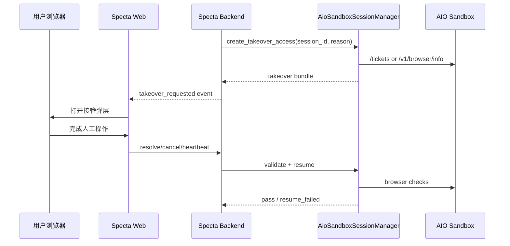

# Specta AIO 前端接管协议设计

> 日期：2026-03-31
> 状态：Draft
> 目标：定义 Specta Web 如何基于 AIO 官方接管能力，向用户提供可控的 browser-ui 接管和 VNC fallback，而不自创一套脱离官方接口的浏览器控制协议。

---

## 1. 一句话结论

Specta 的接管协议应分成两层：

1. `接管控制协议`
   - 由 Specta 自己定义，用于前后端协商接管生命周期
2. `接管渲染通道`
   - 由 AIO 官方能力承载
   - `Canvas + CDP/browser-ui` 为主
   - `VNC` 为 fallback

也就是说，Specta 定义的是“什么时候接管、如何恢复、如何审计”，不是重新定义浏览器远控底层协议。

本设计中的 `takeover_state`、`heartbeat`、`resolve/cancel` 语义以 [design-aio-runtime-contracts-2026-04-01.md](/D:/AGEO-worktrees/browser-operator-design/docs/design-aio-runtime-contracts-2026-04-01.md) 为准。

---

## 2. 官方约束

本协议必须服从以下官方事实：

1. 官方浏览器 guide 明确给出两种接管方式：
   - `VNC`
   - `CDP + @agent-infra/browser-ui`
2. `Canvas + CDP`
   - 默认只覆盖当前页面内容
3. `VNC`
   - 提供完整桌面与完整浏览器
4. 鉴权 guide 明确给出：
   - JWT
   - `POST /tickets`
   - VNC ticket URL
5. 官方没有像 VNC 那样，给出 browser-ui 的标准 ticket URL 模式

所以 Specta 的协议必须建立在这些边界上。

---

## 3. 设计目标

### 必须做到

1. 让用户在 Specta Web 内完成接管
2. 默认优先 `Canvas + CDP`
3. 遇到完整浏览器需求时自动降级 `VNC`
4. 接管完成后自动恢复 Agent 流程
5. 全链路可审计

### 不追求

1. 在 V1 里完整复刻浏览器全部壳层 UI
2. 让前端直接持有 AIO 原始 JWT
3. 让用户直接操作原始 AIO 控制台

---

## 4. 参与方



---

## 5. 接管模式矩阵

## 5.1 `canvas_cdp`

默认主模式。

适用于：

1. 登录表单输入
2. 验证码后的页面继续操作
3. 普通对话提交与等待
4. 单页浏览器内交互

## 5.2 `vnc_fallback`

兜底模式。

适用于：

1. 需要完整 Tabs
2. 需要多窗口
3. 需要文件选择器或桌面级操作
4. browser-ui 连接失败
5. CDP heartbeat 不稳定

## 5.3 `debug_vnc`

只用于内部排障，不作为默认用户路径。

---

## 6. 什么时候必须切 VNC

以下情况不应强撑 `Canvas + CDP`：

1. 平台打开了新窗口或需要显式切换 tab
2. 需要完整浏览器壳层信息
3. 需要上传本地文件并触发文件对话框
4. browser-ui 无法稳定恢复连接
5. 用户明确请求“看完整浏览器”

---

## 7. 接管状态机

统一状态只允许：

1. `requested`
2. `issued`
3. `active`
4. `resolved`
5. `expired`
6. `cancelled`
7. `resume_failed`

---

## 8. Backend 到 Frontend 的事件协议

建议通过现有 Specta WebSocket 发送以下事件。

## 8.1 `aio_takeover_requested`

```json
{
  "type": "aio_takeover_requested",
  "takeover_id": "takeover_xxx",
  "session_id": "sess_xxx",
  "workspace_id": "ws_xxx",
  "task_id": "task_xxx",
  "platform": "deepseek",
  "reason": "login_required",
  "preferred_mode": "canvas_cdp",
  "fallback_mode": "vnc_fallback",
  "display": {
    "title": "需要人工登录 DeepSeek",
    "description": "请在接管窗口完成登录，完成后点击继续"
  },
  "access": {
    "canvas_config_url": "/api/v1/aio/takeovers/takeover_xxx/canvas-config",
    "vnc_url": "/api/v1/aio/takeovers/takeover_xxx/vnc-url"
  },
  "expires_at": "2026-03-31T12:00:00Z"
}
```

## 8.2 `aio_takeover_status`

```json
{
  "type": "aio_takeover_status",
  "takeover_id": "takeover_xxx",
  "takeover_state": "issued|active|resolved|expired|resume_failed|cancelled",
  "message": "..."
}
```

## 8.3 `aio_takeover_closed`

```json
{
  "type": "aio_takeover_closed",
  "takeover_id": "takeover_xxx",
  "resolution": "resolved|cancelled|expired"
}
```

---

## 9. Frontend 到 Backend 的 HTTP 协议

## 9.1 `POST /api/v1/aio/takeovers/{takeover_id}/heartbeat`

## 9.2 `POST /api/v1/aio/takeovers/{takeover_id}/resolve`

用户表示“我已经操作完了，请继续”，必须走 resolve API，不再使用自定义 WS 事件。

## 9.3 `POST /api/v1/aio/takeovers/{takeover_id}/cancel`

用户主动取消接管，必须走 cancel API，不再使用自定义 WS 事件。

---

## 10. Access Provisioning 规则

## 10.1 VNC

严格按官方鉴权文档：

1. Backend 使用 JWT 调 `POST /tickets`
2. 获取短时 ticket
3. 生成：

```text
/vnc/index.html?ticket={ticket}&path=websockify%3Fticket%3D{ticket}
```

4. 返回给前端

## 10.2 Canvas / browser-ui

这里必须谨慎。

官方只给了：

1. `BrowserCanvas`
2. `cdpEndpoint`

但没有给出像 VNC 那样的标准 ticket URL 模式。  
因此 Specta V1 不应假设：

1. 前端可以直接拿原始 AIO JWT
2. 前端可以直接直连原始 AIO `cdp_url`

### V1 推荐实现

由 Specta Backend/BFF 提供：

1. `GET /api/v1/aio/takeovers/{takeover_id}/canvas-config`

返回：

```json
{
  "mode": "canvas_cdp",
  "cdp_endpoint": "/api/v1/aio/takeovers/takeover_xxx/cdp-relay",
  "heartbeat_interval_ms": 10000,
  "display": {
    "width": 1280,
    "height": 800
  }
}
```

其中：

1. `cdp-relay` 由 Specta 代持 AIO 凭证
2. 前端只访问 Specta 域名下的受控 endpoint
3. takeover 过期后 relay 自动失效

---

## 11. 接管发起流程

1. 平台 Skill 检测到共享 blocker
2. Agent 调用 `aio_browser_request_takeover`
3. Backend 请求 SessionManager 创建 access bundle
4. SessionManager：
   - 锁定 automation lease
   - 生成 takeover 记录
   - 准备 VNC ticket
   - 准备 Canvas config
5. Backend 向前端推送 `aio_takeover_requested`
6. 前端打开弹层

---

## 12. 接管结束与恢复流程

1. 用户在弹层中完成登录/验证
2. 用户点击“继续执行”
3. 前端调用 `resolve`
4. Backend 进入 resume gate
5. 调用平台 skill 的就绪检查：
   - `aio_browser_perceive_page`
   - `aio_browser_detect_captcha`
   - 必要时 `aio_browser_extract_error_state`
6. 若页面恢复就绪：
   - 解除 human takeover lock
   - 恢复 Agent 自动执行
7. 若未恢复：
   - 标记 `resume_failed`
   - 前端提示继续接管或转 VNC

---

## 13. Heartbeat 与 reopen 规则

1. 前端在 Canvas/VNC ready 后启动 heartbeat
2. `issued -> active` 的权威条件是首个 heartbeat 成功
3. heartbeat 超时可导致 `issued/active -> expired`
4. 页面刷新后如需 reopen，必须重新请求 access bundle
5. resolve/cancel/expire 后旧 bundle 立即失效

---

## 14. 接管模式与业务边界

1. 主业务模式：
   - `canvas_cdp`
2. 兜底模式：
   - `vnc_fallback`
3. 内部调试模式：
   - `debug_vnc`

接管协议只负责：

1. 何时进入接管
2. 如何传 access
3. 如何结束接管
4. 如何恢复 Agent

不负责：

1. 页面元素定位策略
2. 平台业务抽取逻辑
3. session 回收策略本身

---

## 15. 非目标

1. 不在本协议里复刻完整浏览器 tab strip
2. 不在协议层开放任意 shell/file/code 控制
3. 不定义前端 UI 组件细节

---

## 16. 下一步

1. 与 Access Relay / Security 文档对齐 HTTP 接口
2. 与 Frontend Takeover UI 文档对齐 heartbeat/reopen 细节
3. 实现阶段取消旧 `aio_takeover_user_ready` 事件写法

---

## 17. 相关文档

1. 共享合同：[design-aio-runtime-contracts-2026-04-01.md](/D:/AGEO-worktrees/browser-operator-design/docs/design-aio-runtime-contracts-2026-04-01.md)
2. Access Relay / Security：[design-aio-access-relay-security-2026-03-31.md](/D:/AGEO-worktrees/browser-operator-design/docs/design-aio-access-relay-security-2026-03-31.md)
3. Frontend Takeover UI：[design-aio-frontend-takeover-ui-2026-03-31.md](/D:/AGEO-worktrees/browser-operator-design/docs/design-aio-frontend-takeover-ui-2026-03-31.md)

---

## 18. 参考资料

1. AIO 浏览器与 VNC: https://sandbox.agent-infra.com/zh/guide/basic/browser
2. AIO 鉴权: https://sandbox.agent-infra.com/zh/guide/basic/authentication
3. AIO API 文档: https://sandbox.agent-infra.com/zh/api
