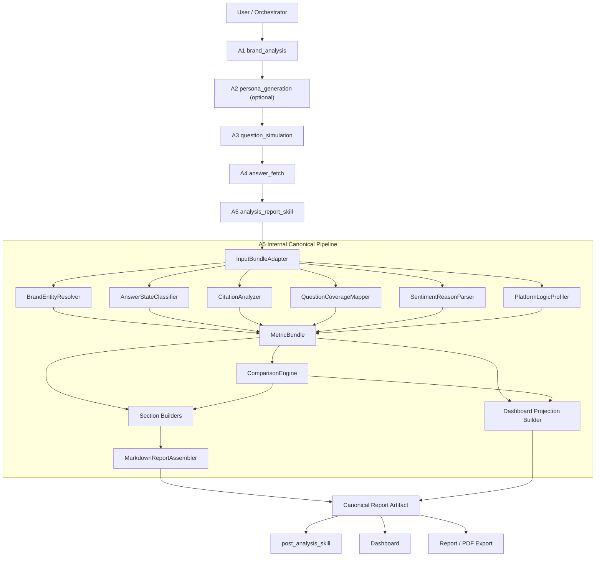
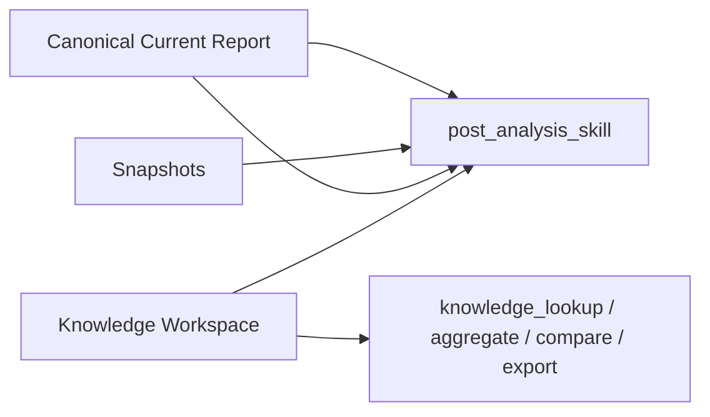

# GEO Canonical Implementation Plan (2026-04-17)

## Goal

Implement the GEO redesign as a deterministic analysis layer that:

- preserves A1 / A2 / A3 / A4 as producer layers
- preserves orchestrator-facing report and follow-up capabilities
- replaces the legacy A5 report/dashboard/export contract
- supports hard-cut launch with old brand-generated analysis data purged

## Terminology Rule

To align with the current AGEO architecture:

- `Public Skill` means orchestrator-facing coarse capability
- `Executor` means the concrete implementation entrypoint behind that skill
- `Internal Analyzer` means deterministic module inside the executor
- `Artifact` means durable writeback consumed by report/dashboard/follow-up

This plan therefore keeps:

- `analysis_report_skill` as a public skill
- `A5` as the report executor behind that public skill
- GEO analyzers as internal A5 modules rather than new public skills

Frozen decisions:

- canonical platform value is `yuanbao`
- launch cleanup may fully clear brand entities and monitoring schedules
- users / organizations / auth remain preserved
- canonical report transport type is `report`
- canonical report metadata uses `artifact_kind=geo_report` and
  `report_kind=panorama|scenario`

## 1. Architecture Decision

### 1.1 What stays

- producer stages A1 / A2 / A3 / A4
- orchestrator public skill surface:
  - `analysis_report_skill`
  - `post_analysis_skill`
  - `knowledge_lookup`
  - `knowledge_aggregate`
  - `knowledge_compare`
  - `knowledge_export`
- history primitives:
  - `KnowledgeWorkspaceService`
  - `AnalysisSnapshot`
  - `MonitoringSchedule.baseline_data` concept

### 1.2 What gets replaced

- A5 internal report generation logic
- legacy report artifact shape in current A5 writeback
- dashboard aggregation based on `summary_metrics / scenario_matrix / source_overview`
- frontend markdown/export fallback computation

## 2. Chain Design

### 2.1 Runtime chain



### 2.2 Follow-up and history chain



### 2.3 Why the public skill surface should stay coarse-grained

The new analysis modules should not all be exposed directly to the
orchestrator in phase 1.

Reason:

- the product capability remains “generate a report”
- the engineering requirement is “make report generation deterministic”
- exposing every internal analyzer would increase orchestration complexity without
  product benefit

Recommended public surface:

- keep `analysis_report_skill` as the primary report entrypoint
- keep `post_analysis_skill` as the primary current-report follow-up entrypoint
- optionally add deeper dedicated follow-up skills later only if user-facing
  intent routing truly benefits from it

## 3. Public Skill and Internal Analyzer Boundary

### 3.1 `InputBundleAdapter`

Responsibility:

- normalize A1/A2/A3/A4 outputs into canonical GEO objects
- resolve legacy aliases
- apply enum normalization
- enforce null/ordering/domain rules from GEO docs

This is the safety boundary of the redesign.

### 3.2 Deterministic internal analyzers

| Internal analyzer | Primary output | Complexity | Notes |
| --- | --- | --- | --- |
| `BrandEntityResolver` | answer-level mentioned brand entities | low-medium | mainly deterministic alias resolution |
| `AnswerStateClassifier` | answer-level state classification | low | pure rule engine |
| `CitationAnalyzer` | answer-level and aggregate citation structure | medium-high | needs taxonomy |
| `QuestionCoverageMapper` | normalized question diagnostics | medium | limited by current A3 richness |
| `SentimentReasonParser` | reason/topic/attribution outputs | high | biggest structured semantic gap |
| `PlatformLogicProfiler` | logic archetype and platform profile outputs | medium-high | requires stable rules |
| `ComparisonEngine` | scenario vs panorama delta bundle | medium | depends on explicit baseline binding |

### 3.3 Builders and assembler

`SectionBuilders` should:

- consume already computed canonical bundles
- only format/report facts
- never recalculate business metrics

`MarkdownReportAssembler` should:

- assemble ordered sections
- emit final markdown
- preserve section metadata for downstream rendering/export

## 4. Persistence Design

### 4.1 Canonical report artifact

Recommended writeback shape:

```json
{
  "meta": {},
  "input_bundle": {},
  "skill_outputs": {},
  "metric_bundle": {},
  "comparison_bundle": {},
  "insight_candidates": [],
  "sections": {},
  "full_markdown": "",
  "dashboard_projection": {}
}
```

Canonical transport/writeback target:

- `Message.output_type = report`
- `extra_metadata.artifact_kind = geo_report`
- `extra_metadata.report_kind = panorama | scenario`

Migration note:

- `report_baseline` remains only as a temporary compatibility input during
  cutover

### 4.2 Snapshot design

Snapshots should no longer rely only on legacy `metrics/report_data`.

Recommended options:

1. store canonical report artifact ref plus compact summary metrics
2. store compact canonical bundle directly in snapshot raw payload

Preferred option for phase 1:

- store compact canonical summary + artifact ref

This keeps follow-up comparison possible without duplicating the full artifact.

### 4.3 Knowledge design

Preserve current A1/A4 fact ingestion because it already supports:

- historical answer lookup
- citation lookup
- brand/competitor context reuse

Add canonical report awareness by:

- allowing follow-up skills to combine canonical current artifact + history facts
- avoiding a second redundant report-only knowledge store in phase 1

## 5. Follow-up and History Design

### 5.1 Current report follow-up

`post_analysis_skill` should continue to exist, but its read contract changes.

Current inputs:

- old `fetch_results`
- old `metrics`
- old `report`

Target inputs:

- `input_bundle`
- `metric_bundle`
- `comparison_bundle`
- `sections`
- `dashboard_projection`
- snapshot summary if historical delta is requested

### 5.2 History-oriented public skills

These remain valuable and should be preserved:

- `knowledge_lookup`
- `knowledge_aggregate`
- `knowledge_compare`
- `knowledge_export`

Target design:

- history queries continue to read `KnowledgeWorkspaceService` facts
- current-report follow-up reads canonical current artifact first
- historical compare can combine snapshot summaries + knowledge evidence

### 5.3 Product-level rule

When the user asks about “this report / this run / why this happened”, prefer:

- `post_analysis_skill`

When the user asks about “historical / across previous runs / export all prior
evidence”, prefer:

- `knowledge_*`

This rule already matches the current orchestrator direction and should be kept.

### 5.4 Launch consequence after data purge

Immediately after launch purge, history-oriented capabilities will have reduced
coverage until new runs accumulate.

Expected temporary impact:

- `compare_snapshots` may be unavailable for some brands
- `knowledge_compare` may return insufficient history
- trend/delta boards may remain empty or `null`

This is acceptable under the current rollout assumption and should be reflected
in UX copy and null-state handling.

## 6. Dashboard Redesign

### 6.1 Current problem

Current dashboard logic is tightly coupled to legacy A5 fields and multiple
fallback reconstruction paths.

This should be deleted after cutover.

### 6.2 New dashboard principle

Dashboard must consume a backend-produced `dashboard_projection`, not infer facts
from markdown or legacy report fields.

### 6.3 Recommended board set

1. `VisibilityBoard`
2. `CitationVisibilityBoard`
3. `QuestionDiagnosticsBoard`
4. `SentimentRiskBoard`
5. `PlatformProfileBoard`
6. `ScenarioDeltaBoard` for scenario reports only
7. `RecommendationsBoard`

### 6.4 Backend responsibility

Backend should provide:

- board-level payloads already shaped for UI
- no business metric recomputation in frontend
- explicit `null` values when a metric is not computable

## 7. Export Design

Recommended rule:

- report markdown authority stays on backend
- PDF/export consumes canonical sections or canonical markdown
- frontend export layer becomes presentation-only

This allows removal of current markdown fallback generation in
`canvasExportShared.ts`.

## 8. Data Cleanup Strategy

### 8.1 Launch cleanup policy

At launch, purge old brand-generated analysis data.
Do not purge:

- users
- organizations
- auth/identity data

### 8.2 Data categories to purge

Recommended purge scope:

- `analysis_snapshots`
- `analysis_tasks`
- `task_runs`
- task-run child attempts
- old report/output messages for brand analysis sessions
- `knowledge_records`
- `knowledge_segments`
- monitoring baseline payloads in `MonitoringSchedule.baseline_data`
- any old cached dashboard/report derived payloads
- legacy snapshot raw payloads that only preserve old A5 report structures
- brand entities when doing full launch reset
- sessions and messages under those brand entities
- monitoring schedules tied to those brand entities

### 8.3 Data categories to preserve

Recommended preserve scope:

- user account tables
- organization tables
- auth/identity tables

### 8.4 Cleanup design constraint

Even with full brand-shell cleanup, account-system boundaries must remain strict.

Allowed cleanup target:

- brand-scoped business data
- entity rows and schedule rows tied to those brands
- sessions/messages/artifacts/tasks/history under those brands

Forbidden cleanup target:

- users
- organizations
- auth/identity system data

### 8.5 First-run recreation requirement after full cleanup

Because launch cleanup may remove `Entity` rows and schedules, the post-launch
product flow must support:

- creating or recreating a brand entity on first analysis
- treating the first new run as the fresh canonical baseline
- showing empty/null history states until enough new runs accumulate

### 8.6 Frozen recreation path

Phase-1 recreation path is now frozen as:

1. user enters from empty brand list / no-brand state
2. frontend or backend creates a new brand entity
3. system creates a session bound to that entity
4. first analysis run writes the first canonical report artifact and first
   history baseline

Non-goal for phase 1:

- introducing a second session-only launch path that bypasses entity creation

## 9. Phase Plan

### Phase 0. Contract freeze

Deliverables:

- canonical objects and enums frozen
- `yuanbao` canonical platform decision frozen
- scenario vs panorama naming frozen
- baseline binding rule frozen
- terminology rule frozen: public skill vs internal analyzer vs artifact
- single `report` transport typing frozen
- entity-first first-run recreation flow frozen

Dependencies:

- none

### Phase 1. Adapter and contract scaffolding

Deliverables:

- `InputBundleAdapter`
- canonical object schemas
- fixture-based tests using GEO example IO docs

Dependencies:

- Phase 0

### Phase 2. Deterministic analysis modules

Deliverables:

- `BrandEntityResolver`
- `AnswerStateClassifier`
- `CitationAnalyzer`
- `QuestionCoverageMapper`
- `SentimentReasonParser`
- `PlatformLogicProfiler`
- `MetricBundle`
- `ComparisonEngine`

Dependencies:

- Phase 1

### Phase 3. Canonical report assembly

Deliverables:

- section builders
- markdown assembler
- canonical artifact writeback
- snapshot writeback adjustment
- report transport/metadata typing cut to the new canonical shape

Dependencies:

- Phase 2

### Phase 4. Follow-up rebinding

Deliverables:

- `post_analysis_skill` consumption updated
- snapshot compare adjusted
- current-report drill-down updated

Dependencies:

- Phase 3

### Phase 5. Dashboard and export cutover

Deliverables:

- new backend dashboard projection
- new dashboard boards
- frontend report rendering cut to canonical markdown
- export/PDF cut to canonical sections or markdown
- frontend/report consumers migrated off `report_baseline`

Dependencies:

- Phase 3

### Phase 6. Data purge and legacy removal

Deliverables:

- one-time purge script / admin operation
- old dashboard/report compatibility removed
- rollout verification checklist
- full brand-shell reset supported for launch
- first-run brand recreation path verified after reset

Dependencies:

- Phase 4 and Phase 5

## 10. Dependency Order

Must be serial:

1. contract freeze
2. adapter
3. deterministic analyzer outputs
4. canonical artifact

Can partially overlap after canonical artifact exists:

- follow-up rebinding
- dashboard cutover
- export cutover

Should be last:

- data purge
- legacy code removal

## 11. Design Review Checks

This design was checked against current repo principles and current feature
shape.

### 11.1 Alignment with agent-first layering

Aligned:

- public capability remains coarse-grained
- executor/implementation stays behind the public skill
- deterministic mechanics move into code modules
- artifact writeback remains first-class

Rejected by design:

- exposing every GEO analyzer as a public skill
- creating a GEO-only parallel capability system outside the current harness

### 11.2 Alignment with current post-analysis boundary

Aligned:

- `post_analysis_skill` remains read-only on existing results
- data reacquisition stays under fetch/report runtime, not follow-up analysis

### 11.3 Alignment with rollout assumption

Aligned:

- no long-lived legacy report/dashboard compatibility is required
- purge cost is acceptable because there is no external live-user dependency
- full brand-shell reset is acceptable because account-level continuity is kept

### 11.4 Remaining gray zone now made explicit

The remaining migration-sensitive area is no longer a product ambiguity but an
execution concern:

- ensuring all report consumers move from split transport typing
  (`report_baseline` / `report`) to the single canonical `report` transport

## 12. Complexity Assessment

| Workstream | Complexity | Main risk |
| --- | --- | --- |
| contract freeze | medium | naming and enum instability |
| adapter | medium | hidden producer inconsistencies |
| citation analyzer | medium-high | taxonomy completeness |
| sentiment reason parser | high | structured semantic extraction quality |
| platform profiler | medium-high | rule stability |
| comparison engine | medium | baseline binding correctness |
| report assembly | medium | section completeness, not complexity |
| follow-up rebinding | medium | old raw payload assumptions |
| dashboard redesign | medium-high | removing fallback debt cleanly |
| purge rollout | medium | deleting enough, not too much |

## 13. Immediate Next Steps

1. Freeze the field mapping and missing-field derivation rules.
2. Apply `hunyuan -> yuanbao` normalization everywhere at the canonical boundary.
3. Freeze post-purge null-state handling for history/snapshot features.
4. Apply single-transport report typing across backend and frontend consumers.
5. Freeze first-run brand recreation flow after full cleanup.
6. Design the canonical schema modules and A5 adapter boundary.
7. Start implementation from the adapter, not from frontend or markdown.
