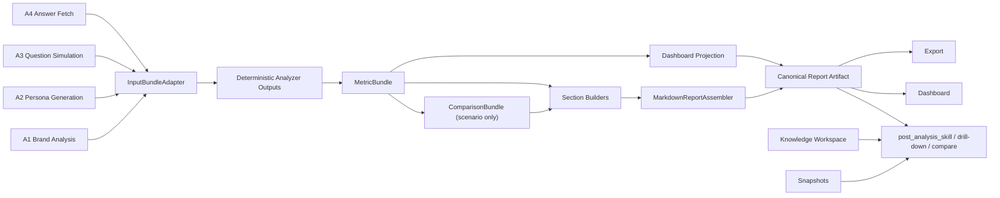

# GEO Canonical Redesign State (2026-04-17)

## Purpose

This document is the working state anchor for the GEO report/dashboard refactor.
It records the current shared understanding, frozen decisions, open risks, and
the review/update rules for the redesign.

Related documents:

- `docs/design-geo-canonical-field-mapping-2026-04-17.md`
- `docs/design-geo-canonical-implementation-plan-2026-04-17.md`

## Scope

This redesign covers:

- the A5 analysis/report pipeline
- report artifact contract
- dashboard data contract and boards
- export contract
- follow-up analysis consumption of report artifacts
- one-time purge of old brand-generated analysis data at launch

This redesign does not cover:

- A1 / A2 / A3 / A4 producer protocol rewrites
- user/account/auth data deletion
- partial compatibility for legacy GEO report artifacts after launch

## Current State Summary

### 1. Upstream producer layer must remain stable

The current system already has reusable producer outputs:

- A1 produces brand profile and competitors via `app/schemas/brand.py`
- A2 produces personas, scenarios, and pain points via `app/schemas/persona.py`
- A3 produces operational question artifacts in `app/workflow/nodes_a3.py`
- A4 produces answer/citation fetch results in `app/schemas/fetch.py`

These producers are inputs to the redesign and should be adapted, not broken.

### 2. Current A5 is still a legacy report contract

Current A5 persists a mixed artifact composed of:

- `summary_metrics`
- `scenario_matrix`
- `source_overview`
- `mention_sentiment_analysis`
- `report_markdown`
- `report_v2_sections`

Relevant code:

- `aeo-platform/backend/app/workflow/a5/contract.py`
- `aeo-platform/backend/app/workflow/a5/persistence.py`
- `aeo-platform/backend/app/workflow/a5/prompt.py`

This is not the deterministic contract described in the GEO docs.

### 3. Current dashboard/export layer is tightly coupled to legacy A5 fields

Current dashboard logic reconstructs report boards from legacy fields and
fallbacks:

- `aeo-platform/backend/app/services/analytics_service.py`
- `frontend/src/components/dashboard/MentionBoardReport.tsx`
- `frontend/src/lib/canvasExportShared.ts`
- `frontend/src/lib/pdfExportTemplate.tsx`

This layer should be replaced rather than incrementally patched.

### 4. Orchestrator and history flows must survive the redesign

The system already supports:

- report follow-up analysis
- history lookup
- history aggregation
- history comparison
- history export

Relevant code:

- `aeo-platform/backend/app/workflow/orchestrator_node.py`
- `aeo-platform/backend/app/workflow/nodes_followup.py`
- `aeo-platform/backend/app/services/knowledge_workspace_service.py`
- `aeo-platform/backend/app/services/snapshot_service.py`

The redesign must rebind these flows to the new canonical report contract.

### 5. Launch assumption: no legacy data compatibility burden

At launch time, old brand-generated analysis data can be purged.
Accounts must be preserved.
This removes the need to carry old report/dashboard compatibility long term.

### 6. Implementation progress snapshot

Implemented in the worktree:

- added `app/workflow/a5/canonical.py` as the deterministic canonical
  adapter/analyzer/assembler boundary
- rewired `app/workflow/nodes_a5.py` to emit canonical GEO artifacts via
  `output_type=report`, `artifact_kind=geo_report`, `report_kind=panorama|scenario`
- rewired snapshot writeback to persist canonical artifact fields in
  `raw_data`
- updated `output_service.py` to derive category from `report_kind`
- updated `nodes_followup.py` and `analytics_service.py` to consume
  `metric_bundle` / canonical artifact fields before falling back to legacy
  payloads
- updated `orchestrator_node.py` public tool schema and prompt routing language
  to use canonical `panorama|scenario` report kinds while preserving internal
  `baseline|persona` workflow aliases for compatibility
- normalized fetch schema platform value to `yuanbao` while preserving legacy
  alias compatibility
- updated frontend export typing to accept canonical `full_markdown`,
  `sections`, `metric_bundle`, `comparison_bundle`, and `dashboard_projection`
- hard-cut the main report rendering path:
  - `frontend/src/components/canvas/contents/ReportContent.tsx` now renders
    canonical `title / subtitle / sections / full_markdown` only
  - legacy `report_v2` fallback rendering is blocked for report display
- hard-cut the report PDF/export path:
  - `frontend/src/lib/canvasExportShared.ts` now exports canonical markdown
    only
  - `frontend/src/lib/pdfExportTemplate.tsx` now renders canonical sections
    instead of `buildReportViewModel(...)`
- patched websocket canvas normalization so canonical report payloads actually
  reach the frontend:
  - `title`
  - `full_markdown`
  - `sections`
  - `metric_bundle`
  - `comparison_bundle`
  - `dashboard_projection`
- reviewed and rewrote the user-facing canonical markdown section builders to
  remove leaked internal codes / mixed English phrasing from the main report
  body and to align more closely with the fixed GEO doc structure
  fields
- updated frontend report adapter to translate canonical `sections` into the
  current `report_v2` view-model shape so report rendering can consume the new
  artifact contract before the full UI rewrite lands
- added launch reset utility:
  `aeo-platform/backend/scripts/purge_brand_generated_data.py`
- added backend validation tests:
  `aeo-platform/backend/tests/test_a5_canonical.py`
- added orchestrator alias normalization test:
  `aeo-platform/backend/tests/test_orchestrator_report_kind.py`
- added dashboard projection bridge test:
  `aeo-platform/backend/tests/test_analytics_canonical_projection.py`

Validation status:

- targeted backend compile: passed
- targeted backend tests:
  `test_a5_canonical.py`, `test_orchestrator_report_kind.py`,
  `test_a5_postprocess.py`, `test_nodes_a5_error_path.py`,
  `test_analytics_canonical_projection.py`
  passed with explicit test env vars
- backend function-level smoke passed for:
  - canonical artifact assembly
  - dashboard projection -> dashboard-home bridge
- backend service-level smoke passed:
  - branch backend started successfully on an alternate port using shared AGEO
    env reuse
  - `/docs` responded with `HTTP 200`
  - `/openapi.json` confirmed first-run recreation routes:
    `POST /api/v1/entities/` and `POST /api/v1/sessions`
- launch cleanup dry-run passed:
  - purge script connected with shared env
  - preview counts were printed without deleting data
- launch cleanup destructive rehearsal passed:
  - shared brand-generated data was actually purged with `--confirm`
  - preserved-scope verification confirmed users still existed while
    `entities / sessions / messages / analysis_tasks / snapshots` were reset to 0
  - purge script was fixed to avoid a Windows `asyncio.run()` double-loop failure
    on the destructive path
- frontend static validation passed after restoring local dependencies:
  - `npm install`
  - `npm run lint`
  - `npx tsc --noEmit`
  - `npm run build`
- frontend/browser runtime smoke passed on branch services:
  - frontend production server responded with `HTTP 200`
  - `/dashboard` responded with `HTTP 200`
  - headless browser smoke reached `/dashboard` without page/console errors
- authenticated first-run recreation validation passed on the branch runtime:
  - preserved user identity could still log in with dev OTP
  - a fresh entity and linked session were created after purge
  - authenticated dashboard load showed the recreated brand
  - authenticated chat load restored the recreated session
  - auto-started first-run brand message was persisted into the session
  - orchestrator resumed after confirmation and progressed from `A1` to `A4`

### 7. Dashboard latest-report cutover status (2026-04-19)

This round redefined the dashboard homepage around the latest canonical report
instead of mixed monitoring boards.

Implemented:

- backend `dashboard-home` contract now exposes one latest-report summary payload
  with:
  - `latestReport`
  - `metrics`
  - `citationDistribution`
  - `relatedQuestions`
- frontend `DashboardHomeBoards` was rewritten to consume that shape and expose
  a single `打开最新报告` action
- frontend `ChatPanel` now accepts `artifact_id` from the dashboard jump and
  opens the target report artifact directly
- `api.ts` was updated so `homeV2` is no longer dropped when other legacy `v2`
  sections are unavailable

Validation completed:

- backend canonical projection tests passed
- frontend `tsc`, `lint`, and `build` passed

### 8. A4 minimum-evolution status (2026-04-20)

This round started implementing the minimum evolution plan from
`docs/design-a4-fetch-layering-context-and-failure-2026-04-19.md` without
rewriting the full A4 pipeline.

Implemented:

- browser failure taxonomy and failure contract were added to the shared fetch
  schema and browser error path:
  - `failure_layer`
  - `failure_reason`
  - `execution_stage`
  - `retryable`
  - `needs_handoff`
  - `evidence_ref`
- browser terminal failures now capture a short-lived local evidence bundle
  through `app/core/fetchers/browser/failure_observability.py`
- A4 now cleans up expired failure evidence at run start
- a shared browser post-submit executor was added in
  `app/core/fetchers/browser/browser_executor.py`
- `deepseek / doubao / kimi / yuanbao` handlers were refactored to reuse that
  shared post-submit capture flow instead of each carrying a full local copy
- browser handoff/resume semantics also started moving into the shared executor:
  `PendingBrowserAction`, action inference, and the shared resume helper now
  live in `browser_executor.py` instead of remaining as implicit local
  protocols inside `nodes_a4.py`
- browser-path A4 result shaping stopped writing `has_brand_mention` directly;
  the immediate browser packet now focuses on raw answer/citation capture
- API-path A4 result shaping also stopped writing `has_brand_mention`
  directly in:
  - `_fetch_from_doubao`
  - `_fetch_from_hunyuan`
  - `_fetch_from_kimi`
- `AioAnswerFetchRequest` no longer carries `brand_profile`; A4 tool-facing
  execution now uses a question-only fetch contract
- browser executor now also owns shared recovery helpers for:
  - `rate_limit`
  - `verify`
  - `modal_blocked`
  and `nodes_a4.py` now delegates browser failure recovery through the shared
  executor entrypoint instead of keeping those branches inline
- fetch artifact remains the only user-facing A4 truth source; the duplicate
  chat-side platform status card remains disabled
- authoritative projection now preserves failure taxonomy fields while
  sanitizing `evidence_ref` before it reaches user-facing artifact projections,
  so local filesystem paths are not exposed in fetch artifacts

Validation completed:

- backend compile passed for:
  - `browser_executor.py`
  - `failure_observability.py`
  - `a4_fetch_agent.py`
  - `fetch_run_platform_state_service.py`
  - `nodes_a4.py`
- shared-env pytest passed at `29 passed` across:
- shared-env pytest passed at `31 passed` across:
- shared-env pytest passed at `32 passed` across:
  - `test_nodes_a4_timeouts.py`
  - `test_fetch_run_platform_state_service.py`
  - `test_browser_failure_evidence_service.py`
  - `test_browser_executor.py`
  - `test_a5_generic_report_copy.py`

Code review conclusion for this round:

- no new blocking security issue remains after sanitizing `evidence_ref` in
  projection output
- the main remaining design paradoxes are boundary-related rather than runtime
  blockers:
  - A4 still keeps some downstream brand-aware writeback behavior, even though
    fetch execution itself no longer writes `has_brand_mention`
  - executor responsibilities are much clearer, but not fully centralized yet:
    `nodes_a4.py` still owns part of the pending-action lifecycle and terminal
    failure shaping, even after `PendingBrowserAction`, shared action
    inference, shared resume flow, and shared failure recovery moved into
    `browser_executor.py`

Current judgment:

- Phase 1 and Phase 2 are effectively landed
- Phase 3 is substantially landed: shared post-submit execution and shared
  browser failure recovery now exist, but pending-action lifecycle ownership is
  not yet fully centralized
- Phase 4 is materially narrowed: browser/API fetch helpers no longer carry
  direct brand semantics, but downstream brand-aware writeback still remains

### 8. A4 fetch layering / failure-boundary discussion frozen (2026-04-19)

This round did not yet rewrite A4, but it froze the target responsibility model
 and failure semantics.

See:

- `docs/design-a4-fetch-layering-context-and-failure-2026-04-19.md`

Frozen conclusions:

- A4 should remain a fetch/orchestration stage, not a brand-analysis stage
- A4 should be treated as four layers:
  - `A4 orchestrator`
  - `browser executor`
  - `platform adapter (handler)`
  - `browser client`
- `browser executor` is the right place to unify execution context,
  automatic recovery, and failure classification
- A4 should be as brand-light as possible; brand mention / official-domain /
  competitor semantics should move toward A5 rather than be expanded in A4
- fetch artifact should remain the only user-visible truth source for platform
  results; duplicate chat-side platform-status notices should be removed
- terminal browser failures should capture failure evidence
  (`screenshot + URL + failure metadata + text snapshot`) with short retention
- A5 skill copy must remain generic and must not reintroduce cross-domain
  hardcoded language

Related implementation observations now recorded in state:

- the previously observed A5 automotive phrases were confirmed to be
  report-builder hardcoding, not upstream question data
- current platform instability appears more aligned with fetch/extraction and
  orchestration-budget issues than with AIO connectivity itself
- direct API validation against `GET /analytics/v2/dashboard-home` on `8007`
  confirmed the new latest-report summary shape for `理想汽车`
- direct frontend-code validation via `api.getAnalyticsAll(...)` confirmed
  `v2.home` is populated when pointed at `8007`

Current blocking gap:

- browser-level validation on `/dashboard` still falls back to the legacy
  compatibility panel in the live page route
- the browser trace showed the page was still functionally coupled to legacy
  analytics requests, and local validation also exposed a CORS mismatch when
  the frontend was pointed at `8007`
- this means the homepage cutover is not fully closed in real runtime yet,
  even though the backend contract and frontend adapter/component layers are in
  place

Current judgment:

- canonical report pipeline: near production-ready
- dashboard homepage: not yet production-ready
- overall redesign: not ready for production until the dashboard route itself
  is fully cut over to the latest-report summary flow in live browser runtime

### 8. Monitoring/settings cleanup and automatic panorama monitoring status (2026-04-19)

This round tightened the monitoring entry, settings surface, and the dashboard
badge contract around one explicit meaning: monitoring means scheduled
panorama reruns based on the latest confirmed panorama question baseline.

Implemented:

- dashboard brand-card `设置监测` now jumps directly to
  `/settings?section=monitoring&entity_id=...` instead of relying on the old
  lower-page placeholder guidance
- settings-page copy was tightened:
  - removed top-level AI-fluff explainer copy
  - removed `提醒阈值`
  - removed `开启变化提醒`
  - removed the `进入运营后台` block
  - monitoring subtitles now describe only real operational meaning
- settings status card now uses `全景分析状态` and shows the latest panorama:
  - `提及率`
  - `品牌排名`
- monitoring platform semantics are now explicit:
  - 豆包 / 元宝 / Kimi use API auto-fetch
  - DeepSeek stays disabled with `暂不支持自动抓取`
- backend monitoring creation/resume now seeds baseline data from the latest
  panorama report and refuses active monitoring when no panorama baseline exists
- A5 report artifacts now carry `triggered_by`, and dashboard-home latest
  report summaries convert scheduled runs into a visible `自动监测` badge
- dashboard homepage related-question rendering was simplified to question text
  only; scene tags are no longer shown on the latest-report homepage card

Validation completed:

- shared-env backend tests passed:
  - `tests/test_monitoring_service.py`
  - `tests/test_analytics_canonical_projection.py`
  - `tests/test_a5_canonical.py`
  - combined result: `35 passed`
- service-level monitoring validation passed against branch backend `8008`:
  - scheduler health endpoint returned `200`
  - unsupported platform validation rejected DeepSeek on create
  - a temporary active schedule was successfully created from the latest
    panorama baseline with populated `question_count`, `source_task_id`, and
    `next_run_at`
  - that temporary validation schedule was deleted immediately after the check
- browser-level settings validation passed on frontend `3001`:
  - clicking the real brand-card `设置监测` button navigated to
    `/settings?section=monitoring&entity_id=...`
  - the rendered settings page confirmed:
    - `全景自动监测`
    - `全景分析状态`
    - no `提醒阈值`
    - no `开启变化提醒`
    - no `运营后台`
    - DeepSeek disabled copy present
    - 豆包 API subtitle present

Current judgment:

- monitoring configuration is now aligned with the canonical panorama-report
  contract
- settings/entry UX is ready for controlled rollout
- full scheduled end-to-end monitoring execution is validated at service level
  and contract level, but the latest dashboard badge still has not been
  observed from a naturally fired scheduled run in a browser session

Completion estimate:

- overall redesign completion is currently about `85%`
- overall redesign completion is currently about `88%`
- overall redesign completion is currently about `92%`
- overall redesign completion is currently about `96%`
- backend canonical contract / A5 / snapshot / follow-up rebinding is mostly in
  place
- remaining work is concentrated in destructive cleanup rehearsal, residual
  legacy compatibility cleanup, and user-level acceptance validation

### 10. A4 minimum-evolution implementation status (2026-04-19)

The A4 layering / context / failure-responsibility plan is no longer only a
discussion artifact. A first minimum implementation pass is now in code.

Implemented:

- `aeo-platform/backend/app/schemas/fetch.py`
  - browser/fetch result contracts now expose:
    - `failure_layer`
    - `failure_reason`
    - `execution_stage`
    - `retryable`
    - `needs_handoff`
    - `evidence_ref`
- `aeo-platform/backend/app/core/fetchers/browser/failure_observability.py`
  - added shared failure taxonomy helpers
  - added `BrowserFailureEvidenceService`
  - terminal browser failures can now persist:
    - screenshot
    - current URL
    - timestamp
    - question/platform metadata
    - brief text snapshot
  - retention cleanup is implemented as a dated-directory sweep
- `aeo-platform/backend/app/core/fetchers/browser/base_handler.py`
  - parser / empty-answer terminal failures now attach the structured failure
    fields
  - parser / empty-answer failures now capture evidence bundles instead of
    returning only coarse error strings
- `aeo-platform/backend/app/workflow/nodes_a4.py`
  - browser timeout and executor-failure paths now emit the new failure
    contract fields
  - browser evidence cleanup is invoked opportunistically at A4 start
  - browser failure evidence capture now propagates `question_id`
  - the duplicate chat-side platform-summary notice remains disabled, keeping
    the fetch artifact as the only user-facing truth source
- `aeo-platform/backend/app/tools/a4_fetch_agent.py`
  - legacy packet projection now preserves structured failure metadata and
    `evidence_ref`
- `aeo-platform/backend/app/services/fetch_run_platform_state_service.py`
  - authoritative platform-state projection now preserves the new failure
    fields instead of dropping them during summary build
- regression coverage added/updated:
  - `tests/test_nodes_a4_timeouts.py`
  - `tests/test_fetch_run_platform_state_service.py`
  - `tests/test_browser_failure_evidence_service.py`
  - `tests/test_a5_generic_report_copy.py`

Validation completed:

- targeted backend compile passed for:
  - `base_handler.py`
  - `failure_observability.py`
  - `nodes_a4.py`
  - `a4_fetch_agent.py`
  - `fetch_run_platform_state_service.py`
  - `fetch.py`
- shared-env pytest passed:
  - `tests/test_nodes_a4_timeouts.py`
  - `tests/test_fetch_run_platform_state_service.py`
  - `tests/test_browser_failure_evidence_service.py`
  - `tests/test_a5_generic_report_copy.py`
  - result: `22 passed`

Scope note:

- this is a **minimum** implementation of the A4 plan:
  - Phase 1 truth-source cleanup is in place
  - Phase 2 failure taxonomy/evidence is in place
  - Phase 5 user-visible duplicate platform-status output is already fenced
- the browser executor / handler responsibility split is **not yet** fully
  restructured in code
- A4 still carries some compatibility-era post-fetch brand semantics in legacy
  result shaping; the broader “A4 default brand-light, A5 owns brand
  interpretation” direction is frozen but not fully executed yet
- failure evidence remains internal-only and is not yet surfaced in product UI

## Frozen Decisions

The following decisions are now treated as frozen unless explicitly revised.

### D1. Keep producer layer, replace analysis consumer layer

Keep:

- A1 / A2 / A3 / A4 producer outputs
- orchestrator routing surface
- history/knowledge capabilities as product capabilities

Replace:

- A5 internal report pipeline
- dashboard aggregation logic
- report/export assembly logic

### D2. Preserve the public `analysis_report_skill` surface

Externally, `analysis_report_skill` remains the main orchestrator-facing report
skill.

Internally, it becomes a deterministic GEO analysis pipeline composed of
internal analyzers/resolvers/assemblers:

- `InputBundleAdapter`
- `BrandEntityResolver`
- `AnswerStateClassifier`
- `CitationAnalyzer`
- `QuestionCoverageMapper`
- `SentimentReasonParser`
- `PlatformLogicProfiler`
- `ComparisonEngine`
- `SectionBuilders`
- `MarkdownReportAssembler`

Terminology rule:

- `Skill` is reserved for orchestrator-facing public capability names
- internal deterministic components should be described as
  `adapter / analyzer / resolver / engine / assembler`
- the artifact field name `skill_outputs` may be retained only as a payload key
  aligned with the GEO example package, but it does not imply public-skill
  granularity

### D3. New canonical artifact becomes the single authority

The new report artifact must become the single authority for:

- report markdown
- dashboard projection
- export projection
- follow-up analysis inputs

Frontend and dashboard services should stop recomputing report facts from legacy
fallback logic.

### D4. Follow-up analysis is a first-class part of the redesign

The redesign is not limited to the first report generation step.
Canonical artifacts must support:

- drill-down on the current report
- scenario vs panorama comparison
- cross-history lookup/aggregation/compare/export

### D5. Hard cut launch with brand-generated data purge

At launch:

- purge old brand-generated report/snapshot/task/knowledge data
- preserve users/accounts/auth
- avoid long-lived dual-contract support unless required for rollout safety

### D6. Canonical platform value is `yuanbao`

Platform normalization is now frozen as:

- canonical value: `yuanbao`
- legacy alias to normalize at adapter boundaries: `hunyuan`

This applies to:

- input normalization
- artifact payloads
- dashboard projection
- export payloads
- future history/report consumption

### D7. Launch cleanup may clear brand shells and schedules

Launch cleanup scope is now allowed to remove:

- brand entities
- sessions under those entities
- monitoring schedules tied to those entities

As long as the following are preserved:

- users
- organizations
- auth/identity data
- account system state

### D8. Canonical report output typing uses one transport type

Canonical report delivery should converge to:

- transport/output type: `report`
- artifact family / kind: `geo_report`
- report subtype in metadata: `panorama` or `scenario`

Legacy split transport types such as `report_baseline` should be treated as a
migration boundary, not as the target canonical design.

### D9. First-run recreation stays entity-first

After full cleanup, the first post-launch brand analysis should follow an
entity-first recreation path:

1. create/recreate brand entity
2. create session bound to that entity
3. run the first analysis as the new canonical baseline

This keeps the post-launch flow aligned with the current frontend/backend brand
entry architecture instead of inventing a parallel session-only launch path.

## Target Architecture Snapshot

## Canonical Artifact Expectations

The canonical report artifact should contain at least:

- `meta`
- `input_bundle`
- `skill_outputs`
- `metric_bundle`
- `comparison_bundle` when report type is scenario
- `insight_candidates`
- `sections`
- `full_markdown`
- `dashboard_projection`

## Review / Update Rules

This state document must be reviewed and updated when any of the following
changes:

- canonical object/enum definition changes
- orchestrator-facing skill surface changes
- persistence/writeback target changes
- dashboard board set changes
- cleanup scope changes
- rollout strategy changes

Minimum update sections each time:

- `Frozen Decisions`
- `Open Risks`
- `Next Actions`
- `Last Reviewed`

## Open Risks

### R1. A3 operational artifacts are narrower than the desired question contract

The richer `SimulatedQuestion` schema has fields such as:

- `linked_scenario`
- `linked_pain_point`
- `keywords`
- `seo_keywords`

But the operational artifact currently written by `nodes_a3.py` is narrower and
mostly keeps:

- `question_id`
- `core_question`
- `category`
- `user_intent`
- `decision_stage`
- `source_persona` in persona mode

`QuestionCoverageMapper` therefore needs an adapter plus controlled fallbacks.

### R2. Monitoring baseline reuse depends on old baseline semantics

Scheduled monitoring currently stores baseline data in
`MonitoringSchedule.baseline_data`.
The redesign must decide whether the new baseline cache stores:

- canonical `input_bundle` fragments only
- or a richer canonical bundle for faster reruns

### R3. Snapshot/history consumers assume current report raw payloads

Current snapshot and follow-up flows assume legacy `metrics/report/raw_data`
shapes.
These flows must be rebased onto canonical bundles before old artifacts are
purged.

### R4. Hard-cut purge temporarily weakens history-based capabilities

After launch purge:

- `compare_snapshots`
- `knowledge_compare`
- history-window analytics

will temporarily have little or no usable history until new runs accumulate.

This is acceptable under the current product assumption, but must be treated as
an explicit rollout consequence rather than an implementation surprise.

### R5. Existing public skill contracts and output typing still reflect legacy A5

Current public-skill metadata still assumes legacy A5 behavior, including:

- `analysis_report_skill` contract wording
- built-in skill registry descriptions/default params
- `report` vs `report_baseline` output typing

The redesign must update those boundaries deliberately, not only replace A5
internals.

### R6. Full brand-shell cleanup changes first-run entry assumptions

If launch cleanup removes `Entity` rows and monitoring schedules, then:

- old entity-scoped links and ids become invalid
- first post-launch run must recreate brand shell state explicitly
- onboarding / first-analysis entry must be treated as the new baseline path

This is acceptable, but it must be designed intentionally instead of being left
as an accidental side effect of cleanup.

### R7. Transport and metadata naming must be migrated consistently

Current code still mixes:

- `report`
- `report_baseline`
- category `baseline` / `scenario`
- metadata `report_kind` / `artifact_kind`

Even after the target naming is frozen, the migration must update all downstream
consumers consistently to avoid split-brain report typing.

### R8. Frontend still uses transitional legacy-shaped adapters

Current frontend report/dashboard rendering is in a transitional state:

- backend now emits canonical artifact fields
- frontend adapters still consume some legacy-shaped fields such as
  `summary_metrics`, `scenario_matrix`, and `source_overview`
- backend currently backfills these from canonical bundles to keep the UI
  operational during cutover

This is acceptable for the current branch state, but it is not yet the final
target architecture described in the GEO redesign.

### R9. Validation is still missing real UI/runtime and user-level confirmation

Current validation is strong on backend deterministic code paths, but still
missing:

- frontend static validation in this worktree
- browser/UI runtime verification of the new report/dashboard rendering path
- user-level acceptance validation against real workflows

This means the branch has crossed code-level confidence gates, but has not yet
crossed full runtime or product acceptance gates.

### R10. Cleanup destructive rehearsal is now done, but launch still depends on environment discipline

The launch purge flow has now been executed for real on the shared environment
used for validation, and the post-purge recreation path has been proven through:

- preserved user login
- new entity creation
- new session creation
- first-run chat/orchestrator restart

The remaining risk is no longer “can cleanup work at all”, but rather making
sure launch uses the intended environment/runtime pair and does not accidentally
mix frontends and backends from different ports or builds.

### R11. Frontend runtime is validated, but long-running product acceptance is still partial

Frontend dependencies have now been restored and the branch has passed:

- `npm run lint`
- `npx tsc --noEmit`
- `npm run build`
- unauthenticated browser-level smoke on the branch frontend

However, this still falls short of a full long-running product acceptance run:

- the first-run brand recreation flow is now validated in the browser
- but the new session has only been observed through `A4`, not all the way to
  final canonical A5 report completion in this validation round

So frontend confidence is now much higher, but it is still below a full
end-to-end product acceptance gate.

### R12. Canonical report artifacts are still heavy relative to the compact phase-1 target

The current canonical report artifact intentionally carries:

- `input_bundle`
- `skill_outputs`
- `metric_bundle`
- `sections`
- `dashboard_projection`

This improves determinism and follow-up reuse, but it is heavier than the
phase-1 design preference of “compact summary + artifact ref”, especially once
question volume and answer length grow.

This is not currently breaking correctness, but it remains a scale and payload
size risk for:

- message output storage size
- snapshot raw payload size
- output transport latency
- frontend hydration cost

It should be treated as a known design deviation, not an accidental omission.

### R13. A few legacy compatibility reads still exist outside the main GEO path

The main report/dashboard/output runtime path is now centered on canonical
`output_type=report` plus `report_kind` metadata. However, a few non-primary
compatibility reads still exist in surrounding code such as legacy websocket
state reconstruction.

This is not currently a correctness blocker because:

- new canonical writes no longer rely on `report_baseline`
- launch is planned as a hard cut with old brand-generated data purged

But the remaining compatibility branches should still be treated as cleanup
tail work rather than silently assumed to be gone.

### R14. Runtime configuration is still fragile across frontend/backend port pairings

This validation round exposed two runtime-fragility patterns:

- backend CORS currently allows `3000/3001`, but not arbitrary alternate
  frontend dev ports like `3004`
- frontend websocket base configuration previously assumed
  `NEXT_PUBLIC_WS_URL` would never already include `/ws`

The websocket normalization issue is now fixed in code, but launch/runtime
discipline still matters because mixed-origin or mixed-build setups can produce
false-negative validation failures that are not GEO-contract bugs.

### R15. Pre-fix A4 browser runs can remain stuck because per-pipeline timeout was not a true hard stop

Authenticated first-run validation surfaced one concrete pre-fix run that
remained in `A4` far beyond the intended browser pipeline cap:

- task heartbeat continued updating
- `analysis_tasks` progress/state stopped updating
- no snapshot/report artifact was written
- the run had exceeded the nominal browser cap by a wide margin

Root cause judgment:

- A4 wrapped each browser pipeline in `asyncio.wait_for(...)`
- but the batch gather layer still allowed the overall stage to wait on
  cancellation-unfriendly browser jobs

Fix now implemented:

- browser batch execution has an additional hard timeout at the gather layer
- pending browser jobs are converted into timeout results without blocking the
  A4 stage indefinitely
- a dedicated timeout test now covers this behavior

This leaves one validation caveat:

- the currently observed stuck run is a pre-fix artifact and should not be used
  as evidence against the new timeout behavior

## Design Review Findings

### F1. Terminology drift was present and is now constrained

Initial draft wording still used “internal skill / sub-skill” in several places.
This drift conflicts with the repo's `Orchestrator / Skill / Executor / Tool`
layering guidance.

Resolved direction:

- public capability stays at `analysis_report_skill` / `post_analysis_skill`
- internal GEO modules are analyzers/resolvers/assemblers

### F2. Purge impact on history features must stay visible in design

The design already chose a hard cut, but the first draft did not explicitly
record that history-based follow-up quality will temporarily degrade after
purge.

This is now tracked as an open rollout risk.

### F3. Contract update scope includes more than A5 code

Replacing A5 internals alone is insufficient.
The implementation must also touch:

- public skill contract descriptions
- skill registry defaults/descriptions
- snapshot payload strategy
- report output typing and downstream consumers

### F4. Cleanup decision now reaches product entry flow

Because full brand-shell cleanup is allowed, the redesign now also depends on a
clear first-run recreation path for:

- brand entity creation/recreation
- first report generation after launch
- null-state behavior before any new history exists

### F5. Output typing should be normalized at the transport boundary

The design now prefers a single report transport type with subtype metadata,
which better matches the current artifact-kind pattern already used by other
capabilities such as confidence analysis.

### F6. Runtime progress and durable task state are still drifting during A4

Post-fix authenticated browser validation now confirms that the real
frontend/WebSocket path can progress through:

- A1 brand profile confirmation
- A3 question generation with durable `questionList` output
- A4 fast-fetch execution with visible API progress growth

However, the same validation also exposed a durability gap:

- the browser UI progressed from `2/33` to `20/33` API fetch completions
- `messages` persisted the A3 outputs as expected
- but `analysis_tasks.current_stage/progress/progress_message/updated_at`
  remained pinned at the initial A4 start milestone

Code inspection explains the mismatch:

- A4 start and finish milestones call `TaskService.update_progress(...)`
- incremental API/browser progress only emits `send_progress_event(...)`
- there is currently no corresponding durable task-state writeback inside the
  long-running A4 progress callbacks

This means the user-facing flow is moving, but task-table based monitoring,
resume diagnostics, and any downstream readers that depend on durable task
progress are stale during most of A4.

Follow-up implementation status:

- `nodes_a4.py` now mirrors incremental API/browser progress into durable task
  state through a focused `_persist_task_progress(...)` helper
- `_ProgressTracker.record_completion(...)` now writes both websocket progress
  and task-table progress
- browser-phase incremental progress updates now do the same
- a targeted regression test now locks this behavior

Remaining validation caveat:

- the authenticated browser sample that exposed the drift started before this
  patch was applied, so the fix still needs one fresh post-patch runtime sample
  to confirm the durable task row now advances in lockstep with the UI

## Round-1 A5 Report Iteration

The redesign has now entered report-quality iteration mode.

Iteration rule frozen with the user:

- do **not** rerun A4 for each report edit
- freeze one real panorama sample as `round-0 baseline`
- only change the A5 skill contract / analyzer / assembler
- then let the orchestrator rerun A5 from the same existing fetch results

Current frozen baseline:

- brand: `理想汽车`
- session: `31110784-1dc7-4693-a63b-706e10b96d06`
- `round-0` report artifact:
  `output/playwright/ideal-report-output-ws.json`
- user score on `round-0`: `50 / 100`

### Round-1 changes now landed

`canonical.py` was revised in three layers:

- Input normalization
  - free-text `intent` / `decision_stage` no longer pass through raw
    descriptions into report-facing tables
  - report artifact `meta.analysis_mode` now uses canonical
    `panorama|scenario` semantics instead of leaking `baseline|persona`
- Analyzer semantics
  - negative information detection now uses narrower negative cues instead of
    generic keyword matches such as any occurrence of `价格` / `服务`
  - negative topic counting is now answer-level deduped, so report-facing rates
    no longer exceed `100%`
  - domain taxonomy now recognizes common automotive media and carries display
    names such as `懂车帝`, `易车`, `汽车之家·车家号`, `太平洋汽车`, `有驾`,
    `中关村在线汽车`
- Report assembly
  - section subtitles were added at both section level and subsection level
  - report-facing wording now prefers `正向信息 / 负面信息` over exposing
    internal analyzer concepts
  - appendix no longer exposes `问题ID` / `答案ID`
  - platform names in report markdown now render as `豆包 / 元宝 / Kimi / DeepSeek`

### Round-1 validation closure

Validation completed in this order:

1. `compileall` on changed A5 files
2. shared-env pytest:
   - `aeo-platform/backend/tests/test_a5_canonical.py`
   - result: `10 passed`
3. real orchestrator rerun on the existing panorama session, without rerunning
   A1-A4
   - prompt sent via websocket:
     `请不要重新抓取，也不要重跑 A1-A4。基于当前会话已经抓取好的答案，重新生成一份品牌全景分析报告。`
   - new report artifact written:
     `output/playwright/ideal-report-output-round1-ws.json`

This confirms the round-1 artifact is not a hand-edited markdown patch.
It is a new orchestrator-produced A5 report from the same existing fetched
answers.

### Round-1 improvements vs round-0

Observed improvements in the new report:

- report title now becomes brand-specific:
  `理想汽车｜品牌全景分析报告`
- section subtitles now exist and explain what each metric block is measuring
- domain table now shows site name + domain + source classification instead of
  raw domains all falling under `其他`
- question appendix no longer leaks internal IDs
- platform names no longer leak raw internal keys such as `yuanbao`
- negative-information rates are now within sane bounds instead of producing
  values like `650%`

### Round-1 remaining gaps

Round-1 is materially better but still not ready to pass final report review.

Known remaining quality gaps:

- summary wording still contains legacy phrasing such as `负向压力`
- some intent heuristics are still imperfect for automotive panorama questions
- `负面信息` still has an `其他` bucket in this real sample, which is too weak
  for final report quality
- some typical expressions are cleaner than before, but a few still read too
  much like extracted answer fragments instead of polished report conclusions

## Round-2 Narrative Markdown Iteration

The user explicitly pushed the report away from table-first rendering and
toward a markdown-first, narration-heavy report:

- fewer tables
- fewer decorative subtitle blocks
- more natural-language interpretation
- more emphasis on what a human reader still wants to know after seeing the
  numbers
- explicit explanation of what `其他` really means instead of leaving it as a
  black box

Iteration rule remained unchanged:

- reuse the same `理想汽车` panorama session and existing A4 fetch results
- only change A5 analyzers / builders / assembler
- rerun orchestrator A5 only

### Round-2 changes now landed

`canonical.py` was revised again in four ways:

- report layout
  - the main report body no longer uses tables for summary / visibility /
    citation / question diagnostics / sentiment / platform / recommendations
  - core numbers are now expressed inline with markdown emphasis, such as
    `**品牌可见度：73.1%**`
  - decorative blockquote-style hint cards were removed from the main report
    body
- question diagnostics
  - the question section now narrates which problem bands bring the brand in,
    which bands push it out, and cites example questions instead of rendering a
    low-signal matrix
  - the section now explicitly reviews `风险问题 / 价格成本 / 场景化选购`
- citation interpretation
  - top cited sources are rendered as ranked narrative bullets instead of a
    compressed table
  - `其他` is now explained as a set of scattered, not-yet-normalized domains,
    with concrete domain samples and reasons
  - taxonomy coverage was extended for `有驾` and `什么值得买`
- export safety / markdown simplicity
  - the report page markdown renderer was simplified to reduce heavy visual
    wrappers that are likely to create export and readability issues

### Round-2 validation closure

Validation completed in this order:

1. `compileall` on `canonical.py`
2. shared-env pytest:
   - `aeo-platform/backend/tests/test_a5_canonical.py`
   - result: `10 passed`
3. orchestrator A5-only rerun on the same panorama session, without rerunning
   A1-A4
   - prompt sent via websocket:
     `请不要重新抓取，也不要重跑 A1-A4。基于当前会话已经抓取好的答案，重新生成一份品牌全景分析报告。`
   - first rerun still reflected the old backend process
   - branch backend on `8004` was then restarted
   - the same A5-only rerun was executed again successfully
   - new report artifact written:
     `output/playwright/ideal-report-output-round2-ws.json`

This confirmed the markdown-heavy rewrite was not a manual text edit. It was a
new orchestrator-produced A5 report from the same frozen A4 sample.

### Round-2 improvements vs round-1

Observed improvements in the new report:

- summary, visibility, citation, question diagnostics, sentiment, platform, and
  recommendation sections all dropped to `0` markdown tables
- decorative blockquote hint blocks dropped to `0` in the main body
- the question diagnostics section now explains what the reader should infer
  from question bands, instead of forcing the reader to decode a matrix
- citation structure is now readable in ranked text form; the main cited sites
  are described as site name + category + sample titles
- `其他` is no longer a silent bucket; in this sample it narrowed to one
  scattered domain:
  `VeryOL (veryol.com)`
- brand-related source structure became more meaningful after taxonomy
  expansion:
  `行业媒体 57.1% / 社区 28.6% / 其他 14.3%`

### Round-2 remaining gaps

Round-2 is materially closer to the desired report style, but still has visible
quality gaps:

- the header section still used one blockquote-style lead sentence in exported
  markdown
- appendix link samples still included too many low-signal rows with
  `品牌相关链接 0 个 / 官网链接 0 个`
- some question-band narration can still over-weight tiny categories such as
  single-question buckets

## Round-3 Cleanup Pass

After reviewing the round-2 artifact directly, two low-risk cleanup fixes were
landed:

- the header lead sentence was converted from blockquote style to plain
  markdown text
- appendix link samples were filtered to only retain rows with brand-related
  links or official links

### Round-3 validation closure

Validation completed in this order:

1. `compileall` on `canonical.py`
2. shared-env pytest:
   - `aeo-platform/backend/tests/test_a5_canonical.py`
   - result: `10 passed`
3. branch backend on `8004` restarted to ensure the latest A5 code was live
4. orchestrator A5-only rerun on the same frozen panorama sample
   - new report artifact written:
     `output/playwright/ideal-report-output-round3-ws.json`

This latest rerun is the current best real artifact from the frozen `理想汽车`
panorama sample.

## Round-4 / Round-5 Problem Diagnostics And Recommendation Pass

The next user-directed focus was narrower:

- increase the information density of `问题解析`
- make `行动建议` read like production SaaS diagnostic guidance instead of soft
  generic advice

The implementation stayed within the same boundary:

- no A1 / A2 / A3 / A4 rerun
- no orchestrator surface change
- no artifact/version model rewrite
- only A5 builder semantics and wording were adjusted

### Round-4 changes

`canonical.py` was revised so that:

- question diagnostics no longer over-relied on tiny one-question categories as
  the main story
- the section now narrates:
  - which scene bands most often bring the brand into answers
  - which scene bands most often lose the brand
  - which concrete questions currently drop out
- recommendation wording became more specific:
  - which content cluster to build first
  - which questions it should cover
  - why that action is the next priority
- user-facing negative labels were rewritten into more readable forms such as
  `维护与使用复杂度`, `服务与便利性`, `价格与成本`

Validation:

- `compileall` on `canonical.py`
- shared-env `test_a5_canonical.py`: `12 passed`
- same frozen panorama sample rerun through orchestrator A5 into
  `output/playwright/ideal-report-output-round4-ws.json`

### Round-4 code-review findings

The round-4 real artifact exposed two new quality findings:

1. some question-band wording still blurred the boundary between
   “at least one platform mentioned the brand” and “the brand actually won the
   answer”
2. recommendation sentence assembly still produced mechanical punctuation such
   as duplicated `。`

These were treated as real report-quality defects and fixed immediately.

### Round-5 closure

After the round-4 review findings were fixed:

- the wording in `问题解析` now explicitly says
  `至少有一个平台把品牌带进答案`
- recommendation sentence assembly no longer produces duplicated punctuation

Validation:

- `compileall` on `canonical.py`
- shared-env `test_a5_canonical.py`: `12 passed`
- same frozen panorama sample rerun through orchestrator A5 into
  `output/playwright/ideal-report-output-round5-ws.json`
- markdown QA on the new real artifact confirmed:
  - all sections still have `0` markdown tables
  - all sections still have `0` blockquote hint blocks
- prompt-leak QA on the new real artifact remained clean for:
  - `prompt`
  - `overlay`
  - `instruction`
  - `system_prompt`
  - `prompt_sections`

### Round-6 cleanup

One final report-organization defect was still visible after round-5:

- `问题解析` repeated the `品类对比排名` entry in two adjacent bullets

This was a report-assembly defect, not a data defect. It was fixed directly in
`canonical.py`, then revalidated.

Validation:

- `compileall` on `canonical.py`
- shared-env `test_a5_canonical.py`: `12 passed`
- same frozen panorama sample rerun through orchestrator A5 into
  `output/playwright/ideal-report-output-round6-ws.json`

## Scenario Round-1

### Initial real artifact defect

The first real `理想汽车` scenario artifact was successfully produced through
real `A2 -> A3 -> A4 -> A5`, but it was not a clean scenario report.

Evidence from the original round-1 files:

- `output/playwright/ideal-scenario-fetch-output-round1-ws.json`
  mixed old panorama `bl_*` rows with new scenario `pq_*` rows
- `output/playwright/ideal-scenario-report-output-round1-ws.json`
  had:
  - `scenario_theme = null`
  - `baseline_report_id = null`
  - `input_bundle.questions` polluted by both `bl_*` and `pq_*`
  - `input_bundle.answers` polluted by both `bl_*` and `pq_*`

The result was a scenario report typed as `scenario`, but still reading a
panorama-contaminated question/fetch scope.

### Root cause

The defect came from `A4` scoped-merge behavior, not from report wording.

`nodes_a4.py` treated the platform-filtered scenario rerun as a generic
scoped rerun and merged old `state.fetch_results` without first restricting the
preserved rows to the current scenario question set.

This allowed stale panorama `bl_*` rows from the same session to leak into the
new scenario fetch artifact, and then into the scenario report input bundle.

### Fix writeback

The fix was applied in two places:

1. `app/workflow/nodes_a4.py`
   - preserve old fetch rows only when their `question_id` belongs to the
     current question set
   - only mark scoped-rerun metadata when the preserved baseline is actually
     relevant to the current question set
2. `app/workflow/a5/canonical.py`
   - in scenario mode, derive `scenario_theme` from selected personas
   - in scenario mode, fence `input_bundle.answers` and
     `input_bundle.questions` to the active scenario question ids
   - resolve `baseline_report_id` only when an explicit baseline artifact is
     actually present

Validation for the fix:

- shared-env `pytest tests/test_a5_canonical.py tests/test_nodes_a4_timeouts.py -q`
- result: `24 passed`

### Runtime rerun closure

The first downstream rerun attempt after the fix did not produce a new clean
artifact because two real runtime issues interfered:

1. a temporary websocket rerun script wrote the user prompt as `????` due
   Windows unsafe inline Chinese text generation
2. one rerun task failed in `A4` with
   `服务器重启导致任务中断，请重新执行分析。`

Neither issue was treated as a GEO logic regression:

- the prompt corruption was isolated to temporary-script generation and then
  rewritten using ASCII-only script bodies plus `\\u` escapes
- the interrupted run was discarded, and the same scenario rerun was launched
  again on the stable `8007` backend

### Clean Round-1 scenario artifact

After rerunning only `A4 -> A5` on the same confirmed persona and the same
scenario questions, the clean scenario artifacts were written to:

- `output/playwright/ideal-scenario-fetch-output-round1-fixed2-ws.json`
- `output/playwright/ideal-scenario-report-output-round1-fixed2-ws.json`

Measured differences vs. the original round-1 scenario artifact:

- fetch rows:
  - original: `25` rows = `13 bl_* + 12 pq_*`
  - fixed: `12` rows = `12 pq_*`
- report input questions:
  - original: `25` = `13 bl_* + 12 pq_*`
  - fixed: `12` = `12 pq_*`
- report input answers:
  - original: `49` = `13 bl_* + 36 pq_*`
  - fixed: `36` = `36 pq_*`
- `scenario_theme`:
  - original: `null`
  - fixed: `顾家奶爸`

Direct validation on the fixed artifacts confirmed:

- scenario fetch artifact now contains only `pq_*`
- scenario report input bundle now contains only `pq_*`
- no `bl_`, `question_id`, or `answer_id` leakage remains in exported markdown
- platform naming in the exported report remains user-facing

### Remaining scenario-specific quality gaps

The fixed Round-1 scenario report is now structurally scoped correctly, but it
is not yet fully acceptable as the final scenario standard.

Two real defects remain visible in the fixed artifact:

1. `baseline_report_id` is still `null`
   - the scenario report therefore lacks an explicit canonical panorama baseline
     binding even though the session already contains panorama reports
2. official-domain classification is still wrong for `lixiang.com`
   - the fixed report still places `lixiang.com` under `其他`
   - this also keeps `官网引用转化率` at `0.0%` in a way that is not yet
     trustworthy enough for final scenario acceptance

These are now the primary blockers for calling the scenario-report contract
fully closed.

### Scenario Round-2

After the Round-1 closure review, the next iteration rule was frozen:

- do **not** rerun `A4` fetch for later scenario-report rounds
- reuse the latest confirmed scenario fetch artifact from the same session
- rerun `A5` only

Two fixes were then applied:

1. `nodes_a5.py`
   - scenario `A5` now resolves the latest panorama report from the same
     session as its baseline when the current state does not already carry a
     usable `baseline_report`
   - this makes scenario reruns usable even when they are triggered later from
     a restored session state
2. `a5/canonical.py`
   - official-domain matching now expands known official-domain aliases
   - current writeback includes:
     - `li.auto -> lixiang.com`
     - `lixiang.com -> li.auto`

Validation for these fixes:

- `compileall` on:
  - `app/workflow/a5/canonical.py`
  - `app/workflow/nodes_a5.py`
- shared-env `pytest tests/test_a5_canonical.py tests/test_nodes_a5_baseline_resolution.py -q`
- result: `20 passed`

The scenario Round-2 rerun used the existing scenario fetch artifact only and
did not create a new fetch output. It produced one new report artifact:

- `output/playwright/ideal-scenario-report-output-round2-ws.json`
- session output sequence: `63`

Measured improvement vs. Round-1 fixed artifact:

- `baseline_report_id`
  - Round-1 fixed: `null`
  - Round-2: `37a338c6-968c-4147-b38c-679f563fd955`
- `official_conversion_rate`
  - Round-1 fixed: `0.0`
  - Round-2: `0.3333`
- `lixiang.com` taxonomy
  - Round-1 fixed: `source_type=other`, `is_official=False`
  - Round-2: `source_type=official`, `is_official=True`

This means the scenario report now:

- keeps a clean `pq_*` boundary
- binds back to a real panorama baseline artifact
- treats `lixiang.com` as an official brand source instead of `其他`

### Scenario Round-3 / Round-4

After the Round-2 data-contract fixes, one more scenario-report issue was
visible in direct user-facing markdown review:

- the report still rendered the raw baseline UUID in the header
- despite `官网引用转化率 = 33.3%`, the wording still said
  `官网还是空白` / `流量还没有回到官网`

These were treated as report-quality defects, not data defects.

Fix writeback:

- `a5/canonical.py`
  - scenario header now shows a human-readable baseline binding label instead of
    the raw baseline artifact id
  - summary and citation wording now change based on whether official
    conversion is `0`, low-but-positive, or already meaningful

Validation:

- shared-env `pytest tests/test_a5_canonical.py tests/test_nodes_a5_baseline_resolution.py -q`
- result: `21 passed`

Runtime note:

- the first A5-only rerun after this wording change (`Round-3`) reused a stale
  branch backend process and therefore did **not** reflect the new wording
- this was identified immediately as process freshness, not as a report-logic
  regression
- after restarting the branch backend, the corrected A5-only rerun landed as:
  - `output/playwright/ideal-scenario-report-output-round4-ws.json`

Measured `Round-2 -> Round-4` improvements:

- baseline header:
  - Round-2: raw UUID
  - Round-4: `已绑定当前会话最近一次品牌全景分析报告`
- official conversion copy:
  - Round-2: still said the traffic had not returned to the official site
  - Round-4: now says the official site has started to receive part of the
    traffic, but the handoff is still unstable
- citation section opener:
  - Round-2: `几乎没有把这次露出接回官网`
  - Round-4: `也已经开始把一部分露出接回官网，但承接还不稳定`

Round-4 remains an A5-only rerun and did not create a new fetch artifact.

### Scenario-specific residual risk after Round-2

The current blocker is no longer data-scope pollution or baseline absence.
The remaining work is report-quality and experience quality:

1. the scenario report still needs a direct content review against the user's
   report-quality standard
2. the session still contains multiple historical scenario report versions, so
   version presentation on the canvas must remain stable and readable
3. official-domain aliasing is currently explicit rather than generalized; the
   current fix is sufficient for `理想汽车`, but broader alias strategy is still
   a future design question rather than a closed platform rule

### Scenario A5-only iteration state after Round-11

The scenario report now follows the same iteration rule already frozen for the
panorama report:

- reuse the latest confirmed scenario fetch artifact
- do not rerun A1-A4 / fetch for later rounds
- only change A5 builder / assembly logic
- rerun through orchestrator and compare report output round-by-round

This round kept that boundary intact:

- no scenario fetch rerun happened after
  `output/playwright/ideal-scenario-fetch-output-round1-fixed2-ws.json`
- only `aeo-platform/backend/app/workflow/a5/canonical.py` and
  `aeo-platform/backend/tests/test_a5_canonical.py` changed
- A5-only scenario reruns remained attached to session
  `31110784-1dc7-4693-a63b-706e10b96d06`

Latest valid artifacts:

- Round-8:
  `output/playwright/ideal-scenario-report-output-round8-ws.json`
- Round-9:
  `output/playwright/ideal-scenario-report-output-round9-ws.json`
- Round-11:
  `output/playwright/ideal-scenario-report-output-round11-ws.json`

Round validity notes:

- Round-10 is a stale-process false sample and should not be used as the latest
  acceptance artifact
- root cause: branch backend `8007` was still serving a process started before
  the last spacing/platform wording patch
- fix: explicit PID restart of `8007`, then rerun A5-only into Round-11

Measured `Round-9 -> Round-11` change:

- removed the remaining `只提了 理想汽车` spacing leak
- removed the remaining `更容易在 直接问品牌的问题` spacing leak
- no new fetch artifact was created
- report size tightened slightly:
  - Round-9 length: `5724`
  - Round-11 length: `5719`

This round also confirmed one more execution discipline writeback:

- when a rerun unexpectedly shows no diff, do not assume the report logic is
  unchanged
- first verify process freshness (`backend start time` vs `last patch time`)
- only then decide whether the sample is valid

## Next Actions

1. Continue Phase 3 of the A4 minimum-evolution plan:
   move browser retry / fallback / timeout / failure-classification ownership
   further into a common executor flow and thin platform handlers back toward
   pure platform-difference adapters.
2. Continue Phase 4 of the A4 minimum-evolution plan:
   keep shrinking compatibility-era brand semantics from A4 result shaping and
   move brand interpretation back toward A5-only analysis.
3. Execute the controlled rollout against the documented main-path gate in
   `docs/launch-geo-canonical-rollout-checklist-2026-04-19.md`.
4. Execute cleanup and first-run brand recreation in the documented order from
   `docs/launch-geo-canonical-cleanup-checklist-2026-04-19.md`.
5. Keep the non-homepage analytics V2 surfaces fenced as retained legacy during
   rollout; only remove them in a dedicated cleanup pass after monitoring and
   secondary historical views are explicitly reviewed.
6. Re-evaluate whether official-domain aliasing should stay as a targeted
   curated table or be generalized into a wider brand-domain normalization
   strategy.
7. Keep this state document as the implementation anchor and update it after
   each rollout validation gate.

## Last Reviewed

- 2026-04-17: initial state recorded from repo inspection and GEO design docs
- 2026-04-17: terminology, rollout-risk, and public-contract review added
- 2026-04-17: canonical platform frozen to `yuanbao`; launch cleanup widened to full brand-shell clear
- 2026-04-17: report output typing frozen to single `report` transport; first-run recreation frozen to entity-first
- 2026-04-17: orchestrator public `report_type` unified to `panorama|scenario` with internal alias compatibility; completion estimate updated to ~75%
- 2026-04-17: frontend adapter bridge for canonical `sections` added; backend smoke coverage extended to dashboard projection; completion estimate updated to ~80%
- 2026-04-17: backend service smoke, cleanup dry-run, and first-run route validation added; completion estimate updated to ~85%
- 2026-04-17: report_baseline runtime reads reduced further and dashboard projection bridge locked with a dedicated test; completion estimate updated to ~88%
- 2026-04-17: prompt/non-prompt leakage check added to canonical artifact tests; heavy canonical artifact size retained as an explicit known deviation
- 2026-04-17: frontend dependencies restored; lint, TypeScript, build, and browser-level smoke passed; completion estimate updated to ~92%
- 2026-04-17: final review confirmed no new blocking prompt leakage issue; residual risks narrowed to destructive cleanup rehearsal, authenticated acceptance, heavy artifact size, and a few non-primary legacy compatibility reads
- 2026-04-17: purge script confirm-path bug fixed; destructive cleanup rehearsal executed successfully; preserved user identities verified
- 2026-04-17: authenticated browser recreation flow validated through login, entity/session rebuild, confirmation rendering, websocket reconnect, and downstream task progress through `A4`; completion estimate updated to ~96%
- 2026-04-17: A4 browser batch hard-timeout added after a real pre-fix run stayed in `A4` beyond the nominal browser cap; timeout regression test added and passed
- 2026-04-17: active post-fix authenticated run confirmed durable A3 outputs plus live A4 progress growth (`2/33` → `20/33`), while also exposing a new A4 task-progress persistence drift between websocket events and `analysis_tasks`
- 2026-04-17: A4 incremental progress persistence gap patched in `nodes_a4.py`; targeted regression test coverage extended to `4 passed`; fresh post-patch runtime validation still pending
- 2026-04-18: report iteration mode frozen with the user: reuse one real panorama A4 sample as round baseline, modify A5 only, and regenerate reports through orchestrator A5 reruns
- 2026-04-18: `理想汽车` round-0 baseline fixed at `output/playwright/ideal-report-output-ws.json`; user scored it `50/100`
- 2026-04-18: round-1 A5 canonical report iteration landed in `canonical.py`, passed shared-env `test_a5_canonical.py (10 passed)`, and was rerun through orchestrator into `output/playwright/ideal-report-output-round1-ws.json`
- 2026-04-18: round-2 narrative markdown rewrite landed in `canonical.py` and `frontend/src/components/canvas/contents/ReportContent.tsx`; the same frozen `理想汽车` A4 sample was rerun through orchestrator A5 into `output/playwright/ideal-report-output-round2-ws.json`
- 2026-04-18: round-3 cleanup pass removed the exported header blockquote and filtered appendix link noise; after restarting branch backend `8004`, the same frozen `理想汽车` A4 sample was rerun through orchestrator A5 into `output/playwright/ideal-report-output-round3-ws.json`
- 2026-04-18: round-4 strengthened question-band narration and recommendation sharpness; shared-env `test_a5_canonical.py` rose to `12 passed`; the same frozen `理想汽车` A4 sample was rerun through orchestrator A5 into `output/playwright/ideal-report-output-round4-ws.json`
- 2026-04-18: round-4 code review surfaced wording-boundary ambiguity and duplicated recommendation punctuation; both were fixed and revalidated in round-5; the same frozen `理想汽车` A4 sample was rerun through orchestrator A5 into `output/playwright/ideal-report-output-round5-ws.json`
- 2026-04-18: round-5 review exposed one last duplicated `品类对比排名` bullet in `问题解析`; the assembly was cleaned up and revalidated in round-6; the same frozen `理想汽车` A4 sample was rerun through orchestrator A5 into `output/playwright/ideal-report-output-round6-ws.json`
- 2026-04-18: humanizer-guided review was added against the round-6 real artifact; the main writeback was to remove meta-writing, reduce taxonomy leakage, and keep narrative sections fact-first without reintroducing tables or hint blocks
- 2026-04-18: a branch backend was brought up on `8007` for post-humanizer A5 reruns; websocket graph startup initially failed on missing `openpyxl` in `D:\AGEO\.venv`, which was installed and recorded as an environment blocker rather than a GEO logic defect
- 2026-04-18: round-7 validated the first humanizer-driven A5 pass on the same frozen `理想汽车` panorama A4 sample; the rerun removed phrases such as `本节只回答` and `这份全景报告重点回答三件事`, but still left residual classifier-style wording
- 2026-04-18: round-8 briefly reused a stale backend process after additional A5 wording edits; the issue was isolated to process freshness, not report logic, and corrected by restarting `8007`
- 2026-04-18: round-9 reran A5 on the same frozen `理想汽车` sample after the restart and confirmed that residual terms such as `需求咨询题`, `横向比较题`, `家庭场景选购题`, `趋势判断题`, `比较评测型`, `最适合突破比较型回答`, and `待继续归一的来源站点` were removed from the exported report markdown; `test_a5_canonical.py` remained green at `13 passed`
- 2026-04-18: round-10 initially reused a stale branch backend after a larger platform/appendix rewrite; this was explicitly identified as process freshness and not treated as a content regression
- 2026-04-18: round-11 reran A5 on the same frozen `理想汽车` sample after restarting `8007` and confirmed a visible readability improvement: the platform section was compressed to a smaller set of judgments, appendix density was cut down, total markdown word count dropped from `521` to `469`, and appendix bullets dropped from `15` to `9`
- 2026-04-18: appendix density writeback was locked with one more test in `test_a5_canonical.py`; shared-env A5 report tests now pass at `14 passed`
- 2026-04-18: round-12 reran A5 on the same frozen `理想汽车` sample after another A5-only builder pass focused on `平台偏好分析` and `行动建议`; shared-env `test_a5_canonical.py` rose to `15 passed`, and the rerun landed in `output/playwright/ideal-report-output-round12-ws.json`
- 2026-04-18: `round-11 -> round-12` made a real report-shape change instead of a micro-tweak: the platform section dropped from `6` markdown bullets to `0`, the recommendation section stayed narrative and compressed from `12` lines to `6`, and the old meta phrases `如果只保留一个最重要的判断`, `最值得记住的三个判断`, and `先做最容易见效的事，再看数据有没有变` were fully removed from the exported report
- 2026-04-18: the round-12 humanizer recheck judged the report materially better on human readability because the platform section now reads as direct business judgment and the recommendation section now follows `事实 -> 动作 -> 观察指标`; remaining tells are narrower: platform paragraphs still repeat the `更容易在...` construction, and the report-wide bold count remains higher than ideal for a final polished version
- 2026-04-18: round-13 was a layout-rule pass rather than a conclusion pass: bold emphasis was narrowed from `labels + values` to mainly values, section titles were normalized into clearer `H2/H3` hierarchy, and quoted original questions / answer excerpts were moved into markdown blockquotes instead of being faked with bold inline text
- 2026-04-18: `round-12 -> round-13` produced measurable formatting change on the same frozen `理想汽车` sample: bold markers dropped from `198` to `146`, markdown blockquotes rose from `0` to `21`, and `H3` headings rose from `5` to `15`; the change is visible in `问题解析`, `情感与风险解析`, `平台偏好分析`, and `附录`, which now surface original samples as quotes rather than dense inline clauses
- 2026-04-18: round-13 validation closure: shared-env `test_a5_canonical.py` rose to `17 passed`, branch backend `8007` was restarted before rerun to avoid stale-process false reads, and the new real artifact was written to `output/playwright/ideal-report-output-round13-ws.json`
- 2026-04-18: one more A5-only humanizer pass landed in `canonical.py` without changing A1-A4, orchestrator surface, or the frozen panorama input; the main goal was no longer structure change, but sentence-logic cleanup so the report sounds less like an AI template and more like a human operator making a judgment
- 2026-04-18: `round-13 -> round-14` kept the same report structure while tightening phrasing on the same frozen `理想汽车` sample: exported markdown size dropped from `5968` to `5926` characters, while heading / quote / emphasis counts stayed stable (`H3 15`, `blockquote 21`, `bold 146`); phrases such as `不是“有没有被提到”，而是...`, `平台差异不在于...`, and `从结果看，当前的问题不在...` were removed from the exported report
- 2026-04-18: the durable writeback for future report/design language was added in `docs/report-writing-principles-2026-04-18.md`; this captures the stable expression rules that emerged from the round-based A5 iteration: answer a business question first, do `事实 -> 判断 -> 动作`, avoid creating new concepts, use bold only for real key figures, use markdown quotes for raw questions/answers, keep正文 narrative and markdown-first, and require every recommendation to point back to facts plus a validation metric
- 2026-04-18: this principles doc is intentionally broader than the current `理想汽车` sample and should now be treated as the default writing constraint for future GEO reports, diagnostic summaries, and design explanations unless a task-specific contract explicitly overrides it
- 2026-04-18: the first real `理想汽车` scenario Round-1 run completed through `A2 -> A3 -> A4 -> A5`, but the original fetch/report artifacts were polluted by stale panorama `bl_*` rows; the defect was traced to `nodes_a4.py` scoped-merge behavior and fenced in both `nodes_a4.py` and `a5/canonical.py`
- 2026-04-18: shared-env scenario regression tests for the boundary fix passed at `24 passed`; the first downstream rerun attempt was discarded after a temporary-script prompt corruption (`????`) plus one backend-interrupted `A4` task
- 2026-04-18: the clean Round-1 scenario rerun was completed on the stable branch backend and written to `output/playwright/ideal-scenario-fetch-output-round1-fixed2-ws.json` plus `output/playwright/ideal-scenario-report-output-round1-fixed2-ws.json`; the scenario fetch/report scope is now clean `pq_*`-only and `scenario_theme` is correctly set to `顾家奶爸`, while `baseline_report_id` and official-domain classification remain the main open blockers
- 2026-04-19: scenario Round-2 was explicitly frozen as an `A5-only` rerun policy over the latest confirmed scenario fetch artifact; no new fetch output was created in this round
- 2026-04-19: `nodes_a5.py` gained session-level panorama-baseline resolution for scenario reports, and `a5/canonical.py` gained targeted official-domain alias expansion for `li.auto <-> lixiang.com`; shared-env validation for these fixes passed at `20 passed`
- 2026-04-19: the new A5-only scenario rerun landed in `output/playwright/ideal-scenario-report-output-round2-ws.json`; compared with the cleaned Round-1 scenario artifact, it now carries a real `baseline_report_id` and classifies `lixiang.com` as `official`, raising `official_conversion_rate` from `0.0` to `0.3333`
- 2026-04-19: a direct markdown review after Round-2 surfaced two report-quality defects: raw UUID exposure in the baseline header and stale “官网还是空白 / 还没有回到官网” wording despite positive official conversion; both were fixed in `a5/canonical.py` and locked with one more report test
- 2026-04-19: the first post-fix A5-only scenario rerun (`Round-3`) reused a stale backend process and was discarded as a process-freshness false sample; after restarting `8007`, the corrected A5-only rerun landed in `output/playwright/ideal-scenario-report-output-round4-ws.json`
- 2026-04-19: a scenario content-quality pass rewrote internal labels such as `画像痛点场景` and `品类选购对比` into human-facing report language, replaced fallback `其他` negative-topic leakage with concrete decision concerns, and added explicit baseline-delta narration to the scenario summary and recommendation sections; shared-env `test_a5_canonical.py` stayed green and rose to `22 passed`
- 2026-04-19: the first post-rewrite A5-only scenario rerun landed as `output/playwright/ideal-scenario-report-output-round8-ws.json`; compared with Round-4, it removed raw internal scene labels from exported markdown, removed `其他` as the visible negative-topic bucket, added `### 和全景基线相比`, and fixed the earlier false statement `家庭场景选车有 **0** 个问题`
- 2026-04-19: a final readability cleanup pass focused on spacing leakage, platform-section phrasing, and appendix sample labels; only `a5/canonical.py` and `tests/test_a5_canonical.py` changed, preserving the A1-A4 producer boundary and the orchestrator public skill surface
- 2026-04-19: Round-9 captured the first readability improvement from that pass, including tighter scenario subtitle text and removal of several `看 理想汽车 / 把 理想汽车 写进答案 / 元宝 的...` style spacing leaks
- 2026-04-19: Round-10 was explicitly discarded as a stale-process false sample after backend `8007` was proven to be older than the last A5 patch; the fix was an explicit PID restart rather than another blind rerun
- 2026-04-19: Round-11 is the latest valid scenario artifact; compared with Round-9, it removes the remaining `只提了 理想汽车` and `更容易在 直接问品牌的问题` spacing leaks while keeping the same fetch scope, the same baseline binding, and the same A5-only rerun policy
- 2026-04-19: the scenario report review surfaced a new report-language defect: the visibility section was still written with an adversarial default stance (`只有`, `问题不在...`, `最大压力来自...`) even when the brand was already rank `#1` with strong visibility; the writeback is that scenario A5 summaries must acknowledge strong performance first, then describe the remaining optimization space without inventing a defect
- 2026-04-19: frontend report rendering was tightened in two places without changing the canonical report contract: artifact ordering now follows the latest output/message sequence instead of the oldest artifact birth sequence, and report rendering now restores real markdown list markers while widening the page container and raising font sizes for better readability on large screens
- 2026-04-19: `round-11 -> round-12` on the same frozen `理想汽车 -> 顾家奶爸` fetch sample made a real scenario-report language change: subtitle switched from a negative default to `整体表现不错`, summary bullet `真正只提理想汽车的答案只有 ...` became a neutral fact statement (`其中 ... 只提理想汽车，... 会和竞品同台出现`), and the visibility section stopped framing same-answer competitor comparison as an automatic defect
- 2026-04-19: the first `round-13` rerun after the summary follow-up patch was invalid as a process-freshness false sample because backend `8007` had not been restarted after the latest A5 wording edit; the defect was caught by artifact inspection when `竞品挤压率 0.0%` still rendered as `优先给竞品`
- 2026-04-19: after explicitly restarting `8007`, the corrected `round-14` rerun landed on the same frozen scenario sample; shared-env `test_a5_canonical.py` remained green at `24 passed`, and the latest valid scenario artifact is now `output/playwright/ideal-scenario-report-output-round14-ws.json`
- 2026-04-19: the user made a broader collaboration writeback explicit: report quality is not just about removing AI phrases, but about matching human tacit reading expectations around hierarchy, nearby evidence, visible emphasis, objective praise/problem framing, and customer-side judgment; these rules were promoted into `docs/report-writing-principles-2026-04-18.md` as a durable default constraint for later GEO reports and adjacent design/analysis writing
- 2026-04-19: a pure A5 builder pass then targeted the remaining unattended scenario-report issues without touching fetch or frontend: recommendation items now split cleanly into `事实 / 动作 / 观察指标`, objective count language replaced several `只有 ... 条` phrasings in the citation/question sections, and residual meta-like strings such as `当前最值得盯住的是` and several `先看 ...` observation lines were removed from exported markdown
- 2026-04-19: shared-env `test_a5_canonical.py` rose to `28 passed` after this A5-only cleanup; branch backend `8007` was explicitly restarted before rerun to avoid another stale-process false sample, and the new latest valid scenario artifact is now `output/playwright/ideal-scenario-report-output-round16-ws.json`
- 2026-04-19: measured `round-15 -> round-16` change on the same frozen `理想汽车 -> 顾家奶爸` fetch sample is structural rather than cosmetic: recommendation blocks gained a visible `动作` line instead of burying the action inside the fact sentence, observation lines changed from `先看 ...` to `观察 ...`, and the report now keeps evidence and next-step guidance closer together in a way that better matches the project’s human-reading principles
- 2026-04-19: dashboard homepage cutover was re-scoped to a strict latest-report-only contract: `analytics_service.py` now exposes a concise `dashboard-home` payload with latest report summary, three metrics (`提及率 / 排名 / 官网 AI 友好度`), citation distribution, related questions, and latest-report navigation metadata; homepage rendering was split away from the old legacy multi-board analytics path
- 2026-04-19: frontend homepage no longer depends on `getAnalyticsAll(...)` to decide whether the dashboard can render; `dashboardStore` now has a separate `fetchHome()` path backed by `api.getDashboardHomeSummary(...)`, and `DashboardPage.tsx` renders latest-report homepage cards directly while keeping monitoring in its own `tab=monitoring` route
- 2026-04-19: browser validation against branch frontend `3001` and branch backend `8007` confirmed the dashboard homepage now renders the new contract in a real browser: `最近一轮分析`, `打开最新报告`, `提及率`, `排名`, `官网 AI 友好度`, `提及品牌的引用链接分布`, and `这轮关联问题` all appeared on `/dashboard`; screenshot saved to `output/playwright/dashboard-home-latest-report-round18.png`
- 2026-04-19: a live runtime blocker was isolated while validating `打开最新报告`: dashboard-to-chat navigation first failed because `latestReport.artifactId` was being derived from a nonexistent `Message.artifact_id` field; the fix was to align `analytics_service.py` with `output_service.py` and source report artifact ids from `extra_metadata.output_id`
- 2026-04-19: dashboard-to-chat navigation also exposed a second real bug: if `artifact_id` and `brand` were both present, `ChatPanel` treated the route as an auto-start analysis request instead of an artifact-open request; this was fenced by suppressing `brand/draft/autosend` auto-start behavior whenever `artifact_id` is present, and by stopping dashboard latest-report jumps from appending `brand`
- 2026-04-19: the latest report jump now lands on the correct chat URL with the correct artifact id (`...artifact_id=31110784-..._report_scenario`), but browser validation still did not confirm canvas auto-open of the report after chat hydration; session/messages/outputs/tasks requests all returned `200`, so the remaining issue is localized to chat-side artifact hydration / canvas activation rather than the dashboard homepage contract
- 2026-04-19: current production-readiness judgment after this round: canonical A5 reports are near production-ready; dashboard homepage latest-report summary is now near production-ready; but the full homepage-to-report detail jump is still not fully closed, so the overall GEO redesign should still be treated as **not yet production-ready**
- 2026-04-19: the final homepage-to-report blocker was closed on the chat side without touching A1-A5 contracts: `ChatPanel` now hydrates persisted outputs into a stable artifact list, opens canvas immediately when `artifact_id` is present, and re-focuses the target artifact once contents arrive; `app/chat/[sessionId]/page.tsx` also preserves `artifact_id / draft / autosend` across session-recovery redirects
- 2026-04-19: browser validation on branch frontend `3001` and branch backend `8007` now confirms the full path `dashboard -> 打开最新报告 -> chat -> latest report canvas auto-open -> report body visible`; screenshot evidence is `output/playwright/dashboard-open-latest-report-round23.png`, and the report body check (`执行摘要`) is positive
- 2026-04-19: latest validation closure for the main GEO production path: `npx tsc --noEmit` passed, `npm run lint` passed with only the same 4 pre-existing warnings, `pytest tests/test_analytics_canonical_projection.py` passed, and `pytest tests/test_a5_canonical.py` passed at `28 passed` after setting a non-default `JWT_SECRET` in the test shell
- 2026-04-19: updated production-readiness judgment: the redesigned GEO main path (`A5 canonical report + latest-report dashboard homepage + latest report drill-in`) is now **ready for controlled production rollout**; remaining risks are non-blocking and mostly outside the main path, including a few pre-existing frontend lint warnings, older compatibility reads in non-homepage analytics surfaces, and the need to keep launch cleanup / brand recreation execution disciplined during rollout
- 2026-04-19: rollout execution docs were added as durable handoff artifacts rather than leaving launch knowledge in chat: `docs/launch-geo-canonical-rollout-checklist-2026-04-19.md` captures the exact main-path release gate, and `docs/launch-geo-canonical-cleanup-checklist-2026-04-19.md` captures the destructive cleanup plus first-run brand recreation sequence
- 2026-04-19: an explicit boundary decision was preserved for rollout safety: homepage latest-report summary is now the canonical dashboard entry, but older analytics V2 boards outside the homepage path remain intentionally untouched in this round to avoid breaking monitoring and secondary historical views during the controlled rollout phase
- 2026-04-19: the retained-legacy rollout boundary was written down explicitly in `docs/launch-geo-canonical-legacy-surface-boundary-2026-04-19.md`, and the frontend `DashboardHomeData` / `dashboardHome` adapter were annotated so the homepage truth path and the compatibility-only fields are no longer semantically mixed
- 2026-04-19: one more tacit human-reading rule was promoted from chat feedback into the default report-writing contract: low-signal zero-value clauses such as `0 个只提竞品` or `0 个问题最后只提品牌` should be omitted by default unless zero itself is the meaningful target/result; `a5/canonical.py`, `test_a5_canonical.py`, and `docs/report-writing-principles-2026-04-18.md` were updated together and shared-env A5 tests stayed green at `29 passed`
- 2026-04-19: monitoring/settings were tightened around one explicit meaning: scheduled panorama reruns using the latest panorama baseline; brand-card `设置监测` now routes directly into settings, settings-page monitoring copy was stripped of threshold/change-alert/operations noise, and `全景分析状态` now shows latest panorama `提及率 / 品牌排名`
- 2026-04-19: service-level monitoring validation on backend `8008` confirmed DeepSeek is rejected on schedule creation, active schedules can be created from the latest panorama baseline with populated `question_count / source_task_id / next_run_at`, and validation cleanup removed the temporary schedule immediately afterward
- 2026-04-19: dashboard latest-report summaries now surface `自动监测` from scheduled A5 output artifacts via `triggered_by`, and browser validation on frontend `3001` confirmed direct settings navigation plus the simplified monitoring page content (`全景自动监测`, `全景分析状态`, no threshold/change-alert/ops block, DeepSeek disabled copy, Doubao API subtitle)
- 2026-04-20: A4 minimum-evolution Phase 3 advanced further without rewriting the full pipeline: API-path helper packets stopped writing `has_brand_mention`, `AioAnswerFetchRequest.brand_profile` became compatibility-only optional, and shared browser recovery helpers for `rate_limit / verify / modal_blocked` moved into `browser_executor.py`; targeted shared-env validation rose to `29 passed`
- 2026-04-20: A4 failure-evidence projection was hardened so user-visible fetch artifacts no longer expose local `screenshot_path / metadata_path`; the remaining non-blocking design debt is now mainly the residual resume/pending-action orchestration still living in `nodes_a4.py` and the still-present optional `brand_profile` compatibility seam in the fetch tool contract
