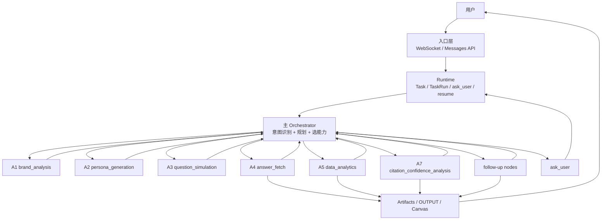
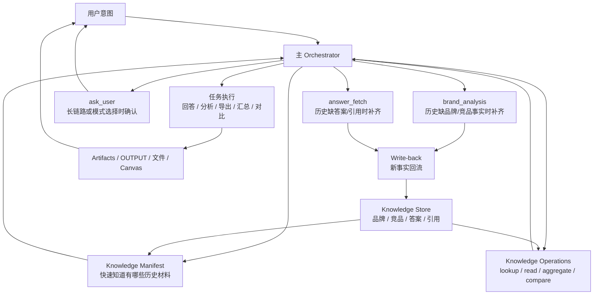

# Knowledge Workspace Agent 设计文档

> 版本：v1.0  
> 日期：2026-03-20  
> 状态：Draft  
> 目的：作为 Specta AI 第 3 步能力建设的开发依据。  
> 核心主题：在现有主 Agent 框架中扩展基于历史事实材料的任务执行能力。

---

## 1. 一句话定义

本阶段不是“加一个通用 RAG 功能”，而是：

`让主 Agent 像 Codex 分析本地代码一样，分析品牌历史事实，并基于这些事实执行问答、分析、导出、对比和补全任务。`

---

## 2. 背景

当前 Specta AI 已经具备完整的主链路能力：

1. 主 Agent 已能识别用户意图，并在多种能力之间做规划与选择。
2. 主 Agent 已能触发 A1/A4/A5/A7、follow-up、ask_user 等执行路径。
3. 系统已具备 Runtime、TaskRun、等待用户确认、恢复执行、artifact 落库与前端推送能力。

现有实现见：

1. 编排与工具选择：
   - [D:/AGEO/.codex-main-merge/aeo-platform/backend/app/workflow/orchestrator_node.py](D:/AGEO/.codex-main-merge/aeo-platform/backend/app/workflow/orchestrator_node.py)
2. LangGraph 主图：
   - [D:/AGEO/.codex-main-merge/aeo-platform/backend/app/workflow/graph.py](D:/AGEO/.codex-main-merge/aeo-platform/backend/app/workflow/graph.py)
3. Runtime / waiting_input / resume：
   - [D:/AGEO/.codex-main-merge/aeo-platform/backend/app/api/v1/websocket_langgraph.py](D:/AGEO/.codex-main-merge/aeo-platform/backend/app/api/v1/websocket_langgraph.py)
4. Artifact 输出：
   - [D:/AGEO/.codex-main-merge/aeo-platform/backend/app/workflow/events.py](D:/AGEO/.codex-main-merge/aeo-platform/backend/app/workflow/events.py)
5. Follow-up 节点：
   - [D:/AGEO/.codex-main-merge/aeo-platform/backend/app/workflow/nodes_followup.py](D:/AGEO/.codex-main-merge/aeo-platform/backend/app/workflow/nodes_followup.py)

问题不在于“Agent 不会规划”，而在于：

1. Agent 当前更偏向“重新跑能力链路”，而不是“先复用历史事实材料”。
2. Follow-up 虽然能消费当前 session 已有结果，但还没有面向跨历史事实仓的统一材料操作层。
3. 系统缺少一层面向 Agent 的历史事实工作台，导致：
   - 历史品牌/竞品/答案/引用无法稳定复用
   - 分析、导出、汇总等任务无法统一地站在历史材料之上执行
   - A5/A7 的能力未来难以逐步下沉成更灵活的 Agent/Skill 组合

---

## 3. 本阶段目标

本阶段目标是：

1. 为主 Agent 增加一套 `Knowledge Workspace` 能力。
2. 让主 Agent 在现有规划框架中，具备“先看历史材料，再决定如何执行任务”的工作方式。
3. 使主 Agent 能基于历史事实完成以下任务：
   - 事实问答
   - 分析任务
   - 导出任务
   - 对比任务
   - 知识补全任务
4. 让通过 A1/A4 新获得的事实自动回流，形成可持续复用的历史材料仓。

---

## 4. 非目标

本阶段明确不做：

1. 不重写现有 orchestrator、Runtime、artifact 机制。
2. 不做通用文档知识库。
3. 不把上传文件纳入第一版知识源。
4. 不把 A5/A7 报告正文作为第一版知识真相源。
5. 不先引入完整外部 RAG 平台作为主系统。
6. 不以向量检索作为第一版前提。
7. 不先做沙盒执行器。

---

## 5. 现有系统图景

当前系统的主工作方式如下：



这套体系已经具备：

1. 意图驱动
2. 工具/能力选择
3. 长任务执行
4. ask_user 反问确认
5. artifact 交付

因此第 3 步不是“重建 Agent”，而是：

`在现有主 Agent 能力图谱中加入一个基于历史事实材料的工作台。`

---

## 6. 第一版知识源范围

第一版只使用 A1/A4 产出的事实材料：

1. `brand_profile`
2. `competitor_profile`
3. `fetch_answer`
4. `fetch_citation`

对应现有 state 结构见：

- [D:/AGEO/.codex-main-merge/aeo-platform/backend/app/workflow/state.py](D:/AGEO/.codex-main-merge/aeo-platform/backend/app/workflow/state.py)

其中：

### 6.1 A1 材料

来源：
- [D:/AGEO/.codex-main-merge/aeo-platform/backend/app/workflow/nodes.py](D:/AGEO/.codex-main-merge/aeo-platform/backend/app/workflow/nodes.py)

包含：
- 品牌名
- 官网
- 行业
- 描述
- 核心产品
- 关键词
- 品牌定位
- 目标受众
- 成立年份
- 价格定位
- 竞品列表
- 竞品类型
- relevance_score

### 6.2 A4 材料

来源：
- [D:/AGEO/.codex-main-merge/aeo-platform/backend/app/workflow/nodes_a4.py](D:/AGEO/.codex-main-merge/aeo-platform/backend/app/workflow/nodes_a4.py)

包含：
- 问题文本
- 平台
- 抓取方式
- 答案正文
- 是否提及品牌
- citations
- duration

---

## 7. 为什么不是“直接查数据库”

数据库是事实真相源，但不是主 Agent 最适合直接使用的工作台。

区别如下：

### 7.1 数据库

职责：

1. 原始业务事实持久化
2. 事务一致性
3. 与 session / entity / task / run 的真实关联
4. snapshot / message / artifact 等原始结构保存

### 7.2 Knowledge Workspace

职责：

1. 把数据库中的原始业务事实，整理成 Agent 可操作的材料对象
2. 提供按时间、平台、问题、竞品、来源等维度的快速材料操作
3. 让 Agent 不必理解底层业务 schema、深层嵌套 JSON 或 artifact 结构

因此：

`数据库是真相源；Knowledge Workspace 是面向 Agent 的材料工作台。`

---

## 8. 为什么不是“先做向量检索”

`knowledge lookup` 是 Agent 看到的能力。  
`向量检索` 只是这个能力的一种底层实现。

第一版不以向量为前提，原因如下：

1. 当前知识源高度结构化。
2. 业务过滤条件比语义近邻更重要。
3. 第一版更重视可控、可追溯、可解释，而不是最强模糊召回。
4. 主 Agent 当前更需要“知道有没有历史材料、材料在哪、怎么按条件组织材料”，而不是“先做一套最强语义搜索”。

第一版策略：

1. 先做 metadata-first / retrieval-first 的材料操作能力
2. 对上层暴露稳定的 `Knowledge Workspace` 接口
3. 后续若需要，再在底层加入：
   - vector retrieval
   - hybrid retrieval
   - rerank

不改变上层 Agent 逻辑

---

## 9. 目标图景



这个图景的核心变化不是“加一个新回答器”，而是：

`让主 Agent 多了一套围绕历史材料的工作方式。`

---

## 10. 核心设计原则

1. 不重造 Agent，只扩能力。
2. 历史事实优先，长链路补全其次。
3. 主 Agent 仍然自主规划，不做规则引擎。
4. 对高成本动作保留 policy 护栏。
5. 新材料必须自动回流，避免重复补齐。
6. 第一版设计要支撑未来分析与导出，而不仅是问答。

---

## 11. Knowledge Workspace 的定位

Knowledge Workspace 不是“回答器”，而是主 Agent 的材料工作台。

它至少要支持两类工作：

1. `材料发现`
   - 有哪些历史材料
   - 材料覆盖到什么范围
   - 最近更新时间

2. `材料操作`
   - 查材料
   - 读材料
   - 聚合材料
   - 对比材料

这使得主 Agent 能基于意图做任务，而不是只做单轮问答。

---

## 12. 第一版 Knowledge Workspace 能力模型

### 12.1 规划上下文：Knowledge Manifest

`manifest` 是一个轻量摘要，不是深检索。

作用：

1. 优化首 Token 时间
2. 帮助主 Agent 做规划判断
3. 告诉主 Agent 当前有哪些材料可用

建议内容：

```json
{
  "entity_id": "...",
  "available_sources": {
    "brand_profile": true,
    "competitor_profile": true,
    "fetch_answer": true,
    "fetch_citation": true
  },
  "history": {
    "analysis_count": 4,
    "latest_analysis_at": "2026-03-19T10:20:00Z"
  },
  "coverage": {
    "platforms": ["deepseek", "kimi", "gpt"],
    "question_count": 20,
    "citation_count": 112
  }
}
```

Manifest 不需要做成用户可见工具，也不需要每次深查。  
它更适合作为 orchestrator 的 planning context。

### 12.2 显式材料操作

第一版建议提供以下操作：

1. `knowledge_lookup`
2. `knowledge_read`
3. `knowledge_aggregate`
4. `knowledge_compare`

其中：

#### knowledge_lookup

作用：找相关材料对象

典型场景：
- 查品牌事实
- 查竞品事实
- 查某问题的历史答案
- 查某平台的引用

#### knowledge_read

作用：读取具体材料对象的完整内容

典型场景：
- 读取命中的品牌档案
- 读取某个问题在某平台上的完整答案
- 读取某条 citation 的完整元数据

#### knowledge_aggregate

作用：按维度组织材料

典型场景：
- 导出 3 月的竞品抓取信息
- 汇总某平台引用域名
- 按问题归类最近抓回来的答案

#### knowledge_compare

作用：跨时间、跨平台、跨竞品做材料对比

典型场景：
- 最近两轮分析对比
- 品牌与竞品答案差距分析
- 某平台前后变化对比

---

## 13. 知识对象模型

第一版不建议只做“通用 chunk”。  
为了支撑未来分析、导出与任务执行，第一版应该以“证据对象”为核心。

### 13.1 核心对象类型

1. `brand_profile_record`
2. `competitor_record`
3. `answer_record`
4. `citation_record`

### 13.2 为什么不是只有 chunk

单纯 chunk 适合问答，不足以稳定支撑：

1. 时间范围导出
2. 平台汇总
3. 竞品对比
4. 引用域名统计
5. 未来弱化 A5/A7 后的分析输入

因此第一版应采用：

`证据对象 + 可检索文本 + 结构化字段`

### 13.3 推荐数据结构

建议在 PostgreSQL 中建立两层：

1. `knowledge_records`
   - 一条记录代表一个证据对象
2. `knowledge_segments`
   - 一条记录代表供检索使用的文本片段

其中 `knowledge_segments` 是检索辅助层，不是唯一主体。

#### knowledge_records 推荐字段

1. `id`
2. `entity_id`
3. `session_id`
4. `task_id`
5. `run_id`
6. `source_type`
   - brand_profile
   - competitor_profile
   - fetch_answer
   - fetch_citation
7. `source_ref`
8. `created_at`
9. `payload`
10. `search_text`
11. `metadata`

#### knowledge_segments 推荐字段

1. `id`
2. `record_id`
3. `segment_index`
4. `content`
5. `search_text`
6. `metadata`

---

## 14. 四类记录的建议结构

### 14.1 brand_profile_record

建议保留：

1. brand_name
2. official_website
3. industry
4. description
5. core_products
6. brand_keywords
7. brand_positioning
8. target_audience
9. founded_year
10. price_positioning

### 14.2 competitor_record

建议保留：

1. competitor_name
2. competitor_website
3. description
4. relevance_score
5. competition_type
6. core_products
7. competitive_advantage

### 14.3 answer_record

建议保留：

1. question_id
2. question_text
3. platform
4. fetch_method
5. success
6. answer_text
7. has_brand_mention
8. duration
9. citation_count

### 14.4 citation_record

建议保留：

1. question_id
2. question_text
3. platform
4. title
5. url
6. site_name
7. domain
8. is_official

---

## 15. 检索与组织维度

第一版材料操作应优先支持以下维度：

1. `entity_id`
2. `session_id`
3. `task_id`
4. `run_id`
5. `source_type`
6. `platform`
7. `question_id`
8. `question_text`
9. `competitor_name`
10. `domain`
11. `is_official`
12. `created_at`
13. `time_range`

默认策略：

1. 允许跨历史检索
2. 结果排序优先：
   - 高相关
   - 新近性
   - source_type 相关性

---

## 16. 主 Agent 的新工作方式

### 16.1 当前工作方式

当前主 Agent 更偏向：

`意图 -> 选现有能力 -> 执行 -> 返回结果`

### 16.2 目标工作方式

目标主 Agent 变成：

`意图 -> 看历史材料 -> 能完成则直接完成 -> 不能完成则补材料或 ask_user -> 返回结果`

这不是替换现有能力，而是让现有能力在主 Agent 内形成新的先后顺序。

---

## 17. 主 Agent 典型路径

### 17.1 历史事实足够

用户问：
- 某品牌事实
- 某竞品事实
- 某平台历史答案
- 某条引用来源

路径：

1. 主 Agent 识别为历史材料可回答的问题
2. 先看 manifest
3. 调 `knowledge_lookup`
4. 必要时 `knowledge_read`
5. 直接回答

### 17.2 历史事实不足，但可自动补齐

用户问品牌/竞品事实，知识不足。

路径：

1. 主 Agent 发现知识层没有足够品牌/竞品事实
2. 直接复用现有 `brand_analysis`
3. 新事实回流 Knowledge Store
4. 再回答

### 17.3 历史事实不足，且链路较长

用户问某个问题在 AI 平台上的答案或引用，但历史没有抓过。

路径：

1. 主 Agent 发现答案/引用材料缺失
2. 识别需要复用现有 `answer_fetch`
3. 若需要模式选择或长任务确认，则使用现有 `ask_user`
4. 执行 A4
5. 新事实回流 Knowledge Store
6. 再回答、分析或导出

### 17.4 导出任务

用户说：
- 导出 3 月所有竞品抓取信息

路径：

1. 主 Agent 识别为导出任务
2. 用 `knowledge_aggregate` 获取时间范围内的材料
3. 组织输出内容
4. 生成文件 artifact
5. 在对话中简述结果

### 17.5 分析任务

用户说：
- 帮我分析最近抓回来的答案，我们和竞品有什么差距

路径：

1. 主 Agent 识别为分析任务
2. 检索与聚合：
   - 品牌 facts
   - 竞品 facts
   - 最近答案
   - 最近 citations
3. 基于材料组织分析思路
4. 必要时 ask_user 确认分析范围
5. 输出分析结果 artifact
6. 在对话中总结

---

## 18. Write-back 机制

Knowledge Workspace 不能只读，必须能回流。

第一版要求：

1. A1 成功后，把 `brand_profile` 与 `competitors` 写入知识层。
2. A4 成功后，把 `fetch_answer` 与 `fetch_citation` 写入知识层。
3. 后续同品牌任务可以直接复用这些材料。

Write-back 是本阶段的强要求，因为它决定 Knowledge Workspace 是否具备累积价值。

---

## 19. 与 A5/A7 的关系

本阶段不直接干掉 A5/A7。  
但本阶段的设计必须为未来弱化 A5/A7 做准备。

原则如下：

1. A5/A7 目前仍然保留。
2. 第一版知识真相源仍然优先使用 A1/A4。
3. 未来分析类任务逐步转向：
   - `知识层提供材料`
   - `Agent/Skill 负责组织分析`
4. A5/A7 中的确定性部分后续可拆成 Skill。

换句话说：

`第一版不是删除 A5/A7，而是为未来让 Agent 站在事实层上做分析铺路。`

---

## 20. 与 Context Engineering 的关系

Knowledge Workspace 不是 Context Engineering 的替代。

二者关系如下：

1. `Knowledge Workspace`
   - 负责材料发现与材料操作
2. `Context Engineering`
   - 负责把选中的材料组织成适合模型消费的上下文

因此本阶段正确分层是：

1. Truth Layer
2. Knowledge Workspace
3. Context Assembly

不建议现在先补一个新的 Context 文件系统。  
当前更应该先把材料层建立起来。

---

## 21. 与外部 RAG / 云平台的关系

第一版不建议让外部 RAG 平台成为主系统。

原因：

1. 当前知识源强业务化、强结构化。
2. 需要严格保留 entity / session / task / run / platform / question 这些业务维度。
3. 如果过早把真相源交给通用 RAG 平台，会增加：
   - 数据同步复杂度
   - 权限与隔离复杂度
   - 血缘与追溯复杂度

推荐策略：

1. 业务知识模型自己定义
2. 检索底层保持可替换
3. 后续若需要，再接：
   - vector retrieval
   - hybrid search
   - OpenSearch / 云检索 / 向量库

---

## 22. 第一版能力边界

### 22.1 第一版会做

1. A1/A4 事实回流
2. Knowledge Store
3. Knowledge Manifest
4. `knowledge_lookup`
5. `knowledge_aggregate`
6. `knowledge_compare`
7. 主 Agent 规划中新增“优先使用历史材料”的工作方式

### 22.2 第一版不做

1. 上传文件知识源
2. 通用文档问答
3. 向量优先检索
4. 沙盒执行器
5. A5/A7 全量替换

---

## 23. 第一版建议实施顺序

### Phase 3.1 材料入库

1. 建立 `knowledge_records`
2. 建立 `knowledge_segments`
3. 接入 A1 write-back
4. 接入 A4 write-back

### Phase 3.2 材料操作

1. `manifest`
2. `knowledge_lookup`
3. `knowledge_read`
4. `knowledge_aggregate`
5. `knowledge_compare`

### Phase 3.3 主 Agent 接入

1. 给 orchestrator 增加 Knowledge Workspace 说明
2. 让主 Agent 在规划时先看 manifest
3. 让主 Agent 在需要时调用 knowledge 操作
4. 在 knowledge miss 时串联现有 A1/A4/ask_user

### Phase 3.4 任务输出

1. 支持知识驱动的问答
2. 支持知识驱动的分析
3. 支持知识驱动的导出
4. 统一走现有 artifact 输出机制

---

## 24. 第一版验收标准

完成后至少要满足：

1. 主 Agent 能回答：
   - 这个品牌以前识别出的竞品有哪些
   - 某平台某问题引用了哪些站点
2. 主 Agent 能基于历史事实做分析：
   - 最近抓回来的答案与竞品差距
3. 主 Agent 能基于历史事实做导出：
   - 导出指定时间范围的竞品抓取信息
4. 若历史缺少品牌/竞品事实：
   - 能自动复用现有 `brand_analysis`
5. 若历史缺少答案/引用：
   - 能自动规划到 `answer_fetch`
   - 长任务或模式不明确时使用现有 `ask_user`
6. 新获取到的 A1/A4 材料会自动回流知识层

---

## 25. 风险与约束

### 25.1 风险

1. 如果知识对象只做成普通 chunk，将不足以支撑分析与导出任务。
2. 如果回流机制不做，系统会反复执行 A1/A4，无法累积知识价值。
3. 如果让主 Agent 直接查底层原始 JSON，会让编排与业务 schema 紧耦合。
4. 如果第一版直接走向量优先，相关性与业务准确性可能不稳定。

### 25.2 约束

1. 保持首 Token 时间可控。
2. 不引入重型外部系统作为第一版真相源。
3. 不破坏现有 orchestrator、Runtime、artifact 主链。

---

## 26. 需要的支持

进入实现前需要确认：

1. 第一版是否将 `knowledge_lookup / aggregate / compare` 作为主 Agent 可直接调用的工具能力暴露给 orchestrator。
2. 第一版导出任务是否直接复用现有 artifact 输出通道，还是需要新增统一的导出 artifact 类型。
3. 第一版 write-back 的历史范围与保留策略是否需要做额外限制。

---

## 27. 结论

第 3 步的正确建设方向不是：

- 做一个通用 RAG
- 做一个规则引擎
- 重写一套 Agent 系统

而是：

`在现有主 Agent 框架中补一层 Knowledge Workspace，让 Agent 能先利用历史事实材料，再基于意图执行问答、分析、导出、对比和补全任务。`

这个方向能够同时兼容：

1. 当前的 A1/A4 主链
2. 已经完成的 Runtime/ask_user/artifact 体系
3. 未来 A5/A7 的 Skill 化与 Agent 化
4. 后续向量检索或更强检索底座的平滑接入
