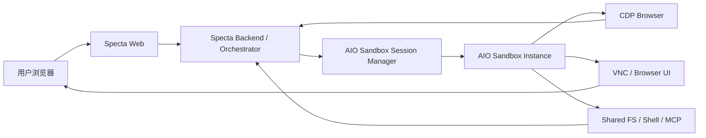

# Specta Web Cloud Sandbox（AIO）V1 方案

> 日期：2026-03-30
> 状态：Draft
> 目标：从服务客户和交付门槛出发，将 `Web + Cloud Sandbox` 明确设为 Specta 第一优先级方案，并将 `agent-infra/sandbox` 作为首选底座进行接入设计。

---

## 1. 一句话结论

如果按“服务客户、降低接入门槛、最短试用路径”排序，Specta 当前的两条方案优先级应调整为：

1. `Priority 1`：`Web + Cloud Sandbox（AIO）`
2. `Priority 2`：`Local Runtime Client`

原因不是本地方案技术上不强，而是从客户真实交付场景看：

1. 客户往往不愿意安装本地客户端
2. 客户 IT 往往不允许安装客户端、插件或开启开发者模式
3. 零安装网页入口对销售演示、PoC、试用、扩张更友好

因此，Specta 当前最值得优先做起来的，是：

`Web 端发起任务 -> AIO Sandbox 云端执行 -> 需要人工介入时在网页内接管浏览器 -> 完成后继续自动执行`

---

## 2. 两个方案的客户视角对比

## 2.1 方案 A：Web + Cloud Sandbox（AIO）

用户感知：

1. 不安装任何客户端
2. 登录网页即可使用
3. 需要验证码或登录时，在网页里看到云端浏览器画面并处理
4. 处理完成后继续自动执行

优势：

1. 零安装
2. 试用最快
3. 最利于销售演示和快速扩张
4. 不受终端 OS、企业桌管、插件商店限制
5. 对非技术用户最友好

劣势：

1. 数据中心 IP 更容易触发风控
2. 某些平台会有地域分流
3. 云端算力和会话成本更高
4. 需要你们自己管理沙箱调度和会话持久化策略

## 2.2 方案 B：Local Runtime Client

用户感知：

1. 需要安装本地客户端
2. 需要给客户端运行权限
3. 浏览器任务在本机执行
4. 登录和验证码在本机浏览器里完成

优势：

1. 更接近真实用户环境
2. 登录成功率和风控友好度更高
3. 最适合强登录态平台

劣势：

1. 安装门槛高
2. 交付受企业 IT 管控影响大
3. Windows/macOS 打包、签名、升级、兼容都要做

## 2.3 当前优先级结论

如果问题是：

`哪个方案更容易让更多客户开始用、先卖起来、先跑起来？`

答案是：

`Web + Cloud Sandbox（AIO）`

如果问题是：

`哪个方案更接近真实本机环境、对强登录平台成功率更高？`

答案是：

`Local Runtime Client`

所以产品排序应该是：

1. 先做 AIO 云端网页版
2. 再把本地客户端作为增强能力补上

---

## 3. 为什么 AIO 适合做第一优先级底座

## 3.1 它不是单一浏览器服务，而是一体化 Agent 沙箱

`agent-infra/sandbox` 官方仓库和文档明确表明，它把：

1. Browser
2. Shell
3. File
4. VSCode Server
5. MCP

放在同一个 Docker 容器里，并共享文件系统。  
这对 Specta 很重要，因为你们的浏览器抓取不是只拿个页面文本，还会涉及：

1. 下载文件
2. 解析文件
3. 运行脚本
4. 生成 artifact

单纯浏览器服务能做浏览器，但 AIO 更像完整 Agent runtime。

## 3.2 它天然支持“人机协作”

官方文档明确给了两种接管方式：

1. `VNC`
2. `CDP + @agent-infra/browser-ui`

而且鉴权文档还说明了可以用 `JWT` 和短时 `ticket` 给前端构建 VNC 访问 URL。  
这和你想要的“在网页 canvas/弹层里给用户接管浏览器”高度一致。

## 3.3 国内可用性更好

README 直接给了中国大陆镜像地址。  
这意味着在腾讯云中国内地或中国香港环境里拉镜像都更顺，不必强依赖海外容器仓库。

## 3.4 现成实践证明适合 AgentRun 类工作流

你给的博文里，实际已经把它用于：

1. connect 到已运行浏览器
2. 用户在 VNC 中完成登录
3. 保存 Cookie
4. 后续任务继续执行

而且文章特别强调：

1. 用 `connect()` 而不是 `launch()`
2. 用 `disconnect()` 保持浏览器运行
3. 状态可通过文件系统持久化

这套心智与 Specta 的“多步骤任务 + 人工确认 + 后续继续执行”非常契合。

## 3.5 官方 Guide / API 复核后的修正

这次重新通读官方 guide 和 `/v1/openapi.json` 后，需要把我们对 AIO 的理解再收紧一层。

### 不是只有“浏览器 + MCP”

官方 OpenAPI `v1.4.2` 当前公开了 `105` 个 path，至少覆盖这些 tag：

1. `sandbox`
2. `shell`
3. `bash`
4. `file`
5. `jupyter`
6. `nodejs`
7. `mcp`
8. `browser`
9. `code`
10. `util`
11. `skills`
12. `proxy`
13. `auth`

这意味着 AIO 对 Specta 来说，不只是“浏览器底座”或“附带 MCP”，而是一套已经分层完成的 Agent runtime。

### browser 组已经提供高层 REST 能力

官方 browser 组不只是 `cdp_url + screenshot + gui action`，而是已经覆盖：

1. `page/*` 高层页面操作
2. `tabs` 管理
3. `cookies` 读写与清理
4. `state/save` 与 `state/load`
5. `network/*` 请求、HAR、headers、route
6. `captcha/detect` 与 `captcha/wait`
7. `restart`

因此 Specta 不应该把 AIO 只当作“CDP 入口”。  
更合理的接入顺序应是：

1. `REST-first`
2. `CDP-second`
3. `MCP-third`
4. `browser-ui / VNC` 用于人工接管

### shell 和 bash 不是一回事

官方同时给了 `shell` 和 `bash` 两组接口：

1. `shell`
   - 更偏向持久化终端会话
- 有 `WebSocket`、session 和内部 shell 调试入口
2. `bash`
   - 更偏向非交互式进程执行和输出控制

这对 Specta 的意义是：

1. `shell` 适合长期运行、恢复、调试和人工观察
2. `bash` 更适合短步骤命令执行

### `/index.html`、`/code-server/`、`/proxy/*` 是重要配套面，不是主产品入口

官方 guide 还明确给了：

1. `/index.html`
   - AIO 控制面板，适合内部排障和运维观察
2. `/code-server/`
   - 适合开发/调试/临时修复
3. `/proxy/{port}`、`/absproxy/{port}`、`${port}-${domain}`
   - 适合把沙箱内服务透出给前端或内部工具

这些能力对 Specta 有价值，但不应直接替代你们自己的产品 UI。  
更合适的定位是：

1. `Specta 用户入口`
   - 仍然是你们自己的 Web 界面
2. `AIO 附属入口`
   - 作为接管、调试、开发和预览能力被嵌入或间接调用

---

## 4. AIO 对 Specta 的角色定义

在 Specta 架构里，AIO 不应被当成“另一个浏览器服务”，而应被定义为：

`Cloud Sandbox Runtime`

也就是云端统一执行器。

### 它负责：

1. 浏览器运行
2. Shell/脚本执行
3. 文件读写
4. 人工接管的浏览器可视界面
5. 任务过程中的共享文件状态

### 它不负责：

1. 业务编排
2. 会话产品逻辑
3. 报告生成
4. 客户权限系统
5. 多租户业务控制面

这些仍然由 Specta 自己负责。

---

## 5. 目标架构

### 分层说明

1. `Specta Web`
   - 发起任务
   - 展示进度
   - 在需要时展示接管画面

2. `Specta Backend / Orchestrator`
   - 决策任务
   - 创建/绑定 sandbox session
   - 通过 CDP 或脚本执行浏览器任务
   - 接收结果并生成 artifact

3. `AIO Sandbox Session Manager`
   - 你们需要新增的一层
   - 负责创建、续租、销毁 sandbox 实例
   - 管理会话状态与持久卷

4. `AIO Sandbox Instance`
   - 单个实际云端沙箱
   - 提供 CDP、VNC、文件、Shell、MCP

---

## 6. 与现有 Specta 代码的接入方式

当前 Specta 已有浏览器动作和人工确认原语，不是从零开始。

### 现有可复用层

1. 浏览器抓取 handler
   - [deepseek_handler.py](/D:/AGEO-worktrees/browser-operator-design/aeo-platform/backend/app/core/fetchers/browser/deepseek_handler.py)
2. 当前 Playwright 浏览器客户端
   - [playwright_client.py](/D:/AGEO-worktrees/browser-operator-design/aeo-platform/backend/app/core/fetchers/browser/playwright_client.py#L28)
3. 浏览器人工动作 runtime
   - [browser_action_runtime.py](/D:/AGEO-worktrees/browser-operator-design/aeo-platform/backend/app/workflow/browser_action_runtime.py#L30)
4. 前端 WebSocket 浏览器动作处理
   - [useWebSocket.ts](/D:/AGEO-worktrees/browser-operator-design/frontend/src/hooks/useWebSocket.ts#L478)

### 必须新增的抽象

把当前单一的 `PlaywrightBrowserClient` 抽象为统一浏览器执行后端：

- `LocalPlaywrightBackend`
- `AioSandboxBackend`

V1 主打 `AioSandboxBackend`。

### AioSandboxBackend 的职责

1. 创建 sandbox session
2. 获取 CDP 地址
3. 用 Playwright/Puppeteer `connect` 到已运行浏览器
4. 管理 VNC 或 browser-ui 的接管链接
5. 管理文件系统中的 cookies / state / 下载文件
6. 销毁或续租 session

### AIO 不等于 Specta Tools

这一步必须和 Specta 的 Agent-first 原则对齐。

AIO 官方已经提供了浏览器 MCP 工具原语，例如：

1. `browser_navigate`
2. `browser_get_clickable_elements`
3. `browser_click`
4. `browser_form_input_fill`
5. `browser_get_text`
6. `browser_screenshot`
7. `browser_new_tab`
8. `browser_switch_tab`

但 Specta 不能直接把这些工具名裸暴露给业务节点后就结束。  
正确分层应是：

#### Layer 0：AIO 原子能力

由 AIO 自带或通过 CDP/MCP 暴露：

1. 浏览器导航
2. DOM 感知
3. 元素交互
4. 截图与文本提取
5. 文件读写
6. Shell/Jupyter 执行

#### Layer 1：Specta Tool 封装

我们要把 AIO 原子能力封装成 Specta 自己的稳定工具契约，例如：

1. `aio_browser_open_platform_home`
2. `aio_browser_perceive_page`
3. `aio_browser_click_element`
4. `aio_browser_fill_input`
5. `aio_browser_extract_answer`
6. `aio_browser_extract_references`
7. `aio_browser_request_takeover`
8. `aio_browser_check_login_ready`
9. `aio_browser_manage_state`
10. `aio_browser_manage_cookies`

### AIO 的“写代码能力”如何接入

AIO 不只是浏览器，还能执行：

1. Python
2. Node.js
3. Shell
4. Jupyter

这部分值得接入，但不能被理解成：

`让 Agent 每一步都自由生成一段任意脚本来操作系统`

正确接法应是把代码执行也收口成受控工具层。

#### Layer 1.5：受控代码工具

建议补充以下 Specta 工具：

1. `aio_fs_read_text`
2. `aio_fs_write_json`
3. `aio_python_run_snippet`
4. `aio_node_run_snippet`
5. `aio_parse_downloaded_file`
6. `aio_cookie_merge_validate`
7. `aio_wait_file_ready`

这些工具适合做：

1. 下载文件解析
2. cookies/state 文件整理
3. DOM 快照后处理
4. 引用结果归一化
5. 平台特定的轻量数据清洗

不适合做：

1. 把整套业务编排变成 LLM 即时生成代码
2. 把 secrets 写进临时代码
3. 无时限的长脚本运行

### 代码工具的执行规约

1. 单次代码执行必须有超时
2. 输出必须写入由 `/v1/sandbox` 返回的 `home_dir` 派生出的 `data_root` 下的明确路径
3. 关键文件写入要有 schema 校验
4. 错误必须显式抛出，不允许静默失败
5. 业务状态仍然通过 artifact / state / file system 传递，不通过全局变量

#### Layer 2：平台 Skill / Node Contract

针对四个平台分别建立 skill/contract：

1. `deepseek_browser_skill`
2. `doubao_browser_skill`
3. `yuanbao_browser_skill`
4. `kimi_browser_skill`

这些 skill 不直接绑死“某一步一定调用哪几个底层 MCP 方法”，而是声明：

1. 平台入口
2. 登录就绪判定
3. 提问动作
4. 回答提取动作
5. 引用提取动作
6. 人工接管条件

#### Layer 3：Agent 决策

最终仍由节点 Agent / orchestrator 负责判断：

1. 当前该调用哪个平台 skill
2. 该调用哪个 Specta Tool
3. 什么时候请求人工接管
4. 什么时候跳过、重试或切换平台

换句话说：

`AIO 提供原子能力`

`Specta 定义 Tools 和 Skill Contract`

`Agent 决定何时调用什么`

而不是把程序写死成一套固定编排。

---

## 7. 登录与接管流程

## 7.1 标准流程

1. 用户在 Specta Web 发起浏览器抓取
2. 后端创建 AIO sandbox
3. 后端通过 CDP 接入沙箱浏览器
4. 浏览器自动打开目标平台
5. 如果检测到登录页或验证码：
   - 后端发出 `browser_user_action`
   - 前端弹出接管入口
   - 用户在网页中的 VNC / Canvas 里处理
6. 用户处理完成后：
   - 前端发送“已完成”
   - 后端复检页面状态
   - 继续任务

## 7.2 两种接管方式

### 方式 A：VNC iframe

优点：

1. 最简单
2. 最快落地
3. 官方直接支持

缺点：

1. UI 比较“远程桌面”
2. 体验比原生 Canvas 稍重

### 方式 B：CDP + browser-ui Canvas

优点：

1. 更像原生网页里的浏览器组件
2. 产品体验更接近 Manus

缺点：

1. 集成复杂度更高
2. 前端调试成本更高

### 对 VNC 的重新评估

AIO 官方博客已经直接给了 `VNC` 与 `Canvas + CDP` 的对比：

1. `VNC`
   - 带宽占用高（10-50 Mbps）
   - 延迟更高
   - CPU 占用高
   - 内存占用高
   - 但更稳定，且能控制整个浏览器/桌面环境
2. `Canvas + CDP`
   - 带宽占用低（1-5 Mbps）
   - 延迟更低
   - CPU 和内存占用更低
   - 更接近产品内嵌浏览器体验
   - 但默认只覆盖页面，不天然覆盖完整 Tabs / 多窗口，且需要额外心跳保活

所以，用户担心“VNC 会大量占服务器内存”这件事是有依据的，不应轻视。

### 当前推荐

如果目标体验是“类似 Manus”，建议改成：

1. `主接管方式`：`Canvas + CDP（browser-ui）`
2. `兜底方式`：`VNC`

VNC 只用于：

1. 文件上传/下载对话框
2. 多窗口或整浏览器级交互
3. 调试和故障兜底

而不是作为默认产品主界面。

---

## 8. 登录态与会话持久化

这里要分清楚两件事：

## 8.1 “AIO 默认每次全新沙箱”是真的

你给的博文明确写了：

1. 每次执行可以是全新的沙箱
2. 自动清理、自动释放资源

这意味着如果你们按最简单方式用 AIO，
确实会面临“每次新建都可能失去登录态”的问题。

## 8.2 但 AIO 并不等于只能每次重登

同一篇实践也明确给了状态保持思路：

1. 通过共享文件系统保存 cookies
2. 用 `connect() + disconnect()` 保持浏览器运行
3. 通过 NAS/OSS 动态挂载保留多步骤状态

因此，Specta 接入 AIO 时必须自己选一种持久化策略。

### V1 推荐策略

用户已经明确要求：持久化必须纳入 V1。  
因此这部分不能再放到 V2。

#### 策略 A：会话内持续存活

适用：

1. 单次分析流程
2. 一次登录后连续跑完四个平台

做法：

1. 每次分析创建一个 sandbox
2. 整个分析流程内不销毁
3. 用 `connect() + disconnect()` 维持浏览器上下文

#### 策略 B：workspace/platform 级状态持久化

适用：

1. 同一 workspace 重复分析
2. 需要减少重复登录
3. 需要四个平台分别持久化

做法：

1. 为 `workspace + platform` 建立持久状态目录
2. 挂载持久卷或对象存储回填 profile
3. 保存 cookies / localStorage / 必要平台状态
4. 启动新 sandbox 时恢复

### 当前结论

V1 必须同时具备：

1. 分析流程内会话持续存活
2. 最小可用的平台状态持久化

否则四平台登录和重复使用的客户体验会很差。

---

## 9. “我们用自己的账号登录云端”怎么放

这个方案可以做，但只能是特定场景的辅助手段。

适用场景：

1. Specta 内部研究账号
2. 公共展示环境
3. 某些不依赖客户个性化身份的平台

不适合作主线的原因：

1. 结果未必代表客户真实视角
2. 账号风控和养号成本转移到 Specta
3. 某些平台不欢迎共享账号自动化

因此：

1. `客户自己的账号` 仍是首选
2. `Specta 自有账号` 作为研究或兜底通道

---

## 10. 安全、隐私与运行规约

你补充的这组规则应当直接上升为 AIO 接入规约。

## 10.1 API Key 与环境变量

1. 不提交 `.env` 到 Git
2. 不在代码里硬编码 API Key / Token
3. 所有 secrets 只通过部署环境或密钥管理系统注入

## 10.2 敏感状态文件

1. `cookies.json`
2. `profile_state.json`
3. `local_storage_dump.json`
4. `session_state.json`

这些文件都只能存在运行态目录，不能进入仓库。

建议做法：

1. 仓库里只保留 `*.example.json`
2. 真实状态文件统一落在 `data_root/<workspace>/<platform>/`
   - 其中 `data_root = <home_dir>/data`
   - `home_dir` 由 `GET /v1/sandbox` 在运行时返回
3. 真实状态文件加密存储或最少做访问隔离

## 10.3 Cookie 管理原则

1. 先访问域名，再设置 Cookie
2. 每个平台单独保存状态
3. 不同 workspace 之间不能共享客户真实 cookies
4. cookies 文件写入后要做基础校验

## 10.4 使用规范

1. 遵守目标网站使用条款和 robots 规则
2. 设置合理请求延迟
3. 限制单次抓取数量
4. 遇到高风控站点优先人工接管
5. 空闲 sandbox 要及时清理，避免计费膨胀

## 10.5 执行时间限制

长任务仍然应按显式步骤与 artifact/state 进行拆分和恢复，  
但当前方案不把某个固定的单次执行时限写成硬约束。

---

## 11. 成本和复杂度

## 11.1 AIO 方案的主要成本

1. 计算资源
   - 每个活跃 sandbox 都要占用 CPU/内存
2. 会话时长成本
   - 登录和人工接管会拉长容器存活时间
3. 持久化成本
   - 如果做 profile / cookie 持久化，需要卷或对象存储
4. 控制面成本
   - 你们需要自己补 session manager、配额、清理策略

## 10.2 为什么它仍然值得第一优先级

因为它把最难的客户接入阻力砍掉了：

1. 不用装客户端
2. 不用装插件
3. 不用找 Chrome 商店
4. 不用让客户 IT 开白名单

这对第一阶段增长价值更大。

---

## 12. 第一阶段实施建议

## Phase 1：AIO 四平台接入

目标：

1. 同时支持：
   - `DeepSeek`
   - `Doubao`
   - `Yuanbao`
   - `Kimi`
2. 主接管方式使用 `Canvas + CDP`
3. `VNC` 只做 fallback
4. 同时具备分析流程内会话保持 + 最小平台状态持久化
5. AIO 原子动作先收口为 Specta Tools，再接给节点 Agent 调用

要做的事情：

1. 新增 `AioSandboxSessionManager`
2. 新增 `AioSandboxBackend`
3. 打通：
   - 创建实例
   - 获取 CDP 地址
   - 生成 browser-ui 接管会话
   - 生成 VNC/ticket fallback URL
   - 绑定 `session_id / task_id / sandbox_id / workspace_id / platform`
4. 新增 AIO 原子工具适配层
5. 新增四个平台 skill contract
6. 前端增加 `云端浏览器接管弹层`
7. 让四个平台 handler 都可走 AIO backend

## Phase 2：多平台扩展

1. 增强引用提取、截图、日志、调试能力
2. 优化 browser-ui 交互体验
3. 统一平台状态检测与接管 UX
4. 平台工具调用效果评估与缓存策略

## Phase 3：持久化增强

1. 完整 workspace 级 cookie / profile 恢复
2. 会话池
3. 空闲回收
4. 研究账号通道

## Phase 4：本地客户端

当以下任一条件出现时，再把 `Local Runtime Client` 拉高优先级：

1. 强登录平台成功率不够
2. 风控率过高
3. 大客户明确要求本地执行

---

## 13. 当前决策

基于当前用户约束，建议决策如下：

1. `Web + Cloud Sandbox（AIO）` 升为第一优先级
2. `Local Runtime Client` 保留为第二阶段增强能力
3. `Browser Plugin Operator` 继续后置
4. 接入 AIO 时，`Canvas + CDP` 是主接管方式，`VNC` 只做 fallback
5. `V1` 不是 DeepSeek 单平台，而是四平台一起支持
6. 会话持久化必须纳入 `V1`
7. AIO 原子能力必须先收口成 Specta Tools，再交给节点 Agent 按状态调用
8. AIO 的代码执行能力要接入，但必须作为受控工具层，而不是任意脚本执行
9. 安全/隐私/成本清理规则直接纳入接入规约

---

## 14. 设计文档包顺序

实现阶段建议按这个顺序阅读：

1. `design-web-cloud-sandbox-aio-v1-2026-03-30.md`
2. `design-aio-runtime-contracts-2026-04-01.md`
3. `design-aio-tool-schema-2026-03-31.md`
4. `design-aio-four-platform-skill-contract-2026-03-31.md`
5. `design-aio-session-manager-2026-03-31.md`
6. `design-aio-backend-adapter-2026-03-31.md`
7. `design-aio-session-persistence-model-2026-03-31.md`
8. `design-aio-access-relay-security-2026-03-31.md`
9. `design-aio-takeover-protocol-2026-03-31.md`
10. `design-aio-frontend-takeover-ui-2026-03-31.md`
11. `design-a4-aio-routing-2026-03-31.md`
12. `design-aio-validation-ops-and-cost-2026-03-31.md`

---

## 15. 参考资料

1. AIO Sandbox GitHub: https://github.com/agent-infra/sandbox
2. AIO 简介: https://sandbox.agent-infra.com/zh/guide/start/introduction
3. AIO 快速开始: https://sandbox.agent-infra.com/zh/guide/start/quick-start
4. AIO 沙盒信息: https://sandbox.agent-infra.com/zh/guide/basic/sandbox
5. AIO 浏览器与 VNC: https://sandbox.agent-infra.com/zh/guide/basic/browser
6. AIO Shell: https://sandbox.agent-infra.com/zh/guide/basic/shell
7. AIO 文件操作: https://sandbox.agent-infra.com/zh/guide/basic/file
8. AIO MCP 集成: https://sandbox.agent-infra.com/zh/guide/basic/mcp
9. AIO 预览代理: https://sandbox.agent-infra.com/zh/guide/basic/proxy
10. AIO Code Server: https://sandbox.agent-infra.com/zh/guide/basic/code-server
11. AIO 鉴权: https://sandbox.agent-infra.com/zh/guide/basic/authentication
12. AIO API 文档: https://sandbox.agent-infra.com/zh/api
13. AIO 浏览器自动化示例: https://sandbox.agent-infra.com/zh/examples/browser
14. AIO 官方发布博客: https://sandbox.agent-infra.com/zh/blog/announcing-0
15. AgentRun 实践文章: https://www.cnblogs.com/alisystemsoftware/p/19646364
16. AIO 浏览器接管文章: https://segmentfault.com/a/1190000047359831
