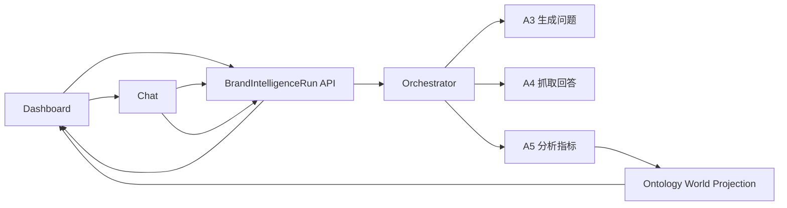

# BrandIntelligenceRun 开发计划与实施方案（2026-05-25）

> 状态：Confirmed for execution
> 依据：`docs/design-brand-intelligence-run-center-2026-05-25.md`
> 目标：把品牌情报主线从 Chat 驱动改为 `BrandIntelligenceRun` 驱动，同时加固 Chat 承接层，避免 Dashboard、Chat、后台任务再次断裂。
> 非目标：本轮不重做整套调度系统、不重做 Chat 全部架构、不重做品牌世界视觉、不新增独立任务管理产品。

## 本轮锁定范围

1. 新表和迁移：新增 `brand_intelligence_runs`，保留 `analysis_task_id` 指向旧执行层。
2. 后台默认执行：Dashboard 开始/继续分析先创建或复用 run，再提交后台执行，不把用户直接踢回 Chat。
3. Chat 气泡：Dashboard 右下角提供统一上下文入口，进入 Chat 时带 `runId / entityId / intent / handoffId`。
4. 监测边界：Dashboard 不再承载内部监测看板；所有监测配置入口回到 Settings。
5. 气泡只负责解释和确认入口；如果为了 handoff 创建 run，状态必须是 `not_started`，不能标记成正在后台执行。

## 一句话方案

先做一个可运行的任务中枢最小闭环：

```text
Dashboard / Chat 发起品牌情报任务
  -> 创建或复用 BrandIntelligenceRun
  -> Dashboard 可见任务状态
  -> Orchestrator 按阶段推进
  -> Chat 只在解释、确认、调整范围时打开
  -> 结果回写 world projection
```

这次开发的核心不是多加按钮，而是新增一个稳定的产品状态层。

## 实施原则

### 1. Dashboard 是主场

Dashboard 必须能独立告诉用户：

- 当前任务是否存在。
- 现在跑到哪一步。
- 是否需要用户确认。
- 下一步系统会做什么。
- 已经形成哪些情报结果。

不能把“去 Chat”当作样本不足、失败、等待确认的统一逃生口。

### 2. Chat 是自然展开

Chat 只承接这些场景：

- 解释指标。
- 追问证据。
- 调整分析范围。
- 处理复杂确认。
- 查看执行细节。

Chat 打开时必须带入结构化上下文，不能要求用户重新描述。

Chat 入口分成两类：

1. `自然发言`：用户主动在 Chat 输入问题。
2. `携带上下文`：用户从 Dashboard 的指标、证据、建议、确认项或右下角气泡进入。

两类入口都必须能进入同一个 workflow 模式：

```text
自然发言 -> 识别意图 -> 创建或复用 BrandIntelligenceRun
携带上下文 -> 读取 run / entity / intent -> 解释、确认或继续执行
```

### 3. 任务状态必须持久化

`BrandIntelligenceRun` 是任务状态真相源。

不允许：

- 只靠 Chat session 判断任务是否继续。
- 只靠前端 handoff 续跑。
- Dashboard 从 world 缺数据反推任务状态。

### 4. 后台能继续的就继续

用户已经明确发起分析，且平台、问题范围、成本、登录状态都不阻塞时，后台应继续推进。

需要用户时，必须说明原因和确认后会发生什么。

### 5. Phase 1 要可回滚

先新增能力，不替换全部旧流程。

旧 Chat A3/A4/A5 主线继续可用；`BrandIntelligenceRun` 先作为产品状态层接入，不强行废弃现有 `AnalysisTask`。

## 总体架构



职责：

| 模块 | 职责 |
| --- | --- |
| `BrandIntelligenceRun` | 品牌情报任务状态真相源 |
| Dashboard | 展示任务状态、情报结果、下一步 |
| Chat | 解释、追问、确认、调整范围 |
| Orchestrator | 推进 A3/A4/A5，写回 run |
| World Projection | 展示完成后的情报、证据、图谱、建议 |

## 数据模型方案

### 新增表：`brand_intelligence_runs`

建议新增数据库表，不建议只塞进 `AnalysisTask.metadata`。

原因：

- 这是产品语义层，不是执行技术层。
- Dashboard 需要稳定查询当前品牌的 active run。
- 后续监测计划也会持续创建 run。
- 用 metadata 过渡会让状态查询、权限、幂等和索引都变脆。

字段草案：

| 字段 | 类型 | 说明 |
| --- | --- | --- |
| `id` | UUID | run id |
| `entity_id` | UUID | 品牌 |
| `created_by_user_id` | UUID nullable | 发起人 |
| `origin_surface` | string | dashboard / chat / monitoring / system |
| `origin_session_id` | UUID nullable | 来源 Chat session |
| `analysis_task_id` | UUID nullable | 底层执行任务 |
| `status` | string | not_started / planning_questions / fetching_answers / analyzing_metrics / building_world / generating_recommendations / waiting_user / completed / failed / cancelled |
| `stage` | string | A3 / A4 / A5 / world / recommendation |
| `progress` | float | 0-1 |
| `message` | string | 用户可见状态 |
| `run_goal` | string | 任务目标 |
| `analysis_mode` | string | panorama / scenario / monitoring |
| `input_scope` | jsonb | 平台、问题范围、竞品、样本目标 |
| `sample_scope` | jsonb | 问题数、回答数、平台数、引用数等 |
| `output_refs` | jsonb | question_set、fetch artifact、report、world projection 等 |
| `requires_user_action` | bool | 是否需要用户处理 |
| `user_action_type` | string nullable | platform_confirmation / browser_takeover / retry_strategy / monitoring_confirmation |
| `blocking_reason` | text nullable | 卡住原因 |
| `error_code` | string nullable | 失败码 |
| `error_message` | text nullable | 用户可见失败原因 |
| `origin_event_id` | string nullable | 幂等 key |
| `started_at` | datetime nullable | 开始时间 |
| `completed_at` | datetime nullable | 完成时间 |
| `failed_at` | datetime nullable | 失败时间 |
| `last_activity_at` | datetime | 最近活动时间 |
| `created_at` | datetime | 创建时间 |
| `updated_at` | datetime | 更新时间 |

索引：

- `(entity_id, status)`
- `(entity_id, updated_at)`
- `(origin_session_id)`
- `(origin_event_id)`

约束：

- 同一品牌默认只允许一个 active run。
- `origin_event_id` 用于重复点击幂等。
- `status=completed/failed/cancelled` 后不能被普通 running 事件覆盖。

### 是否复用 AnalysisTask

短期保留：

```text
BrandIntelligenceRun.analysis_task_id -> AnalysisTask.id
```

分工：

- `BrandIntelligenceRun`：产品状态和用户可见任务。
- `AnalysisTask`：底层执行记录和运行日志。

## 后端开发计划

### B1. 数据库迁移与模型

改动：

- 新增 SQLAlchemy model：`BrandIntelligenceRun`
- 新增 Alembic migration
- 新增 schema：create/update/response
- Entity 删除时级联删除 run

验收：

- migration 可执行。
- 创建品牌情报任务后能查询。
- 删除品牌时 run 被清理。

### B2. Run Service

新增服务：`BrandIntelligenceRunService`

核心方法：

```python
get_active_run(entity_id, user)
create_or_resume_run(entity_id, payload, user)
update_stage(run_id, transition)
mark_waiting_user(run_id, action)
mark_completed(run_id, output_refs)
mark_failed(run_id, error)
cancel_run(run_id, user)
confirm_run(run_id, payload, user)
```

规则：

- 同品牌有 active run 时默认复用。
- `origin_event_id` 幂等。
- terminal state 不允许被 running 覆盖。
- sample_scope 增量更新，不从前端计算。

验收：

- 重复创建不会生成重复 active run。
- completed run 不会被旧事件写回 running。
- 权限失败返回 403。

### B3. API

新增 API：

```http
GET  /api/v1/intelligence-runs/entities/{entity_id}/active
POST /api/v1/intelligence-runs/entities/{entity_id}
GET  /api/v1/intelligence-runs/{run_id}
POST /api/v1/intelligence-runs/{run_id}/resume
POST /api/v1/intelligence-runs/{run_id}/cancel
POST /api/v1/intelligence-runs/{run_id}/confirm
```

返回必须是用户可见状态，不暴露内部 prompt、工具调用、debug。

验收：

- 未认证 401 / 403 不泄露数据。
- active run 查询稳定。
- cancel / resume / confirm 有权限校验。

### B4. Orchestrator 接入

第一阶段不重写整个 workflow，只做状态桥：

- Chat / Dashboard 发起时创建 run。
- A3 完成后写 `planning_questions -> fetching_answers` 或 `waiting_user`。
- A4 完成后写 `fetching_answers -> analyzing_metrics`。
- A5 / world projection 完成后写 `completed`。
- 失败写 `failed`。

需要梳理入口：

- Dashboard `开始分析`
- Dashboard `继续抓取答案`
- Chat 用户请求品牌情报分析
- Chat handoff `continue_run`

验收：

- Chat 退出后 run 状态仍能推进。
- Dashboard 刷新后仍能看到状态。
- 样本不足时 run 能进入正确 stage，而不是只显示 world 空状态。

### B5. World Projection 兼容

world API 保留现有字段，新增或关联：

```json
{
  "active_run": {
    "id": "...",
    "status": "...",
    "stage": "...",
    "sample_scope": {}
  }
}
```

也可以 Dashboard 并行请求 run API。建议 Phase 1 并行请求，避免 world 成为任务状态真相源。

验收：

- world 结果不因 active run 失败而完全失败。
- completed run 刷新 world projection。

## 前端开发计划

### F1. API client / types / store

新增：

- `BrandIntelligenceRun`
- `BrandIntelligenceRunStatus`
- `BrandIntelligenceRunCreateRequest`
- `BrandIntelligenceRunConfirmRequest`
- `intelligenceRunStore`

Store 职责：

- 按 `entityId` 缓存 active run。
- 支持 loading / error。
- 支持 create/resume/cancel/confirm。
- 支持轮询或轻刷新。

验收：

- Dashboard 切换品牌时 active run 正确刷新。
- 接口失败有降级状态。

### F2. Dashboard 当前任务区

新增组件：

```text
BrandIntelligenceRunBanner
BrandIntelligenceChatBubble
```

展示：

- 当前任务标题。
- 状态。
- 样本进度。
- 是否需要用户。
- 下一步。
- 操作按钮。

按钮：

- 开始分析。
- 查看进度。
- 继续执行。
- 处理确认。
- 重试。
- 取消。

规则：

- 样本不足时优先展示 run 状态。
- 没有 active run 且 world 无样本时，展示“开始品牌情报分析”。
- 不展示商业化建议表单。
- 不展示 Dashboard 底部“监测与样本”入口。
- 不在 Dashboard 内打开第二套监测看板。

右下角气泡职责：

- 空闲时作为对话入口。
- 后台运行时显示轻量状态。
- 需要接管、确认平台、失败重试时弹出动态提醒。
- 点击后打开 Chat，并携带结构化 handoff。

验收：

- 用户不用打开 Chat 也知道当前进度。
- 样本不足时不会误以为产品坏了。
- 用户知道需要对话或确认时应点击右下角气泡。

### F3. Chat Handoff 加固

新增结构化 handoff：

```ts
type DashboardChatHandoff = {
  handoffId: string;
  runId?: string;
  entityId: string;
  intent:
    | 'explain_metric'
    | 'inspect_evidence'
    | 'confirm_action'
    | 'adjust_scope'
    | 'continue_run';
  metricKey?: string;
  evidenceRefs?: string[];
  recommendationId?: string;
  confirmationId?: string;
  autosend?: boolean;
  createdAt: string;
  expiresAt: string;
};
```

实现规则：

- URL 只放安全索引字段。
- sessionStorage 放完整 payload。
- Chat 打开先显示任务上下文卡片。
- 历史消息异步加载。
- 历史失败不丢 handoff。
- `handoffId` 防重复消费。

验收：

- Dashboard 点击解释指标，Chat 能带上下文打开。
- 历史消息加载失败时，任务卡片仍显示。
- 重复点击不会重复自动发送。

### F4. Chat Shell 性能加固

改动方向：

- Chat 页面先渲染 shell。
- 消息历史分页或延迟加载。
- 当前任务上下文优先加载。
- WebSocket 连接失败时不阻塞任务卡片。
- 输入框可在任务上下文加载后可用。

验收：

- 1 秒内出现 Chat shell 和任务卡片。
- 慢历史不阻塞页面。
- 刷新后 run 上下文仍在。

### F5. 样本不足体验收口

改动：

- `简要情报` 中样本不足显示 run stage。
- `跟进反馈` 只在 run completed 且样本成立后出现建议。
- “继续抓取答案”优先调用 run resume，不优先跳 Chat。
- 需要复杂确认时再打开 Chat。

验收：

- 无问题：开始分析。
- 有问题无答案：继续抓取答案。
- 有答案但排名不足：显示补样本建议，不显示虚假排名。
- 未完成 run：不展示商业化建议任务表单。

## Chat 与 Dashboard 交互方案

### 入口类型

| Dashboard 入口 | 是否打开 Chat | 是否 autosend | 主动作 |
| --- | --- | --- | --- |
| 开始分析 | 否，优先后台创建 run | 是，后端执行 | 创建 run |
| 继续抓取答案 | 否，优先后台 resume | 是，后端执行 | resume run |
| 解释指标 | 是，通过右下角气泡或指标入口 | 否 | 打开 Chat 上下文 |
| 追问证据 | 是，通过右下角气泡或证据入口 | 否 | 打开 Chat 上下文 |
| 调整范围 | 是，通过右下角气泡 | 否 | Chat 让用户改范围 |
| 处理确认 | 简单确认可内联，复杂确认通过气泡进入 Chat | 复杂确认不 autosend | confirm run |
| 重试失败 | 否，优先后台重试 | 是，后端执行 | resume/retry |

### 自然交互原则

用户看到的是：

```text
我在 Dashboard 处理一个品牌情报任务。
需要解释时，右下角气泡打开 Chat 上下文。
需要确认时，气泡提醒我处理。

气泡为了保证 Chat 上下文完整，可以创建一个 `not_started` run 作为承接对象；只有用户点击“开始分析 / 继续分析 / 重试”时，run 才进入后台执行阶段。
完成后，结果回到 Dashboard。
```

用户不应该感到：

```text
我从 Dashboard 跳到了另一个系统，还要重新讲一遍。
```

## 分阶段交付

### Phase 0：当前修复收口

目标：确保现有修复可合并，不带入新风险。

工作：

- 品牌删除修复保留。
- 旧默认 follow-up 移除保留。
- 样本不足不展示建议保留。
- Dashboard 到 Chat handoff 的小修保留，但后续由新 handoff 协议替换。

验收：

- 当前 targeted tests / build / lint / validate_change 通过。

### Phase 1：Run 最小闭环

目标：Dashboard 和 Chat 不再断。

后端：

- 新表与 service。
- active run API。
- create/resume/cancel 基础能力。
- Chat / Dashboard 创建 run。

前端：

- run types/store/client。
- Dashboard 当前任务区。
- Dashboard 右下角对话气泡。
- 样本不足调用 run create/resume。
- Chat handoff 带 `runId/entityId/intent`。

验收：

- 从 Chat 发起后退出，Dashboard 看到 run。
- 从 Dashboard 发起后后台开始 run。
- 刷新后状态不丢。
- 重复点击不重复创建 run。

### Phase 2：Orchestrator 自动推进

目标：run 能从问题生成自动推进到情报完成。

后端：

- Orchestrator stage 写回 run。
- A3/A4/A5 output_refs 写入。
- 失败、等待确认、重试。

前端：

- Dashboard timeline。
- waiting_user banner。
- failed retry。

验收：

- run 自动从 A3 到 A5。
- 失败能重试。
- waiting_user 能确认后继续。

### Phase 3：Chat 承接层加固

目标：Chat 能承接分散入口且不卡死。

工作：

- Chat shell 优先渲染。
- handoff context 独立于 message history。
- 历史分页或延迟加载。
- handoff consumed 幂等。
- 历史失败降级。

验收：

- 慢网络下 1 秒内看到 Chat shell。
- 历史失败不丢 run context。
- autosend 只执行一次。

### Phase 4：建议与监测闭环

目标：从一次情报进入持续监测。

工作：

- completed run 才生成 recommendation task。
- 建议可创建内容任务或监测计划。
- 监测计划周期触发新 run。
- 多 run 支撑趋势。

验收：

- 样本未成立不显示建议。
- 建议来自真实指标和证据缺口。
- 监测能持续更新品牌世界。

## 测试计划

### 后端测试

- create run 幂等。
- active run 查询。
- 权限隔离。
- terminal state 不被覆盖。
- entity 删除级联 run。
- run stage transition。
- sample_scope 更新。
- waiting_user / confirm / resume。
- world projection 与 completed run 兼容。

命令：

```powershell
pytest tests/test_brand_intelligence_run_service.py tests/test_intelligence_runs_api.py
pytest tests/test_brand_ontology_world_service.py tests/test_entity_service_delete.py
```

### 前端测试

- Dashboard 读取 active run。
- 开始分析创建 run。
- 继续抓取 resume run。
- 样本不足不展示建议。
- Chat handoff 带 run context。
- 历史失败降级。
- 重复点击不重复 autosend。

命令：

```powershell
npm run lint
npm run build
```

### E2E smoke

用理想汽车：

1. 新品牌无样本，Dashboard 显示“开始品牌情报分析”。
2. 点击后创建 run，Dashboard 显示正在生成问题。
3. 退出 Chat 或不打开 Chat，Dashboard 仍显示 run。
4. run 进入抓取答案后，样本数变化。
5. 指标完成后，简要情报显示四个核心指标。
6. 点击解释指标打开 Chat，任务上下文存在。
7. 历史消息接口失败时，任务卡片仍显示。
8. 重复点击开始分析，不创建第二个 active run。

### 质量门禁

每阶段必须跑：

```powershell
python scripts/validate_change.py
rg -n -F "? ? ?" <changed files>  # 实际执行时去掉问号之间的空格
rg -n "Ontology|ActionRecord|Orchestrator|debug|prompt|回到 Chat" frontend/src
```

视觉变更必须截图验证：

- Dashboard desktop。
- Dashboard mobile。
- Chat opened from metric。
- Chat history failure fallback。

## 关键风险

### 风险 1：Run 与 AnalysisTask 状态冲突

缓解：

- Phase 1 只让 run 引用 task，不让 task 反向推断 run。
- Orchestrator transition 统一写 run。

### 风险 2：Chat 性能问题被放大

缓解：

- Phase 3 作为阻断项，不允许大量新增 Chat 入口后不加固。
- Chat shell/context/history 分层。

### 风险 3：自动推进误执行

缓解：

- 只有明确发起 run 才自动推进。
- 成本、登录、监测计划必须 waiting_user。

### 风险 4：Dashboard 继续堆复杂度

缓解：

- 只加当前任务区和明确状态，不做完整任务管理系统。
- 任务历史后置。

## 开发顺序建议

建议实际开发顺序：

1. Phase 0 当前修复收口并合并前确认。
2. 新建 migration/model/service/API。
3. Dashboard 接 active run。
4. 移除 Dashboard 内部监测入口和监测看板分支，监测只回到 Settings。
5. 样本不足入口改为 create/resume run。
6. 右下角气泡接入 run 状态和确认提醒。
7. Chat handoff 支持 `runId/intent/handoffId`。
8. Orchestrator 写回 run stage。
9. Chat shell/context/history 分层加固。
10. 推荐任务 gating 改为 completed run + 样本成立。
11. E2E 和 code review。

## 首轮实施范围建议

首轮不要一次做完 Phase 1-4。建议第一轮只做：

- `BrandIntelligenceRun` 表、service、API。
- Dashboard 当前任务区。
- Dashboard 右下角动态对话气泡。
- Dashboard 开始分析 / 继续抓取走 run API。
- Chat handoff 带 `runId/intent/handoffId`。
- 重复点击幂等。
- 样本不足建议继续禁用。
- Dashboard 底部监测入口和内部监测看板移除，监测入口保留在 Settings。

这能先解决当前最痛的断点：

```text
用户从 Chat 退出后，Dashboard 仍知道任务；
用户从 Dashboard 操作时，不再只靠跳 Chat；
样本不足时，系统有明确任务状态和下一步。
```

## 待确认

1. Phase 1 是否允许新增表和迁移？
2. 同品牌 active run 默认复用，是否符合预期？
3. Dashboard 点击“开始分析”是否默认后台执行，而不是默认打开 Chat？
4. 解释指标类入口是否默认不 autosend？
5. Chat 历史加载失败时，是否允许只显示任务卡片和当前输入？
6. Dashboard 右下角气泡是否作为所有 Chat 上下文入口的统一入口？
7. Dashboard 内部监测看板是否永久移除，只保留 Settings 监测功能？
